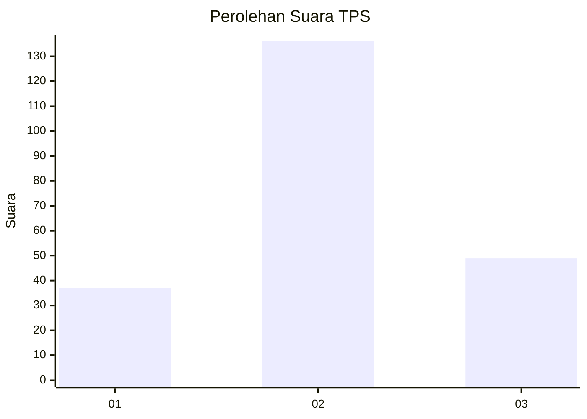
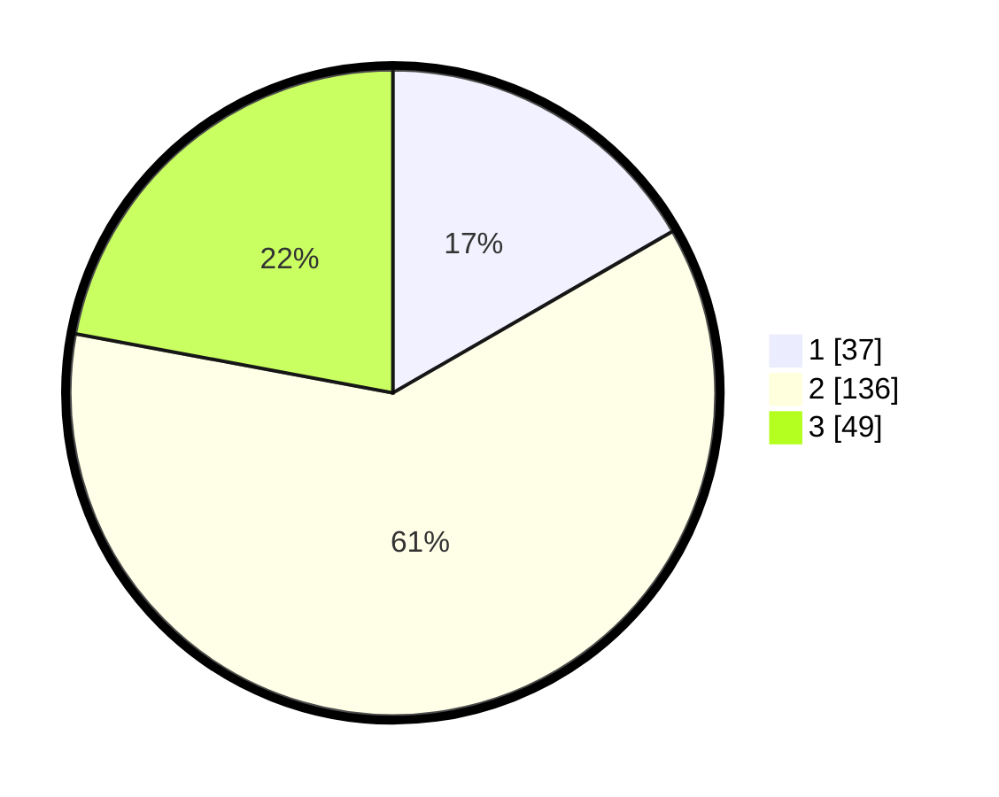

# Hasil

## Grafik

## Tabel

| No. | Nama Paslon    | Suara | Suara (raw) | Persentase |
|:--- |:-------------- | -----:| -----------:| ----------:|
| 1   | ANIES MUHAIMIN | 37    | [37][p-1]   | 16,67      |
| 2   | PRABOWO GIBRAN | 136   | [136][p-2]  | 61,26      |
| 3   | GANJAR MAHFUD  | 49    | [49][p-3]   | 22,07      |

[p-1]: https://github.com/gigit-pemilu/pemilu-2024-35-jawa-timur/blob/main/pilpres/hitung-suara/sub/35-jawa-timur/sub/02-ponorogo/sub/17-ponorogo/sub/1005-surodikraman/sub/004-tps/sub/paslon-1.txt
[p-2]: https://github.com/gigit-pemilu/pemilu-2024-35-jawa-timur/blob/main/pilpres/hitung-suara/sub/35-jawa-timur/sub/02-ponorogo/sub/17-ponorogo/sub/1005-surodikraman/sub/004-tps/sub/paslon-2.txt
[p-3]: https://github.com/gigit-pemilu/pemilu-2024-35-jawa-timur/blob/main/pilpres/hitung-suara/sub/35-jawa-timur/sub/02-ponorogo/sub/17-ponorogo/sub/1005-surodikraman/sub/004-tps/sub/paslon-3.txt

## Foto C Plano

https://sirekap-obj-formc.kpu.go.id/2716/pemilu/ppwp/35/02/17/10/05/3502171005004-20240215-020414--4329aa50-1355-45b2-9e3b-e9a60133b01a.jpg

https://sirekap-obj-formc.kpu.go.id/2716/pemilu/ppwp/35/02/17/10/05/3502171005004-20240215-020009--8ed4dcf0-17e7-4d9e-8aaf-f0fc9ccb68af.jpg

https://sirekap-obj-formc.kpu.go.id/2716/pemilu/ppwp/35/02/17/10/05/3502171005004-20240215-020547--232a7536-149f-435f-8cf7-755112a446e8.jpg

## Metadata

| Key        | Value               |
| ---------- | ------------------- |
| Time Stamp | 2024-02-19 06:16:00 |

