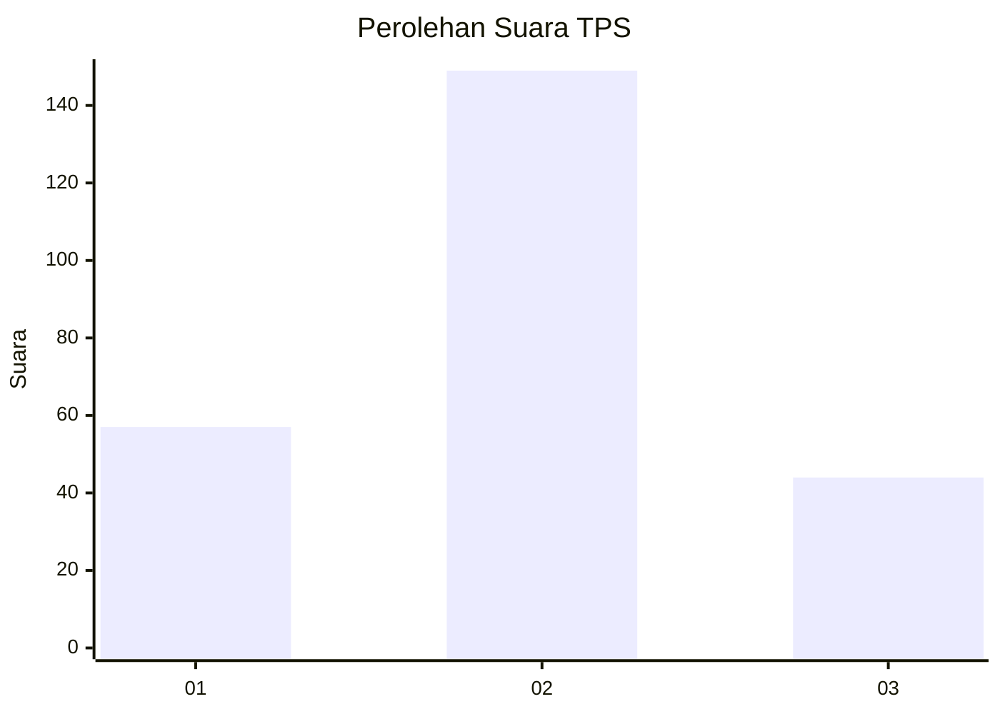
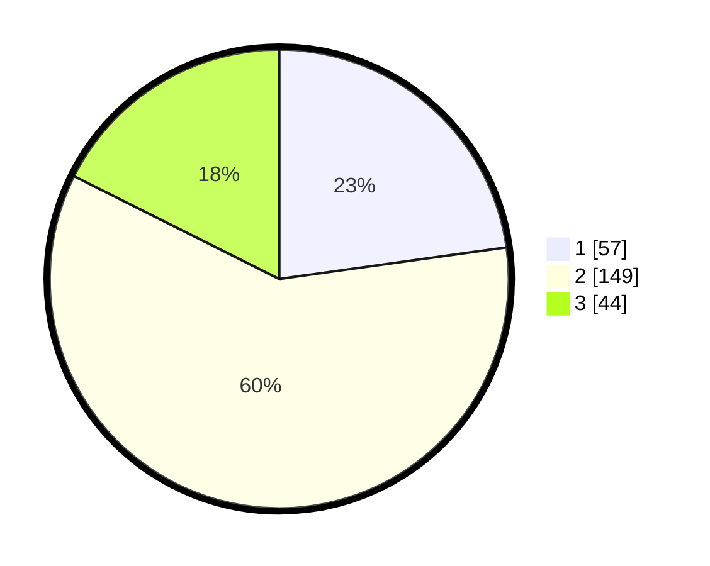

# Hasil

## Grafik

## Tabel

| No. | Nama Paslon    | Suara | Suara (raw) | Persentase |
|:--- |:-------------- | -----:| -----------:| ----------:|
| 1   | ANIES MUHAIMIN | 57    | [57][p-1]   | 22,80      |
| 2   | PRABOWO GIBRAN | 149   | [149][p-2]  | 59,60      |
| 3   | GANJAR MAHFUD  | 44    | [44][p-3]   | 17,60      |

[p-1]: https://github.com/gigit-pemilu/pemilu-2024-35-jawa-timur/blob/main/pilpres/hitung-suara/sub/35-jawa-timur/sub/02-ponorogo/sub/17-ponorogo/sub/1007-tonatan/sub/002-tps/sub/paslon-1.txt
[p-2]: https://github.com/gigit-pemilu/pemilu-2024-35-jawa-timur/blob/main/pilpres/hitung-suara/sub/35-jawa-timur/sub/02-ponorogo/sub/17-ponorogo/sub/1007-tonatan/sub/002-tps/sub/paslon-2.txt
[p-3]: https://github.com/gigit-pemilu/pemilu-2024-35-jawa-timur/blob/main/pilpres/hitung-suara/sub/35-jawa-timur/sub/02-ponorogo/sub/17-ponorogo/sub/1007-tonatan/sub/002-tps/sub/paslon-3.txt

## Foto C Plano

https://sirekap-obj-formc.kpu.go.id/5273/pemilu/ppwp/35/02/17/10/07/3502171007002-20240214-225220--901ef798-a4fe-4d4d-86e3-c0f766fe9b31.jpg

https://sirekap-obj-formc.kpu.go.id/5273/pemilu/ppwp/35/02/17/10/07/3502171007002-20240214-225309--dd9ddf25-c1bb-4a9d-b8bf-d93ff87d3266.jpg

https://sirekap-obj-formc.kpu.go.id/5273/pemilu/ppwp/35/02/17/10/07/3502171007002-20240214-225338--082d6ad0-2a0d-44c5-b83a-730e0ba90492.jpg

## Metadata

| Key        | Value               |
| ---------- | ------------------- |
| Time Stamp | 2024-02-15 16:00:26 |

