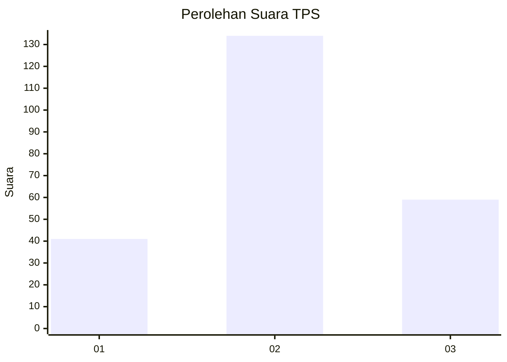
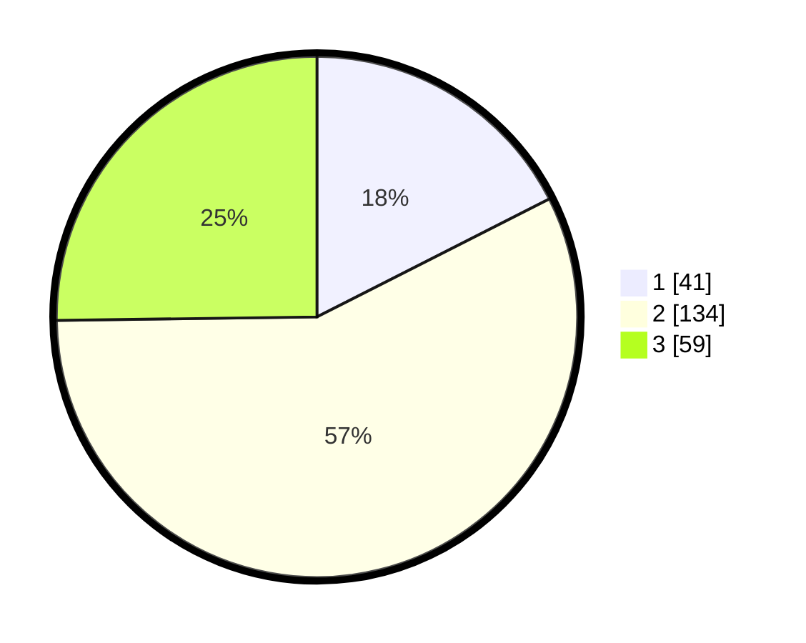

# Hasil

## Grafik

## Tabel

| No. | Nama Paslon    | Suara | Suara (raw) | Persentase |
|:--- |:-------------- | -----:| -----------:| ----------:|
| 1   | ANIES MUHAIMIN | 41    | [41][p-1]   | 17,52      |
| 2   | PRABOWO GIBRAN | 134   | [134][p-2]  | 57,26      |
| 3   | GANJAR MAHFUD  | 59    | [59][p-3]   | 25,21      |

[p-1]: https://github.com/gigit-pemilu/pemilu-2024/blob/main/pilpres/hitung-suara/sub/35-jawa-timur/sub/02-ponorogo/sub/17-ponorogo/sub/1007-tonatan/sub/007-tps/sub/paslon-1.txt
[p-2]: https://github.com/gigit-pemilu/pemilu-2024/blob/main/pilpres/hitung-suara/sub/35-jawa-timur/sub/02-ponorogo/sub/17-ponorogo/sub/1007-tonatan/sub/007-tps/sub/paslon-2.txt
[p-3]: https://github.com/gigit-pemilu/pemilu-2024/blob/main/pilpres/hitung-suara/sub/35-jawa-timur/sub/02-ponorogo/sub/17-ponorogo/sub/1007-tonatan/sub/007-tps/sub/paslon-3.txt

## Foto C Plano

https://sirekap-obj-formc.kpu.go.id/4fce/pemilu/ppwp/35/02/17/10/07/3502171007007-20240219-142328--a8575667-8b3d-4f19-aa2e-c570b8d93e3c.jpg

https://sirekap-obj-formc.kpu.go.id/4fce/pemilu/ppwp/35/02/17/10/07/3502171007007-20240219-142439--9ffdcb16-828b-47b7-b143-44c1ba2940ac.jpg

https://sirekap-obj-formc.kpu.go.id/4fce/pemilu/ppwp/35/02/17/10/07/3502171007007-20240219-142553--d920f6bf-394c-4858-a41a-a763dc9c7fb0.jpg

## Metadata

| Key        | Value               |
| ---------- | ------------------- |
| Time Stamp | 2024-02-19 17:00:00 |

