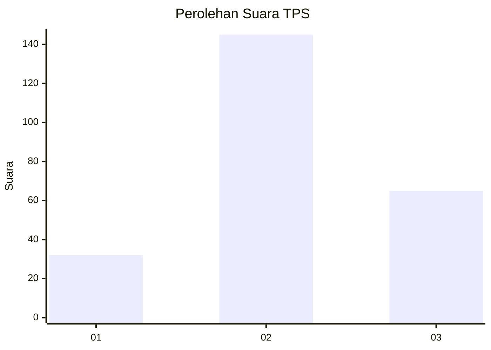
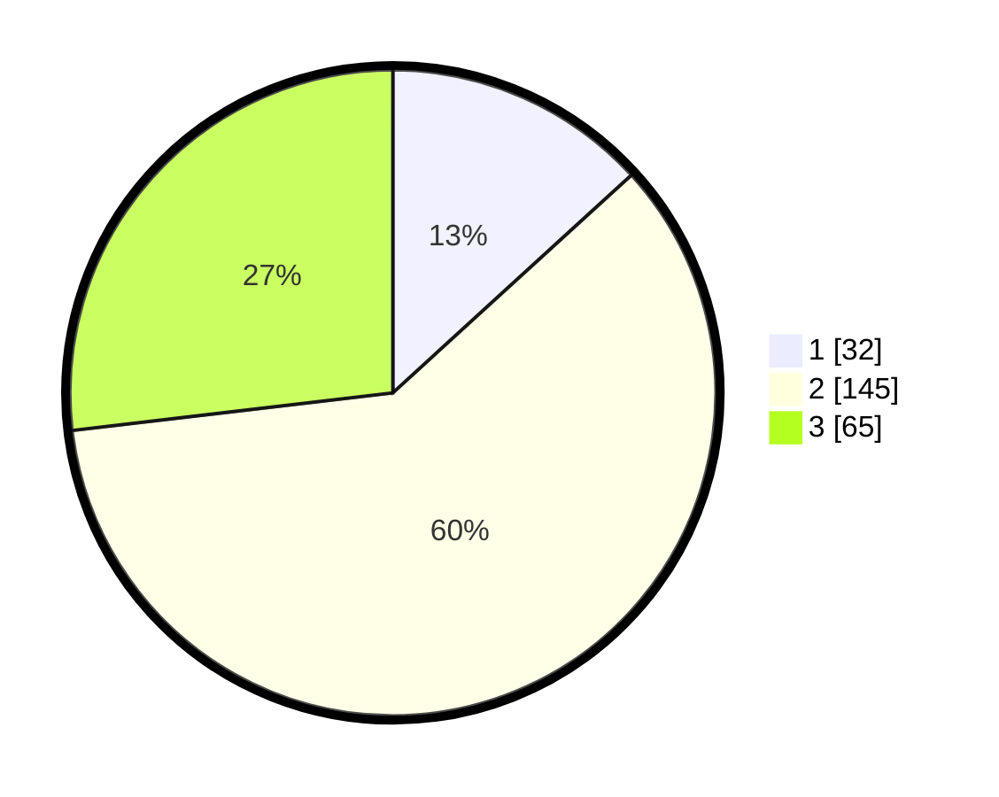

# Hasil

## Grafik

## Tabel

| No. | Nama Paslon    | Suara | Suara (raw) | Persentase |
|:--- |:-------------- | -----:| -----------:| ----------:|
| 1   | ANIES MUHAIMIN | 32    | [32][p-1]   | 13,22      |
| 2   | PRABOWO GIBRAN | 145   | [145][p-2]  | 59,92      |
| 3   | GANJAR MAHFUD  | 65    | [65][p-3]   | 26,86      |

[p-1]: https://github.com/gigit-pemilu/pemilu-2024/blob/main/pilpres/hitung-suara/sub/35-jawa-timur/sub/02-ponorogo/sub/17-ponorogo/sub/1011-tambakbayan/sub/006-tps/sub/paslon-1.txt
[p-2]: https://github.com/gigit-pemilu/pemilu-2024/blob/main/pilpres/hitung-suara/sub/35-jawa-timur/sub/02-ponorogo/sub/17-ponorogo/sub/1011-tambakbayan/sub/006-tps/sub/paslon-2.txt
[p-3]: https://github.com/gigit-pemilu/pemilu-2024/blob/main/pilpres/hitung-suara/sub/35-jawa-timur/sub/02-ponorogo/sub/17-ponorogo/sub/1011-tambakbayan/sub/006-tps/sub/paslon-3.txt

## Foto C Plano

https://sirekap-obj-formc.kpu.go.id/e038/pemilu/ppwp/35/02/17/10/11/3502171011006-20240219-174841--b170da20-056c-4e2a-8a2e-4f01dd8d6d67.jpg

https://sirekap-obj-formc.kpu.go.id/e038/pemilu/ppwp/35/02/17/10/11/3502171011006-20240215-021935--7427b6af-7b38-480e-85bc-f7a65160f88b.jpg

https://sirekap-obj-formc.kpu.go.id/e038/pemilu/ppwp/35/02/17/10/11/3502171011006-20240215-022220--bf17c5bf-abed-4e66-bc71-18aad2d4918c.jpg

## Metadata

| Key        | Value               |
| ---------- | ------------------- |
| Time Stamp | 2024-02-19 18:00:00 |

