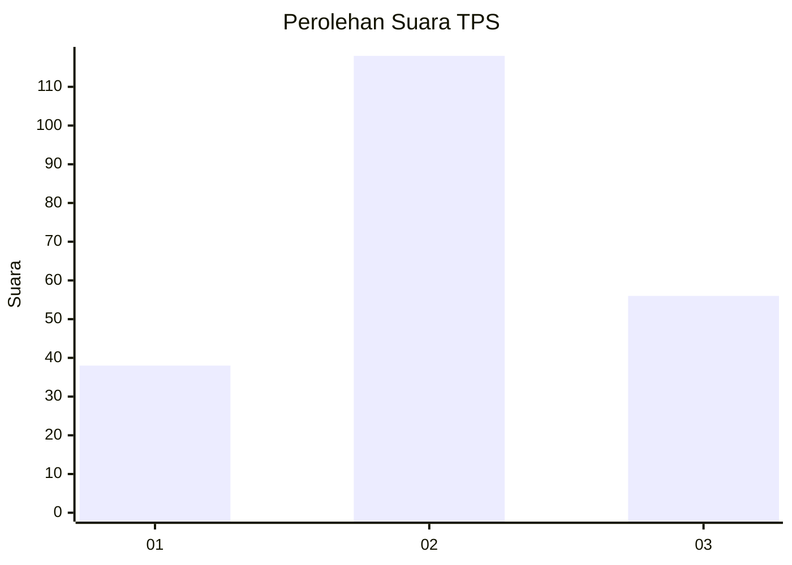
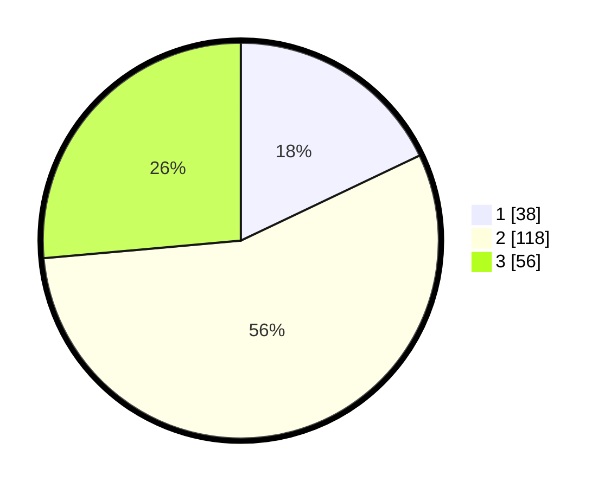

# Hasil

## Grafik

## Tabel

| No. | Nama Paslon    | Suara | Suara (raw) | Persentase |
|:--- |:-------------- | -----:| -----------:| ----------:|
| 1   | ANIES MUHAIMIN | 38    | [38][p-1]   | 17,92      |
| 2   | PRABOWO GIBRAN | 118   | [118][p-2]  | 55,66      |
| 3   | GANJAR MAHFUD  | 56    | [56][p-3]   | 26,42      |

[p-1]: https://github.com/gigit-pemilu/pemilu-2024/blob/main/pilpres/hitung-suara/sub/35-jawa-timur/sub/02-ponorogo/sub/17-ponorogo/sub/1013-mangkujayan/sub/007-tps/sub/paslon-1.txt
[p-2]: https://github.com/gigit-pemilu/pemilu-2024/blob/main/pilpres/hitung-suara/sub/35-jawa-timur/sub/02-ponorogo/sub/17-ponorogo/sub/1013-mangkujayan/sub/007-tps/sub/paslon-2.txt
[p-3]: https://github.com/gigit-pemilu/pemilu-2024/blob/main/pilpres/hitung-suara/sub/35-jawa-timur/sub/02-ponorogo/sub/17-ponorogo/sub/1013-mangkujayan/sub/007-tps/sub/paslon-3.txt

## Foto C Plano

https://sirekap-obj-formc.kpu.go.id/06c2/pemilu/ppwp/35/02/17/10/13/3502171013007-20240217-231722--0804da06-b34e-4687-b3ca-09a4d67d11d0.jpg

https://sirekap-obj-formc.kpu.go.id/06c2/pemilu/ppwp/35/02/17/10/13/3502171013007-20240217-230951--b9937e2e-107d-4285-9238-d6eed937a29a.jpg

https://sirekap-obj-formc.kpu.go.id/06c2/pemilu/ppwp/35/02/17/10/13/3502171013007-20240217-231116--6d772770-9fb6-4ec2-81a7-344560d6560c.jpg

## Metadata

| Key        | Value               |
| ---------- | ------------------- |
| Time Stamp | 2024-02-25 16:00:00 |

