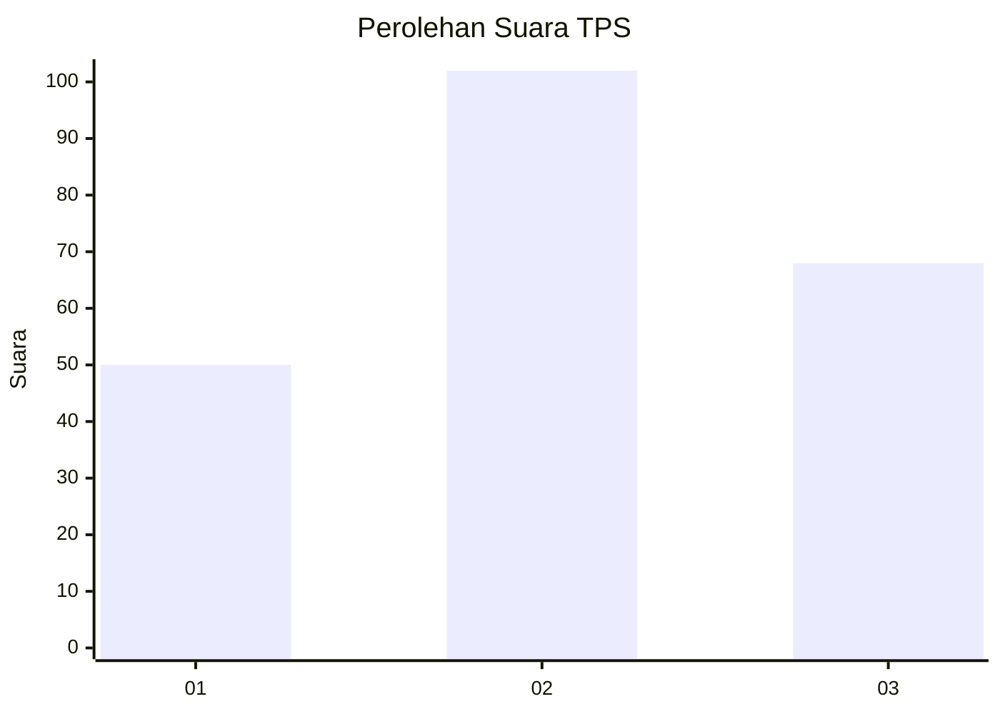
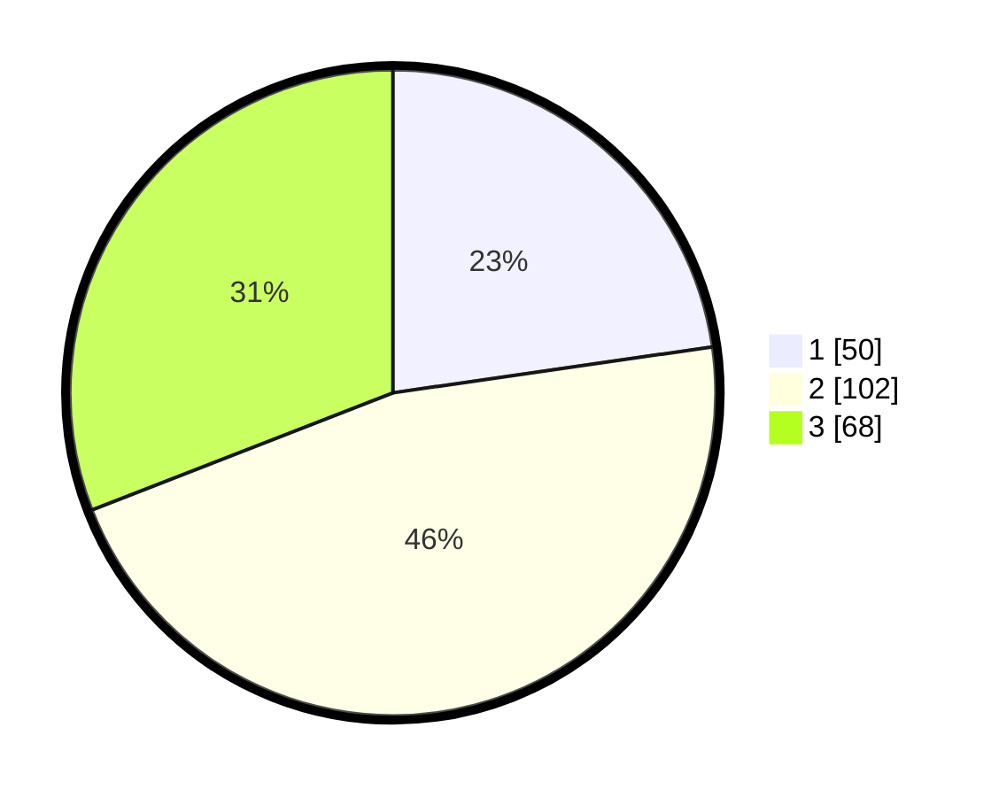

# Hasil

## Grafik

## Tabel

| No. | Nama Paslon    | Suara | Suara (raw) | Persentase |
|:--- |:-------------- | -----:| -----------:| ----------:|
| 1   | ANIES MUHAIMIN | 50    | [50][p-1]   | 22,73      |
| 2   | PRABOWO GIBRAN | 102   | [102][p-2]  | 46,36      |
| 3   | GANJAR MAHFUD  | 68    | [68][p-3]   | 30,91      |

[p-1]: https://github.com/gigit-pemilu/pemilu-2024/blob/main/pilpres/hitung-suara/sub/35-jawa-timur/sub/02-ponorogo/sub/17-ponorogo/sub/1013-mangkujayan/sub/013-tps/sub/paslon-1.txt
[p-2]: https://github.com/gigit-pemilu/pemilu-2024/blob/main/pilpres/hitung-suara/sub/35-jawa-timur/sub/02-ponorogo/sub/17-ponorogo/sub/1013-mangkujayan/sub/013-tps/sub/paslon-2.txt
[p-3]: https://github.com/gigit-pemilu/pemilu-2024/blob/main/pilpres/hitung-suara/sub/35-jawa-timur/sub/02-ponorogo/sub/17-ponorogo/sub/1013-mangkujayan/sub/013-tps/sub/paslon-3.txt

## Foto C Plano

https://sirekap-obj-formc.kpu.go.id/0504/pemilu/ppwp/35/02/17/10/13/3502171013013-20240221-151004--f33bc914-0d8e-4770-8c6d-06fa786d1205.jpg

https://sirekap-obj-formc.kpu.go.id/0504/pemilu/ppwp/35/02/17/10/13/3502171013013-20240221-145717--b63c819a-7a69-424d-a188-43e88be06811.jpg

https://sirekap-obj-formc.kpu.go.id/0504/pemilu/ppwp/35/02/17/10/13/3502171013013-20240221-145917--3e9631ff-83f1-4dd0-af1b-4488d9e3f859.jpg

## Metadata

| Key        | Value               |
| ---------- | ------------------- |
| Time Stamp | 2024-02-21 17:00:00 |

