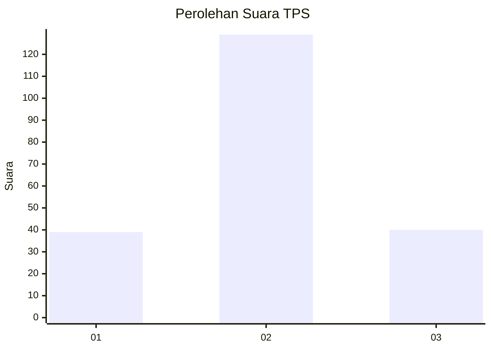
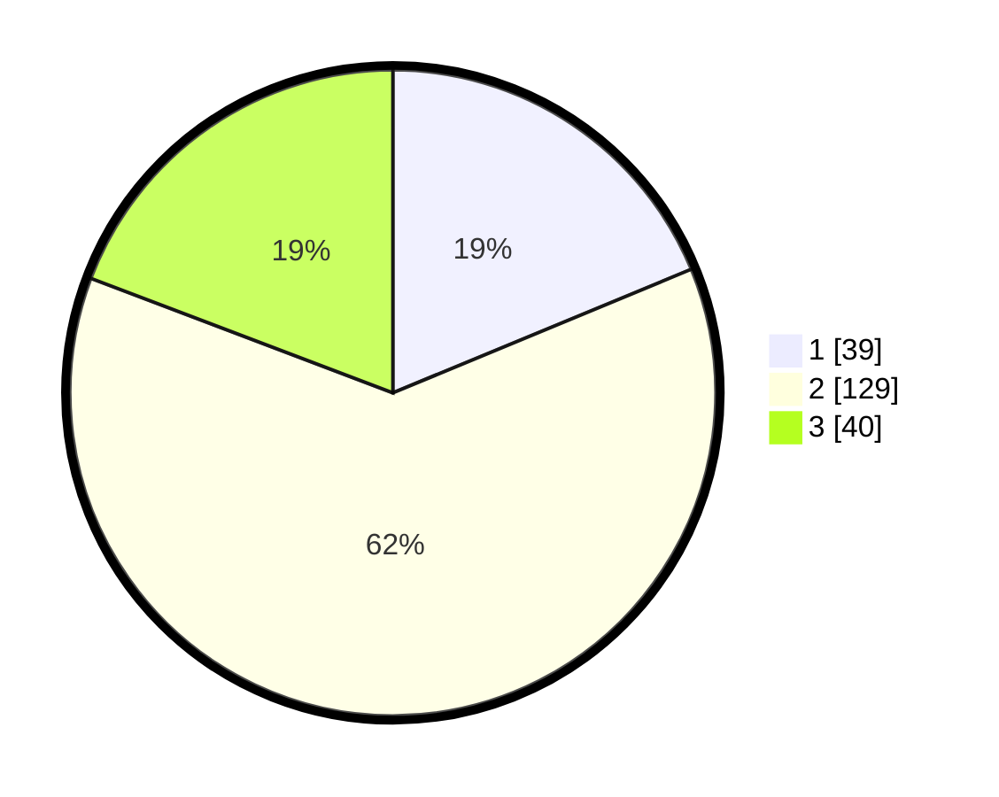

# Hasil

## Grafik

## Tabel

| No. | Nama Paslon    | Suara | Suara (raw) | Persentase |
|:--- |:-------------- | -----:| -----------:| ----------:|
| 1   | ANIES MUHAIMIN | 39    | [39][p-1]   | 18,75      |
| 2   | PRABOWO GIBRAN | 129   | [129][p-2]  | 62,02      |
| 3   | GANJAR MAHFUD  | 40    | [40][p-3]   | 19,23      |

[p-1]: https://github.com/gigit-pemilu/pemilu-2024-35-jawa-timur/blob/main/pilpres/hitung-suara/sub/35-jawa-timur/sub/02-ponorogo/sub/17-ponorogo/sub/1013-mangkujayan/sub/015-tps/sub/paslon-1.txt
[p-2]: https://github.com/gigit-pemilu/pemilu-2024-35-jawa-timur/blob/main/pilpres/hitung-suara/sub/35-jawa-timur/sub/02-ponorogo/sub/17-ponorogo/sub/1013-mangkujayan/sub/015-tps/sub/paslon-2.txt
[p-3]: https://github.com/gigit-pemilu/pemilu-2024-35-jawa-timur/blob/main/pilpres/hitung-suara/sub/35-jawa-timur/sub/02-ponorogo/sub/17-ponorogo/sub/1013-mangkujayan/sub/015-tps/sub/paslon-3.txt

## Foto C Plano

https://sirekap-obj-formc.kpu.go.id/d9c4/pemilu/ppwp/35/02/17/10/13/3502171013015-20240220-111559--68025967-53d1-41da-9ef3-1aba75a66bf3.jpg

https://sirekap-obj-formc.kpu.go.id/d9c4/pemilu/ppwp/35/02/17/10/13/3502171013015-20240220-111753--3dc843d3-63ad-443c-9ebf-77efe83206de.jpg

https://sirekap-obj-formc.kpu.go.id/d9c4/pemilu/ppwp/35/02/17/10/13/3502171013015-20240220-111846--f526de44-9502-4615-949c-80f89efe83df.jpg

## Metadata

| Key        | Value               |
| ---------- | ------------------- |
| Time Stamp | 2024-02-20 16:00:00 |

