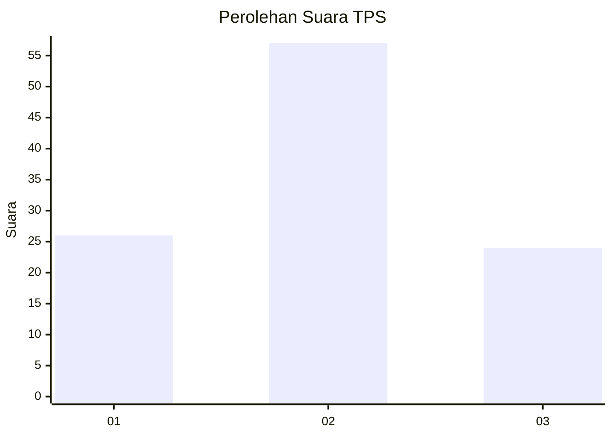
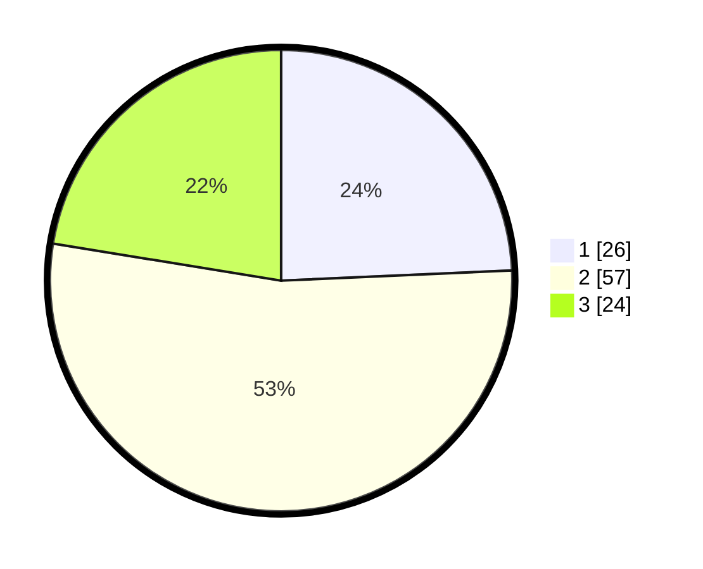

# Hasil

## Grafik

## Tabel

| No. | Nama Paslon    | Suara | Suara (raw) | Persentase |
|:--- |:-------------- | -----:| -----------:| ----------:|
| 1   | ANIES MUHAIMIN | 26    | [26][p-1]   | 24,30      |
| 2   | PRABOWO GIBRAN | 57    | [57][p-2]   | 53,27      |
| 3   | GANJAR MAHFUD  | 24    | [24][p-3]   | 22,43      |

[p-1]: https://github.com/gigit-pemilu/pemilu-2024-35-jawa-timur/blob/main/pilpres/hitung-suara/sub/35-jawa-timur/sub/02-ponorogo/sub/17-ponorogo/sub/1013-mangkujayan/sub/022-tps/sub/paslon-1.txt
[p-2]: https://github.com/gigit-pemilu/pemilu-2024-35-jawa-timur/blob/main/pilpres/hitung-suara/sub/35-jawa-timur/sub/02-ponorogo/sub/17-ponorogo/sub/1013-mangkujayan/sub/022-tps/sub/paslon-2.txt
[p-3]: https://github.com/gigit-pemilu/pemilu-2024-35-jawa-timur/blob/main/pilpres/hitung-suara/sub/35-jawa-timur/sub/02-ponorogo/sub/17-ponorogo/sub/1013-mangkujayan/sub/022-tps/sub/paslon-3.txt

## Foto C Plano

https://sirekap-obj-formc.kpu.go.id/9fca/pemilu/ppwp/35/02/17/10/13/3502171013022-20240219-201728--8d7ae55f-822c-4519-976f-413ef2693076.jpg

https://sirekap-obj-formc.kpu.go.id/9fca/pemilu/ppwp/35/02/17/10/13/3502171013022-20240219-170427--9e9015a5-f2d3-4944-9af3-63c143abd166.jpg

https://sirekap-obj-formc.kpu.go.id/9fca/pemilu/ppwp/35/02/17/10/13/3502171013022-20240219-170755--b5884611-8eb7-40d3-887a-68f80884eab8.jpg

## Metadata

| Key        | Value               |
| ---------- | ------------------- |
| Time Stamp | 2024-02-20 01:00:00 |

