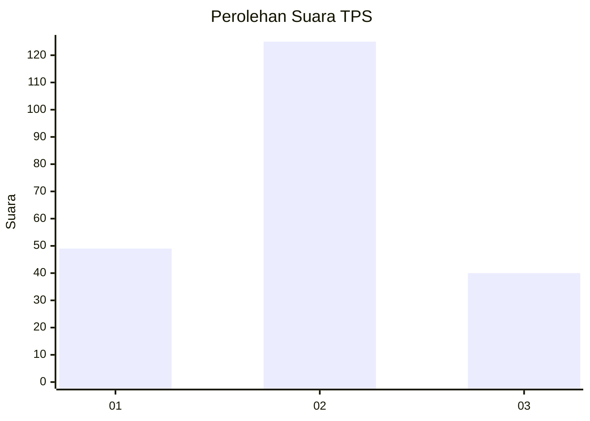
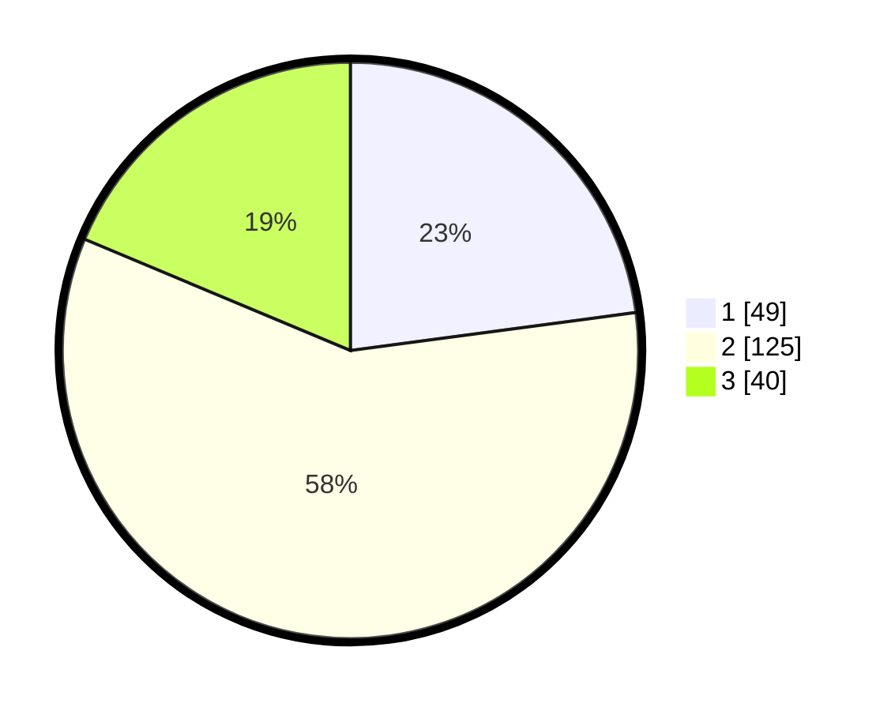

# Hasil

## Grafik

## Tabel

| No. | Nama Paslon    | Suara | Suara (raw) | Persentase |
|:--- |:-------------- | -----:| -----------:| ----------:|
| 1   | ANIES MUHAIMIN | 49    | [49][p-1]   | 22,90      |
| 2   | PRABOWO GIBRAN | 125   | [125][p-2]  | 58,41      |
| 3   | GANJAR MAHFUD  | 40    | [40][p-3]   | 18,69      |

[p-1]: https://github.com/gigit-pemilu/pemilu-2024-35-jawa-timur/blob/main/pilpres/hitung-suara/sub/35-jawa-timur/sub/02-ponorogo/sub/17-ponorogo/sub/1016-cokromenggalan/sub/005-tps/sub/paslon-1.txt
[p-2]: https://github.com/gigit-pemilu/pemilu-2024-35-jawa-timur/blob/main/pilpres/hitung-suara/sub/35-jawa-timur/sub/02-ponorogo/sub/17-ponorogo/sub/1016-cokromenggalan/sub/005-tps/sub/paslon-2.txt
[p-3]: https://github.com/gigit-pemilu/pemilu-2024-35-jawa-timur/blob/main/pilpres/hitung-suara/sub/35-jawa-timur/sub/02-ponorogo/sub/17-ponorogo/sub/1016-cokromenggalan/sub/005-tps/sub/paslon-3.txt

## Foto C Plano

https://sirekap-obj-formc.kpu.go.id/0633/pemilu/ppwp/35/02/17/10/16/3502171016005-20240225-153937--ddae46c2-3a4b-45fe-bfff-cab0d636c872.jpg

https://sirekap-obj-formc.kpu.go.id/0633/pemilu/ppwp/35/02/17/10/16/3502171016005-20240215-025005--fa32900f-258a-480f-9ebd-37467628182d.jpg

https://sirekap-obj-formc.kpu.go.id/0633/pemilu/ppwp/35/02/17/10/16/3502171016005-20240215-020143--5a3fa011-b042-41f9-ba07-528f03d526f9.jpg

## Metadata

| Key        | Value               |
| ---------- | ------------------- |
| Time Stamp | 2024-02-25 16:00:00 |

