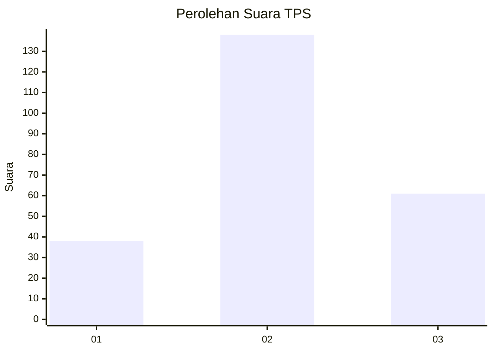
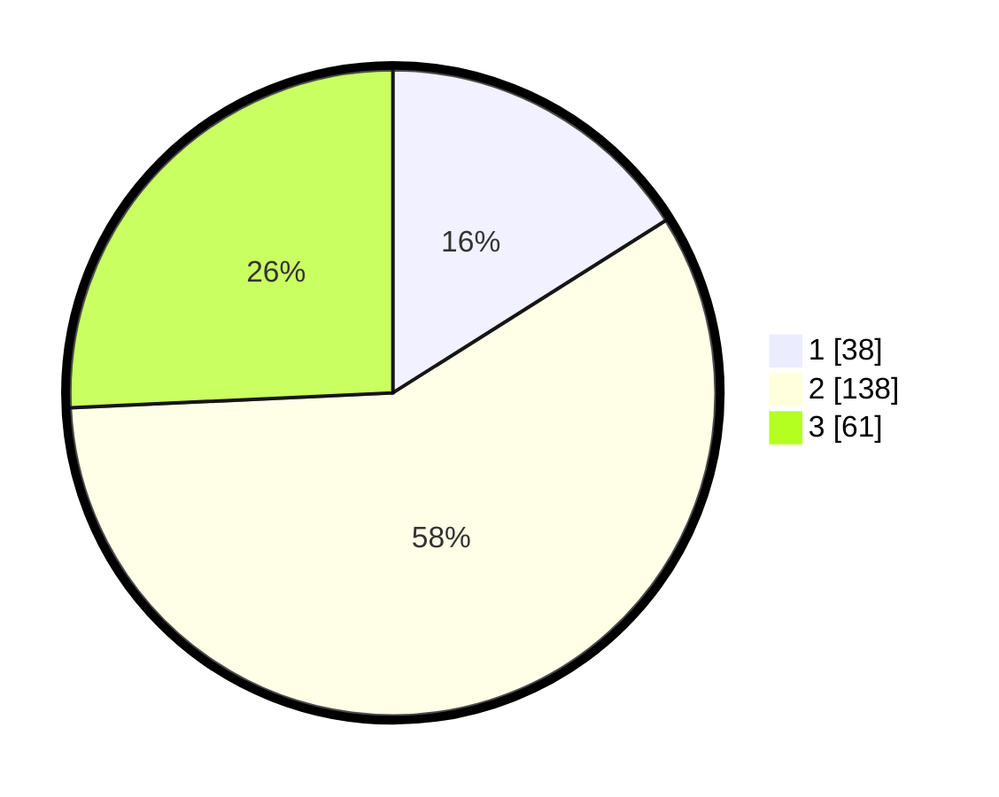

# Hasil

## Grafik

## Tabel

| No. | Nama Paslon    | Suara | Suara (raw) | Persentase |
|:--- |:-------------- | -----:| -----------:| ----------:|
| 1   | ANIES MUHAIMIN | 38    | [38][p-1]   | 16,03      |
| 2   | PRABOWO GIBRAN | 138   | [138][p-2]  | 58,23      |
| 3   | GANJAR MAHFUD  | 61    | [61][p-3]   | 25,74      |

[p-1]: https://github.com/gigit-pemilu/pemilu-2024-35-jawa-timur/blob/main/pilpres/hitung-suara/sub/35-jawa-timur/sub/02-ponorogo/sub/17-ponorogo/sub/1016-cokromenggalan/sub/007-tps/sub/paslon-1.txt
[p-2]: https://github.com/gigit-pemilu/pemilu-2024-35-jawa-timur/blob/main/pilpres/hitung-suara/sub/35-jawa-timur/sub/02-ponorogo/sub/17-ponorogo/sub/1016-cokromenggalan/sub/007-tps/sub/paslon-2.txt
[p-3]: https://github.com/gigit-pemilu/pemilu-2024-35-jawa-timur/blob/main/pilpres/hitung-suara/sub/35-jawa-timur/sub/02-ponorogo/sub/17-ponorogo/sub/1016-cokromenggalan/sub/007-tps/sub/paslon-3.txt

## Foto C Plano

https://sirekap-obj-formc.kpu.go.id/eb6e/pemilu/ppwp/35/02/17/10/16/3502171016007-20240214-195300--e811bb53-efa4-4929-a260-01d0baba70f0.jpg

https://sirekap-obj-formc.kpu.go.id/eb6e/pemilu/ppwp/35/02/17/10/16/3502171016007-20240214-195702--198e247f-34bd-4fb9-beea-6979c5716421.jpg

https://sirekap-obj-formc.kpu.go.id/eb6e/pemilu/ppwp/35/02/17/10/16/3502171016007-20240214-212428--a3857bbe-c630-4456-889a-4c847d5cf7b9.jpg

## Metadata

| Key        | Value               |
| ---------- | ------------------- |
| Time Stamp | 2024-02-15 02:10:27 |

