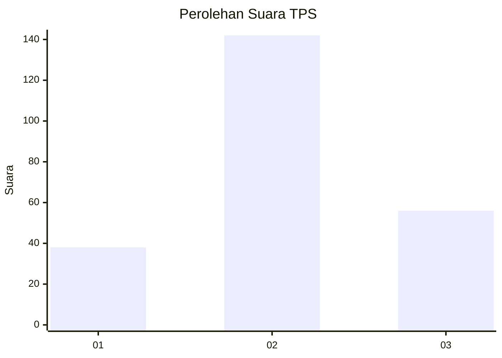
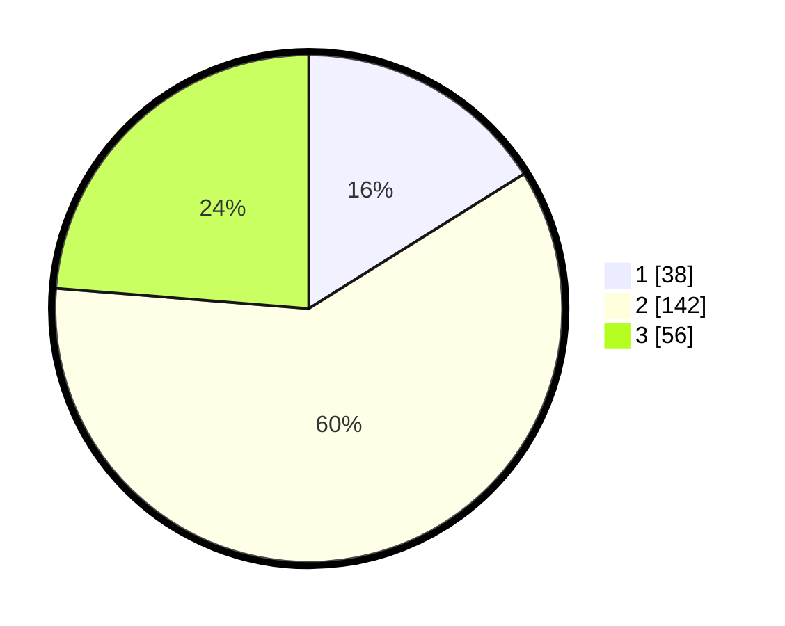

# Hasil

## Grafik

## Tabel

| No. | Nama Paslon    | Suara | Suara (raw) | Persentase |
|:--- |:-------------- | -----:| -----------:| ----------:|
| 1   | ANIES MUHAIMIN | 38    | [38][p-1]   | 16,10      |
| 2   | PRABOWO GIBRAN | 142   | [142][p-2]  | 60,17      |
| 3   | GANJAR MAHFUD  | 56    | [56][p-3]   | 23,73      |

[p-1]: https://github.com/gigit-pemilu/pemilu-2024/blob/main/pilpres/hitung-suara/sub/35-jawa-timur/sub/02-ponorogo/sub/18-jenangan/sub/1002-singosaren/sub/002-tps/sub/paslon-1.txt
[p-2]: https://github.com/gigit-pemilu/pemilu-2024/blob/main/pilpres/hitung-suara/sub/35-jawa-timur/sub/02-ponorogo/sub/18-jenangan/sub/1002-singosaren/sub/002-tps/sub/paslon-2.txt
[p-3]: https://github.com/gigit-pemilu/pemilu-2024/blob/main/pilpres/hitung-suara/sub/35-jawa-timur/sub/02-ponorogo/sub/18-jenangan/sub/1002-singosaren/sub/002-tps/sub/paslon-3.txt

## Foto C Plano

https://sirekap-obj-formc.kpu.go.id/b9af/pemilu/ppwp/35/02/18/10/02/3502181002002-20240217-091514--9cc79c36-2fd5-498d-aab1-f3b2c646b6fc.jpg

https://sirekap-obj-formc.kpu.go.id/b9af/pemilu/ppwp/35/02/18/10/02/3502181002002-20240217-091515--7901a23f-1faa-4a6c-aa16-14f8821b1415.jpg

https://sirekap-obj-formc.kpu.go.id/b9af/pemilu/ppwp/35/02/18/10/02/3502181002002-20240217-091514--84e5c48d-32e8-4d4d-b7fa-6dc90ff1774b.jpg

## Metadata

| Key        | Value               |
| ---------- | ------------------- |
| Time Stamp | 2024-02-17 09:30:03 |

## DATA PEMILIH TETAP

Jumlah pemilih dalam DPT: **293**.
 * L: **140**.
 * P: **153**.

## DATA PENGGUNA HAK PILIH

Jumlah pengguna hak pilih dalam DPT: **244**.
 * L: **114**.
 * P: **130**.

Jumlah pengguna hak pilih dalam DPTb: **1**.
 * L: **1**.
 * P: **0**.

Jumlah pengguna hak pilih dalam DPK: **0**.
 * L: **0**.
 * P: **0**.

Jumlah pengguna hak pilih: **245**.
 * L: **115**.
 * P: **130**.

## JUMLAH SUARA SAH DAN TIDAK SAH

JUMLAH SELURUH SUARA SAH: **236**.

JUMLAH SUARA TIDAK SAH: **9**.

JUMLAH SELURUH SUARA SAH DAN SUARA TIDAK SAH: **245**.

