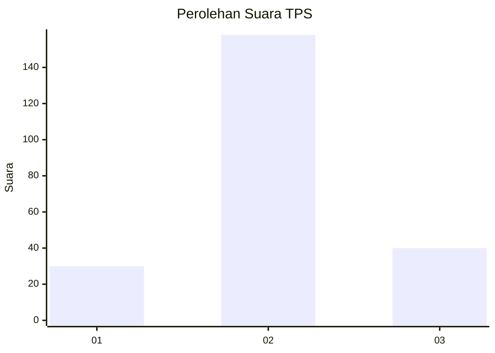
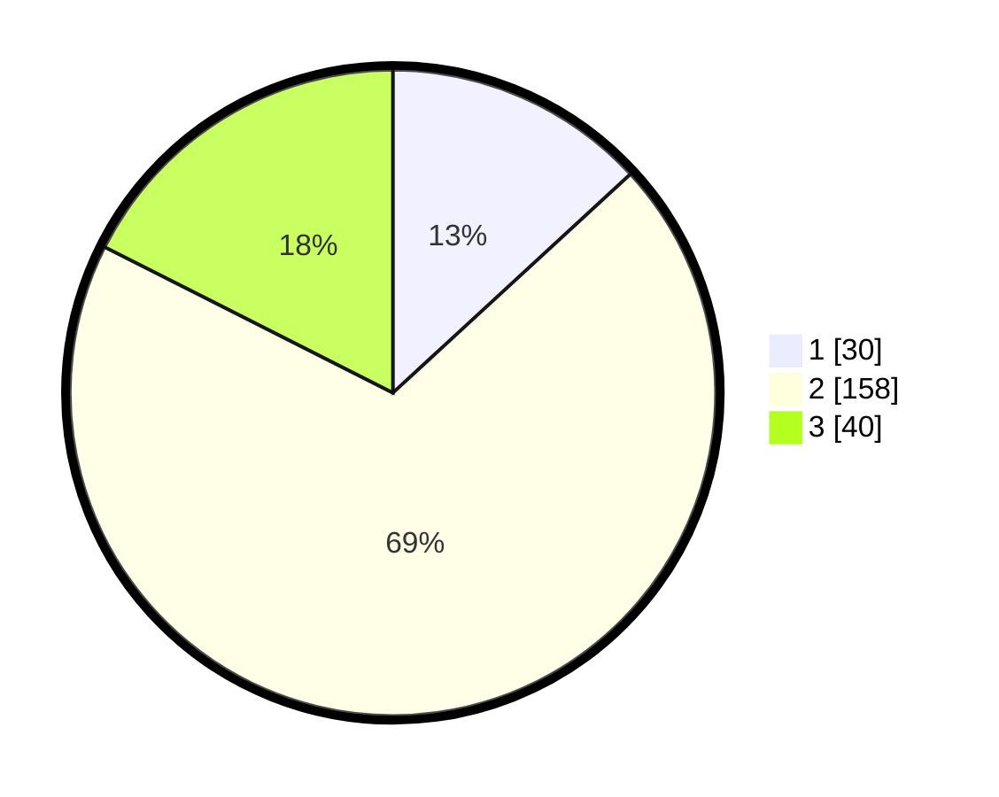

# Hasil

## Grafik

## Tabel

| No. | Nama Paslon    | Suara | Suara (raw) | Persentase |
|:--- |:-------------- | -----:| -----------:| ----------:|
| 1   | ANIES MUHAIMIN | 30    | [30][p-1]   | 13,16      |
| 2   | PRABOWO GIBRAN | 158   | [158][p-2]  | 69,30      |
| 3   | GANJAR MAHFUD  | 40    | [40][p-3]   | 17,54      |

[p-1]: https://github.com/gigit-pemilu/pemilu-2024/blob/main/pilpres/hitung-suara/sub/35-jawa-timur/sub/02-ponorogo/sub/18-jenangan/sub/2003-mrican/sub/002-tps/sub/paslon-1.txt
[p-2]: https://github.com/gigit-pemilu/pemilu-2024/blob/main/pilpres/hitung-suara/sub/35-jawa-timur/sub/02-ponorogo/sub/18-jenangan/sub/2003-mrican/sub/002-tps/sub/paslon-2.txt
[p-3]: https://github.com/gigit-pemilu/pemilu-2024/blob/main/pilpres/hitung-suara/sub/35-jawa-timur/sub/02-ponorogo/sub/18-jenangan/sub/2003-mrican/sub/002-tps/sub/paslon-3.txt

## Foto C Plano

https://sirekap-obj-formc.kpu.go.id/ce87/pemilu/ppwp/35/02/18/20/03/3502182003002-20240221-084922--2f70d48e-b0fa-4f76-b322-21f634b4f126.jpg

https://sirekap-obj-formc.kpu.go.id/ce87/pemilu/ppwp/35/02/18/20/03/3502182003002-20240221-085023--44c34441-4d26-48b2-90dc-2ccbfe46bae3.jpg

## Metadata

| Key        | Value               |
| ---------- | ------------------- |
| Time Stamp | 2024-02-21 17:00:00 |

