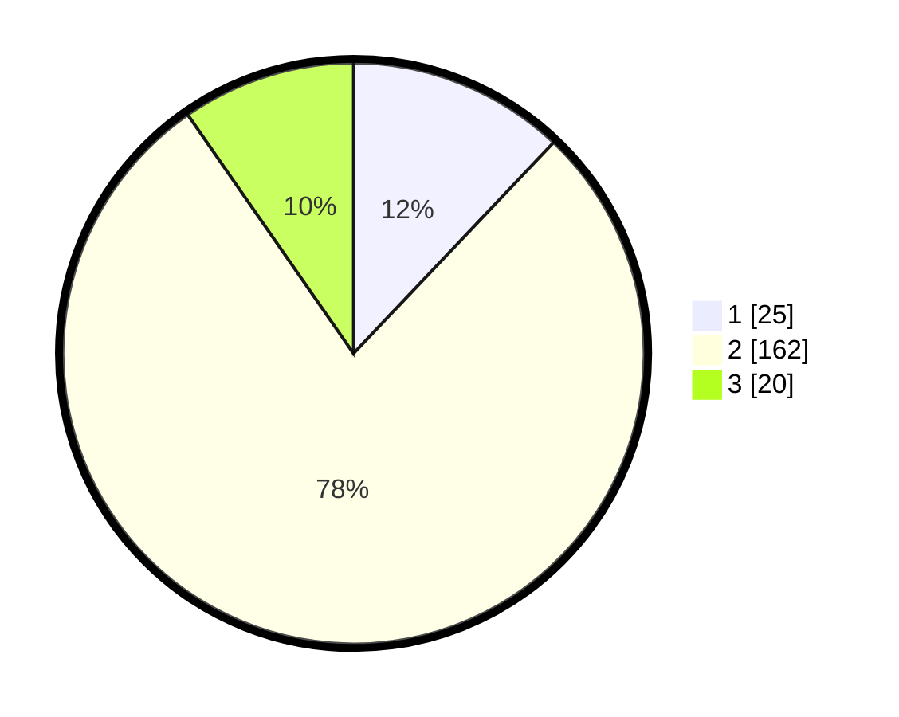

# Hasil

## Grafik

## Tabel

| No. | Nama Paslon    | Suara | Suara (raw) | Persentase |
|:--- |:-------------- | -----:| -----------:| ----------:|
| 1   | ANIES MUHAIMIN | 25    | [25][p-1]   | 12,08      |
| 2   | PRABOWO GIBRAN | 162   | [162][p-2]  | 78,26      |
| 3   | GANJAR MAHFUD  | 20    | [20][p-3]   | 9,66       |

[p-1]: https://github.com/gigit-pemilu/pemilu-2024/blob/main/pilpres/hitung-suara/sub/35-jawa-timur/sub/02-ponorogo/sub/18-jenangan/sub/2009-pintu/sub/006-tps/sub/paslon-1.txt
[p-2]: https://github.com/gigit-pemilu/pemilu-2024/blob/main/pilpres/hitung-suara/sub/35-jawa-timur/sub/02-ponorogo/sub/18-jenangan/sub/2009-pintu/sub/006-tps/sub/paslon-2.txt
[p-3]: https://github.com/gigit-pemilu/pemilu-2024/blob/main/pilpres/hitung-suara/sub/35-jawa-timur/sub/02-ponorogo/sub/18-jenangan/sub/2009-pintu/sub/006-tps/sub/paslon-3.txt

## Foto C Plano

https://sirekap-obj-formc.kpu.go.id/7438/pemilu/ppwp/35/02/18/20/09/3502182009006-20240214-190851--c1c7d466-fcb9-401d-968c-26340da16d1a.jpg

https://sirekap-obj-formc.kpu.go.id/7438/pemilu/ppwp/35/02/18/20/09/3502182009006-20240214-204544--3d822b91-f95c-488c-b1d0-dfc94a69d4e5.jpg

## Metadata

| Key        | Value               |
| ---------- | ------------------- |
| Time Stamp | 2024-02-25 14:00:00 |

