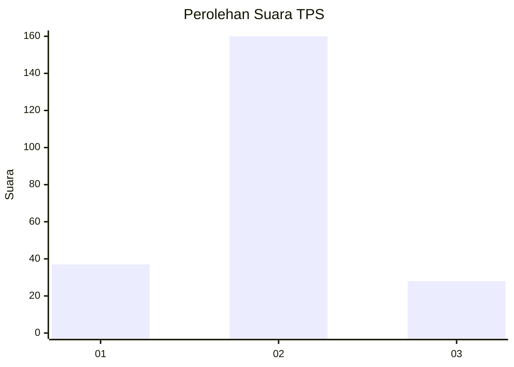
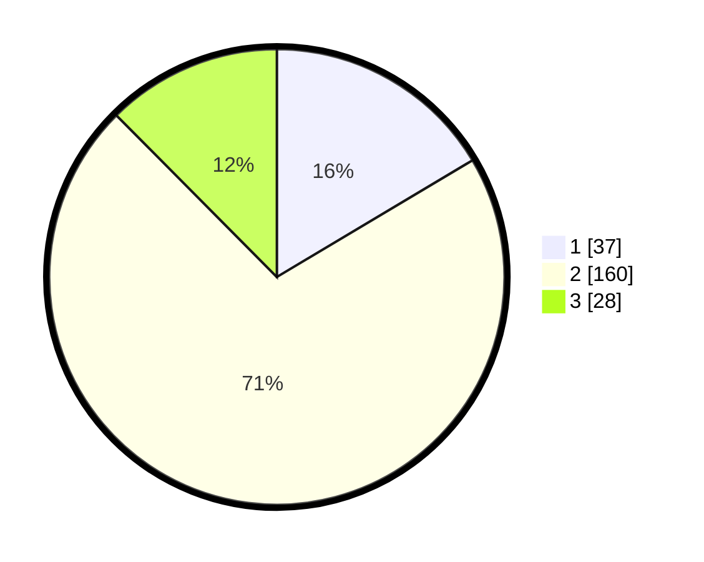

# Hasil

## Grafik

## Tabel

| No. | Nama Paslon    | Suara | Suara (raw) | Persentase |
|:--- |:-------------- | -----:| -----------:| ----------:|
| 1   | ANIES MUHAIMIN | 37    | [37][p-1]   | 16,44      |
| 2   | PRABOWO GIBRAN | 160   | [160][p-2]  | 71,11      |
| 3   | GANJAR MAHFUD  | 28    | [28][p-3]   | 12,44      |

[p-1]: https://github.com/gigit-pemilu/pemilu-2024-35-jawa-timur/blob/main/pilpres/hitung-suara/sub/35-jawa-timur/sub/02-ponorogo/sub/18-jenangan/sub/2010-sedah/sub/002-tps/sub/paslon-1.txt
[p-2]: https://github.com/gigit-pemilu/pemilu-2024-35-jawa-timur/blob/main/pilpres/hitung-suara/sub/35-jawa-timur/sub/02-ponorogo/sub/18-jenangan/sub/2010-sedah/sub/002-tps/sub/paslon-2.txt
[p-3]: https://github.com/gigit-pemilu/pemilu-2024-35-jawa-timur/blob/main/pilpres/hitung-suara/sub/35-jawa-timur/sub/02-ponorogo/sub/18-jenangan/sub/2010-sedah/sub/002-tps/sub/paslon-3.txt

## Foto C Plano

https://sirekap-obj-formc.kpu.go.id/acd2/pemilu/ppwp/35/02/18/20/10/3502182010002-20240219-212633--91a77b87-812c-4192-9a45-11d624e306ee.jpg

https://sirekap-obj-formc.kpu.go.id/acd2/pemilu/ppwp/35/02/18/20/10/3502182010002-20240219-212730--80145ed8-a3a7-4e98-a288-242cc1bc4960.jpg

https://sirekap-obj-formc.kpu.go.id/acd2/pemilu/ppwp/35/02/18/20/10/3502182010002-20240219-212822--e2bba049-6eea-4cdf-86b8-827fc51caa96.jpg

## Metadata

| Key        | Value               |
| ---------- | ------------------- |
| Time Stamp | 2024-02-20 16:00:00 |

