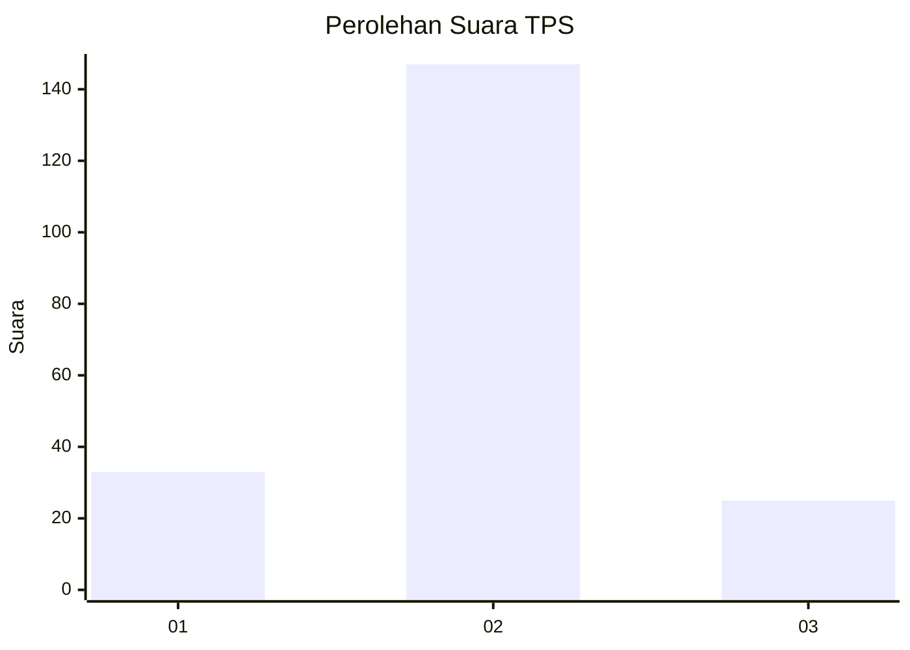
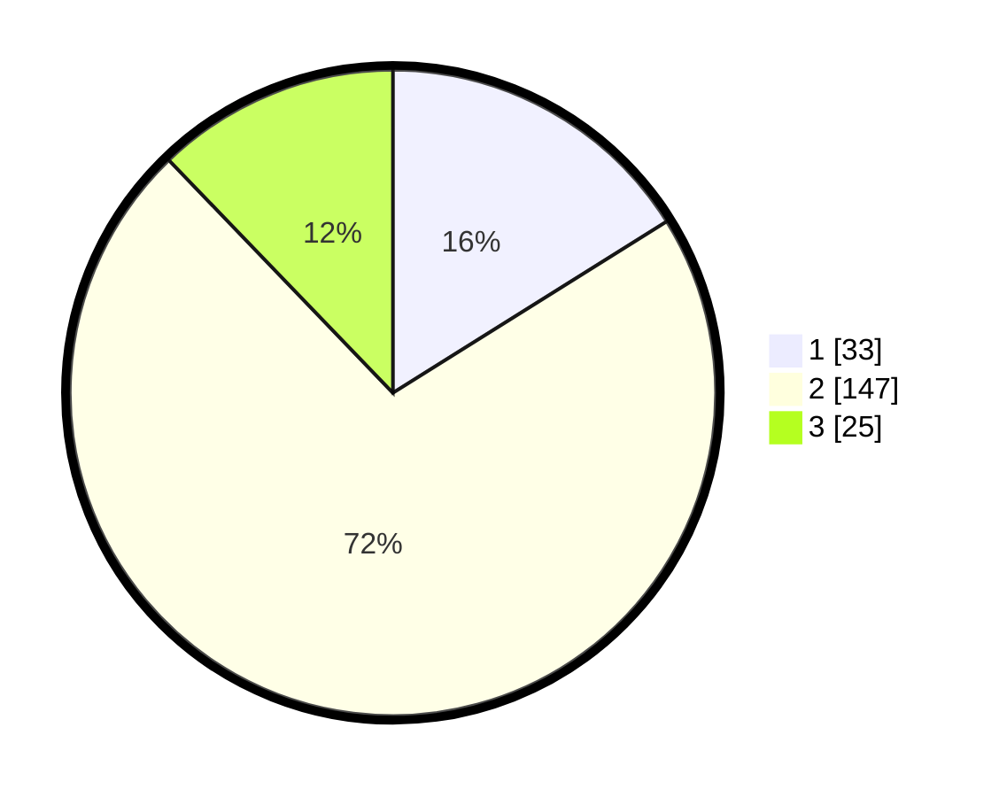

# Hasil

## Grafik

## Tabel

| No. | Nama Paslon    | Suara | Suara (raw) | Persentase |
|:--- |:-------------- | -----:| -----------:| ----------:|
| 1   | ANIES MUHAIMIN | 33    | [33][p-1]   | 16,10      |
| 2   | PRABOWO GIBRAN | 147   | [147][p-2]  | 71,71      |
| 3   | GANJAR MAHFUD  | 25    | [25][p-3]   | 12,20      |

[p-1]: https://github.com/gigit-pemilu/pemilu-2024-35-jawa-timur/blob/main/pilpres/hitung-suara/sub/35-jawa-timur/sub/02-ponorogo/sub/18-jenangan/sub/2010-sedah/sub/003-tps/sub/paslon-1.txt
[p-2]: https://github.com/gigit-pemilu/pemilu-2024-35-jawa-timur/blob/main/pilpres/hitung-suara/sub/35-jawa-timur/sub/02-ponorogo/sub/18-jenangan/sub/2010-sedah/sub/003-tps/sub/paslon-2.txt
[p-3]: https://github.com/gigit-pemilu/pemilu-2024-35-jawa-timur/blob/main/pilpres/hitung-suara/sub/35-jawa-timur/sub/02-ponorogo/sub/18-jenangan/sub/2010-sedah/sub/003-tps/sub/paslon-3.txt

## Foto C Plano

https://sirekap-obj-formc.kpu.go.id/294d/pemilu/ppwp/35/02/18/20/10/3502182010003-20240214-194618--18246a16-2e39-4367-9e2e-7a85367f173e.jpg

https://sirekap-obj-formc.kpu.go.id/294d/pemilu/ppwp/35/02/18/20/10/3502182010003-20240214-194647--916a557a-215f-4732-ad92-45aa19d5cc7c.jpg

https://sirekap-obj-formc.kpu.go.id/294d/pemilu/ppwp/35/02/18/20/10/3502182010003-20240214-194726--eab9a8bf-831b-4c4e-8650-951e28d9d668.jpg

## Metadata

| Key        | Value               |
| ---------- | ------------------- |
| Time Stamp | 2024-02-15 12:00:28 |

