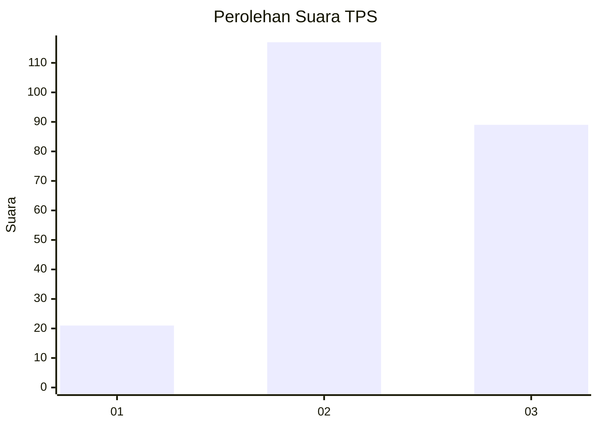
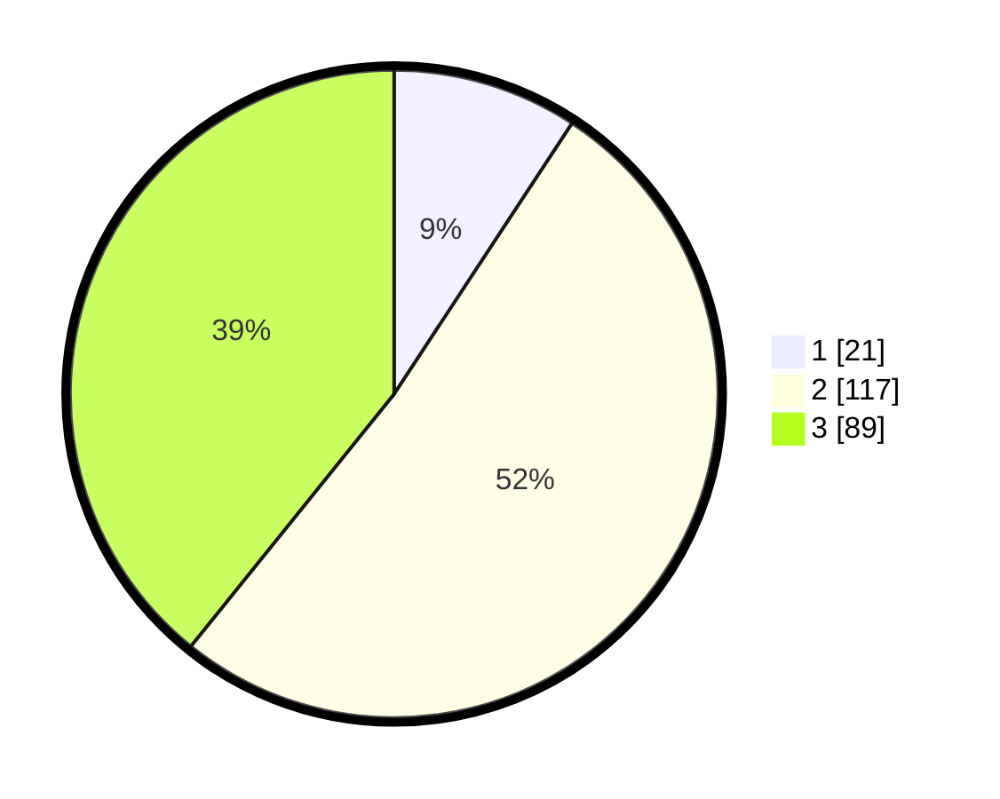

# Hasil

## Grafik

## Tabel

| No. | Nama Paslon    | Suara | Suara (raw) | Persentase |
|:--- |:-------------- | -----:| -----------:| ----------:|
| 1   | ANIES MUHAIMIN | 21    | [21][p-1]   | 9,25       |
| 2   | PRABOWO GIBRAN | 117   | [117][p-2]  | 51,54      |
| 3   | GANJAR MAHFUD  | 89    | [89][p-3]   | 39,21      |

[p-1]: https://github.com/gigit-pemilu/pemilu-2024/blob/main/pilpres/hitung-suara/sub/35-jawa-timur/sub/02-ponorogo/sub/18-jenangan/sub/2014-tanjungsari/sub/003-tps/sub/paslon-1.txt
[p-2]: https://github.com/gigit-pemilu/pemilu-2024/blob/main/pilpres/hitung-suara/sub/35-jawa-timur/sub/02-ponorogo/sub/18-jenangan/sub/2014-tanjungsari/sub/003-tps/sub/paslon-2.txt
[p-3]: https://github.com/gigit-pemilu/pemilu-2024/blob/main/pilpres/hitung-suara/sub/35-jawa-timur/sub/02-ponorogo/sub/18-jenangan/sub/2014-tanjungsari/sub/003-tps/sub/paslon-3.txt

## Foto C Plano

https://sirekap-obj-formc.kpu.go.id/dea2/pemilu/ppwp/35/02/18/20/14/3502182014003-20240214-195112--62ab43c9-38c4-4788-8175-cb55417c828b.jpg

https://sirekap-obj-formc.kpu.go.id/dea2/pemilu/ppwp/35/02/18/20/14/3502182014003-20240214-230443--5fd8dd07-c144-4f8b-96c9-e3a7e7b66aa5.jpg

## Metadata

| Key        | Value               |
| ---------- | ------------------- |
| Time Stamp | 2024-02-17 11:30:03 |

