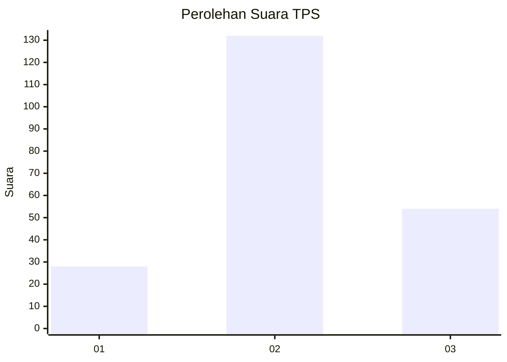
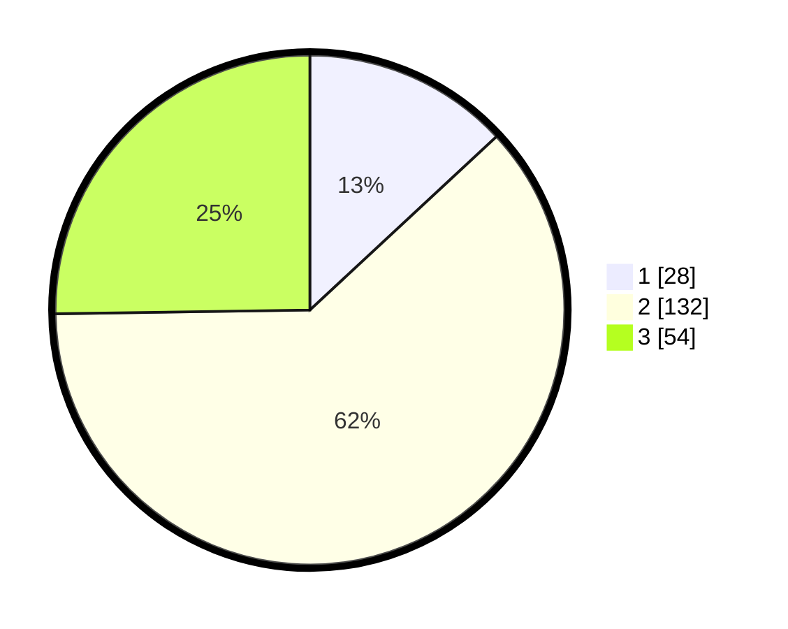

# Hasil

## Grafik

## Tabel

| No. | Nama Paslon    | Suara | Suara (raw) | Persentase |
|:--- |:-------------- | -----:| -----------:| ----------:|
| 1   | ANIES MUHAIMIN | 28    | [28][p-1]   | 13,08      |
| 2   | PRABOWO GIBRAN | 132   | [132][p-2]  | 61,68      |
| 3   | GANJAR MAHFUD  | 54    | [54][p-3]   | 25,23      |

[p-1]: https://github.com/gigit-pemilu/pemilu-2024-35-jawa-timur/blob/main/pilpres/hitung-suara/sub/35-jawa-timur/sub/02-ponorogo/sub/18-jenangan/sub/2014-tanjungsari/sub/005-tps/sub/paslon-1.txt
[p-2]: https://github.com/gigit-pemilu/pemilu-2024-35-jawa-timur/blob/main/pilpres/hitung-suara/sub/35-jawa-timur/sub/02-ponorogo/sub/18-jenangan/sub/2014-tanjungsari/sub/005-tps/sub/paslon-2.txt
[p-3]: https://github.com/gigit-pemilu/pemilu-2024-35-jawa-timur/blob/main/pilpres/hitung-suara/sub/35-jawa-timur/sub/02-ponorogo/sub/18-jenangan/sub/2014-tanjungsari/sub/005-tps/sub/paslon-3.txt

## Foto C Plano

https://sirekap-obj-formc.kpu.go.id/8a06/pemilu/ppwp/35/02/18/20/14/3502182014005-20240218-131421--28a99438-638f-45eb-a78e-4f2d4bd47803.jpg

https://sirekap-obj-formc.kpu.go.id/8a06/pemilu/ppwp/35/02/18/20/14/3502182014005-20240218-143520--1a6716fc-5b2b-4b13-880f-bf46826cc351.jpg

https://sirekap-obj-formc.kpu.go.id/8a06/pemilu/ppwp/35/02/18/20/14/3502182014005-20240218-143630--65566241-5c24-4eea-a848-86d230c5af8a.jpg

## Metadata

| Key        | Value               |
| ---------- | ------------------- |
| Time Stamp | 2024-02-19 06:16:00 |

