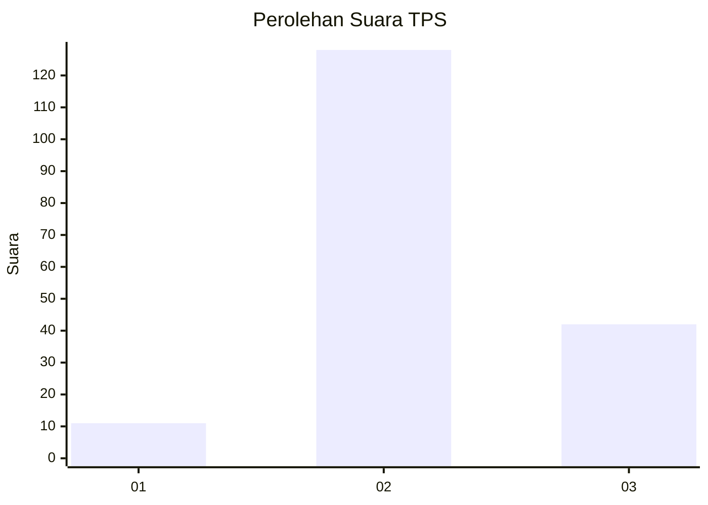
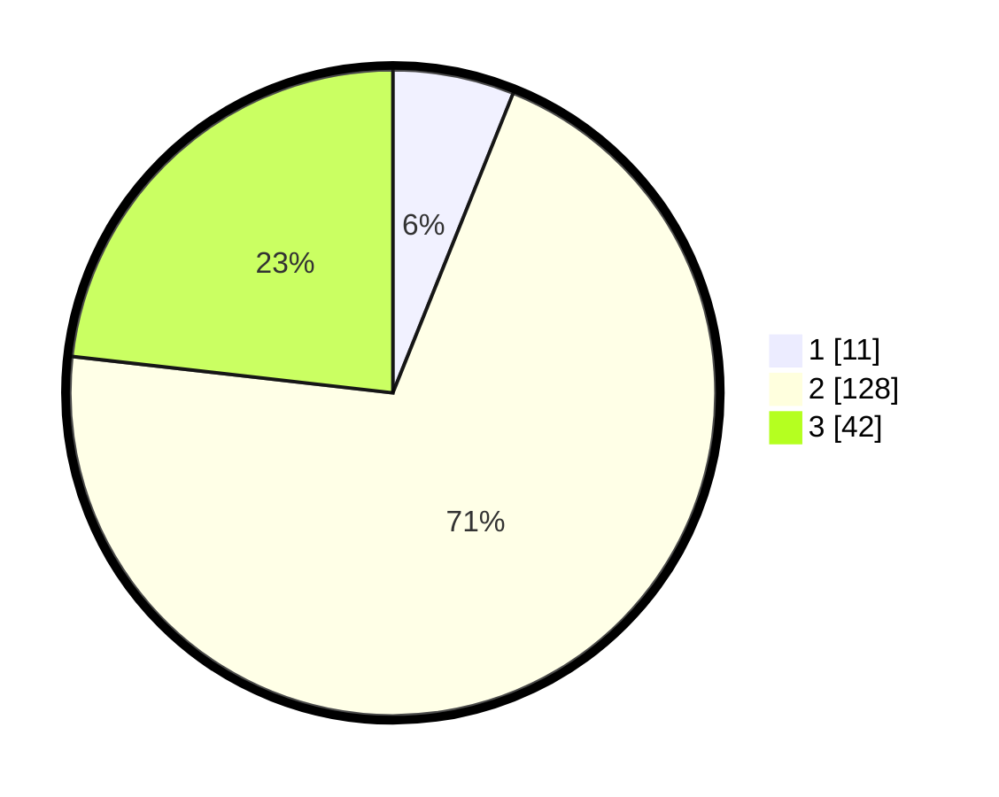

# Hasil

## Grafik

## Tabel

| No. | Nama Paslon    | Suara | Suara (raw) | Persentase |
|:--- |:-------------- | -----:| -----------:| ----------:|
| 1   | ANIES MUHAIMIN | 11    | [11][p-1]   | 6,08       |
| 2   | PRABOWO GIBRAN | 128   | [128][p-2]  | 70,72      |
| 3   | GANJAR MAHFUD  | 42    | [42][p-3]   | 23,20      |

[p-1]: https://github.com/gigit-pemilu/pemilu-2024-35-jawa-timur/blob/main/pilpres/hitung-suara/sub/35-jawa-timur/sub/02-ponorogo/sub/19-ngebel/sub/2001-ngrogung/sub/001-tps/sub/paslon-1.txt
[p-2]: https://github.com/gigit-pemilu/pemilu-2024-35-jawa-timur/blob/main/pilpres/hitung-suara/sub/35-jawa-timur/sub/02-ponorogo/sub/19-ngebel/sub/2001-ngrogung/sub/001-tps/sub/paslon-2.txt
[p-3]: https://github.com/gigit-pemilu/pemilu-2024-35-jawa-timur/blob/main/pilpres/hitung-suara/sub/35-jawa-timur/sub/02-ponorogo/sub/19-ngebel/sub/2001-ngrogung/sub/001-tps/sub/paslon-3.txt

## Foto C Plano

https://sirekap-obj-formc.kpu.go.id/4f0a/pemilu/ppwp/35/02/19/20/01/3502192001001-20240214-185555--c69ac69f-1148-4bdc-8532-16ea32cf28a0.jpg

https://sirekap-obj-formc.kpu.go.id/4f0a/pemilu/ppwp/35/02/19/20/01/3502192001001-20240216-135747--3d1ab8d7-7999-4ede-9882-23ce8235aab8.jpg

https://sirekap-obj-formc.kpu.go.id/4f0a/pemilu/ppwp/35/02/19/20/01/3502192001001-20240214-185743--b6e8a8dc-018d-4ce8-95c5-264c4f793a45.jpg

## Metadata

| Key        | Value               |
| ---------- | ------------------- |
| Time Stamp | 2024-02-16 14:30:33 |

## DATA PEMILIH TETAP

Jumlah pemilih dalam DPT: **232**.
 * L: **124**.
 * P: **108**.

## DATA PENGGUNA HAK PILIH

Jumlah pengguna hak pilih dalam DPT: **185**.
 * L: **99**.
 * P: **86**.

Jumlah pengguna hak pilih dalam DPTb: **0**.
 * L: **0**.
 * P: **0**.

Jumlah pengguna hak pilih dalam DPK: **0**.
 * L: **0**.
 * P: **0**.

Jumlah pengguna hak pilih: **185**.
 * L: **99**.
 * P: **86**.

## JUMLAH SUARA SAH DAN TIDAK SAH

JUMLAH SELURUH SUARA SAH: **181**.

JUMLAH SUARA TIDAK SAH: **4**.

JUMLAH SELURUH SUARA SAH DAN SUARA TIDAK SAH: **185**.

