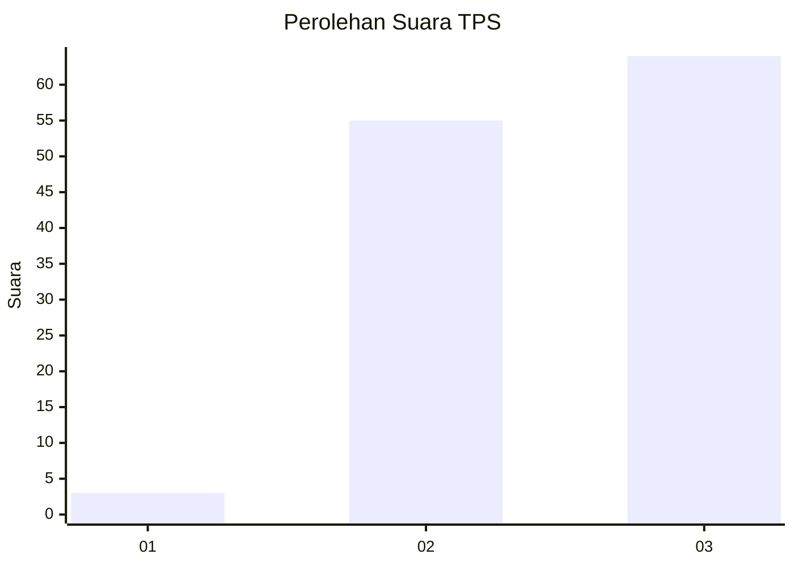
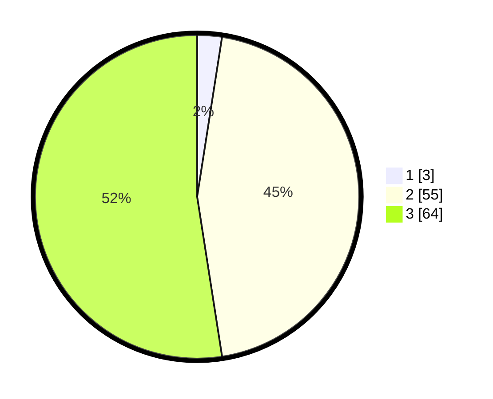

# Hasil

## Grafik

## Tabel

| No. | Nama Paslon    | Suara | Suara (raw) | Persentase |
|:--- |:-------------- | -----:| -----------:| ----------:|
| 1   | ANIES MUHAIMIN | 3     | [3][p-1]    | 2,46       |
| 2   | PRABOWO GIBRAN | 55    | [55][p-2]   | 45,08      |
| 3   | GANJAR MAHFUD  | 64    | [64][p-3]   | 52,46      |

[p-1]: https://github.com/gigit-pemilu/pemilu-2024-35-jawa-timur/blob/main/pilpres/hitung-suara/sub/35-jawa-timur/sub/02-ponorogo/sub/19-ngebel/sub/2001-ngrogung/sub/005-tps/sub/paslon-1.txt
[p-2]: https://github.com/gigit-pemilu/pemilu-2024-35-jawa-timur/blob/main/pilpres/hitung-suara/sub/35-jawa-timur/sub/02-ponorogo/sub/19-ngebel/sub/2001-ngrogung/sub/005-tps/sub/paslon-2.txt
[p-3]: https://github.com/gigit-pemilu/pemilu-2024-35-jawa-timur/blob/main/pilpres/hitung-suara/sub/35-jawa-timur/sub/02-ponorogo/sub/19-ngebel/sub/2001-ngrogung/sub/005-tps/sub/paslon-3.txt

## Foto C Plano

https://sirekap-obj-formc.kpu.go.id/46ac/pemilu/ppwp/35/02/19/20/01/3502192001005-20240217-135219--dad5844f-e8a9-494c-b2d6-5c8e2704121e.jpg

https://sirekap-obj-formc.kpu.go.id/46ac/pemilu/ppwp/35/02/19/20/01/3502192001005-20240217-144511--93c4c0a5-5fbf-40e9-925b-c935d70298c2.jpg

https://sirekap-obj-formc.kpu.go.id/46ac/pemilu/ppwp/35/02/19/20/01/3502192001005-20240217-194042--b4ac494a-ebc0-4c1a-88c5-5ecbeac574aa.jpg

## Metadata

| Key        | Value               |
| ---------- | ------------------- |
| Time Stamp | 2024-02-19 06:16:00 |

## DATA PEMILIH TETAP

Jumlah pemilih dalam DPT: **153**.
 * L: **74**.
 * P: **79**.

## DATA PENGGUNA HAK PILIH

Jumlah pengguna hak pilih dalam DPT: **131**.
 * L: **69**.
 * P: **62**.

Jumlah pengguna hak pilih dalam DPTb: **1**.
 * L: **1**.
 * P: **0**.

Jumlah pengguna hak pilih dalam DPK: **0**.
 * L: **0**.
 * P: **0**.

Jumlah pengguna hak pilih: **132**.
 * L: **70**.
 * P: **62**.

## JUMLAH SUARA SAH DAN TIDAK SAH

JUMLAH SELURUH SUARA SAH: **122**.

JUMLAH SUARA TIDAK SAH: **10**.

JUMLAH SELURUH SUARA SAH DAN SUARA TIDAK SAH: **132**.

