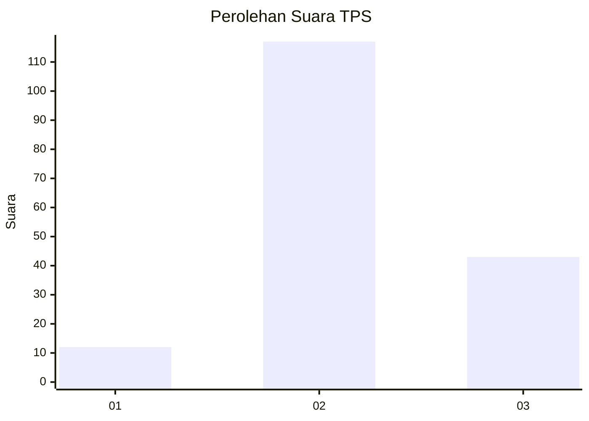
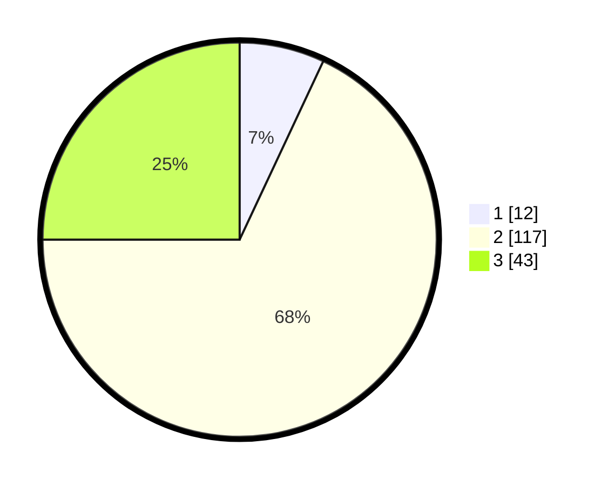

# Hasil

## Grafik

## Tabel

| No. | Nama Paslon    | Suara | Suara (raw) | Persentase |
|:--- |:-------------- | -----:| -----------:| ----------:|
| 1   | ANIES MUHAIMIN | 12    | [12][p-1]   | 6,98       |
| 2   | PRABOWO GIBRAN | 117   | [117][p-2]  | 68,02      |
| 3   | GANJAR MAHFUD  | 43    | [43][p-3]   | 25,00      |

[p-1]: https://github.com/gigit-pemilu/pemilu-2024-35-jawa-timur/blob/main/pilpres/hitung-suara/sub/35-jawa-timur/sub/02-ponorogo/sub/19-ngebel/sub/2008-sempu/sub/005-tps/sub/paslon-1.txt
[p-2]: https://github.com/gigit-pemilu/pemilu-2024-35-jawa-timur/blob/main/pilpres/hitung-suara/sub/35-jawa-timur/sub/02-ponorogo/sub/19-ngebel/sub/2008-sempu/sub/005-tps/sub/paslon-2.txt
[p-3]: https://github.com/gigit-pemilu/pemilu-2024-35-jawa-timur/blob/main/pilpres/hitung-suara/sub/35-jawa-timur/sub/02-ponorogo/sub/19-ngebel/sub/2008-sempu/sub/005-tps/sub/paslon-3.txt

## Foto C Plano

https://sirekap-obj-formc.kpu.go.id/cbcd/pemilu/ppwp/35/02/19/20/08/3502192008005-20240219-161455--130343aa-2566-4e78-a12a-01d36e730f0e.jpg

https://sirekap-obj-formc.kpu.go.id/cbcd/pemilu/ppwp/35/02/19/20/08/3502192008005-20240215-083545--345edd08-3d27-45bf-b8c4-b15360a8b3a7.jpg

https://sirekap-obj-formc.kpu.go.id/cbcd/pemilu/ppwp/35/02/19/20/08/3502192008005-20240215-083554--6bc1f765-a105-4efd-9c97-fe22f409c7f3.jpg

## Metadata

| Key        | Value               |
| ---------- | ------------------- |
| Time Stamp | 2024-02-19 17:00:00 |

