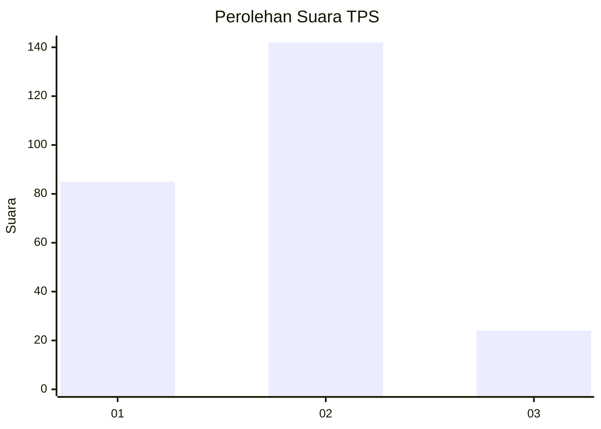
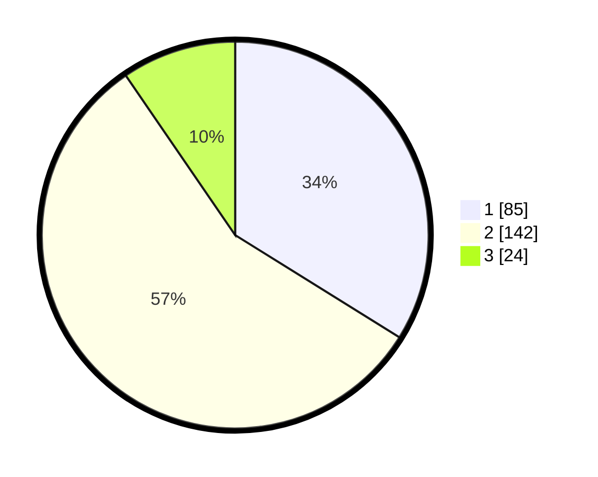

# Hasil

## Grafik

## Tabel

| No. | Nama Paslon    | Suara | Suara (raw) | Persentase |
|:--- |:-------------- | -----:| -----------:| ----------:|
| 1   | ANIES MUHAIMIN | 85    | [85][p-1]   | 33,86      |
| 2   | PRABOWO GIBRAN | 142   | [142][p-2]  | 56,57      |
| 3   | GANJAR MAHFUD  | 24    | [24][p-3]   | 9,56       |

[p-1]: https://github.com/gigit-pemilu/pemilu-2024/blob/main/pilpres/hitung-suara/sub/35-jawa-timur/sub/02-ponorogo/sub/20-jambon/sub/2001-jonggol/sub/002-tps/sub/paslon-1.txt
[p-2]: https://github.com/gigit-pemilu/pemilu-2024/blob/main/pilpres/hitung-suara/sub/35-jawa-timur/sub/02-ponorogo/sub/20-jambon/sub/2001-jonggol/sub/002-tps/sub/paslon-2.txt
[p-3]: https://github.com/gigit-pemilu/pemilu-2024/blob/main/pilpres/hitung-suara/sub/35-jawa-timur/sub/02-ponorogo/sub/20-jambon/sub/2001-jonggol/sub/002-tps/sub/paslon-3.txt

## Foto C Plano

https://sirekap-obj-formc.kpu.go.id/0ac0/pemilu/ppwp/35/02/20/20/01/3502202001002-20240225-134731--f6398049-30b7-4dcb-860f-5b73d85bb770.jpg

https://sirekap-obj-formc.kpu.go.id/0ac0/pemilu/ppwp/35/02/20/20/01/3502202001002-20240225-134809--ae4e5aba-ee81-4081-b549-4e6bb85fa9a9.jpg

https://sirekap-obj-formc.kpu.go.id/0ac0/pemilu/ppwp/35/02/20/20/01/3502202001002-20240225-134922--4583524b-7cf9-4161-a45f-5e0c6d68d9ce.jpg

## Metadata

| Key        | Value               |
| ---------- | ------------------- |
| Time Stamp | 2024-02-25 14:00:00 |

## DATA PEMILIH TETAP

Jumlah pemilih dalam DPT: **251**.
 * L: **132**.
 * P: **119**.

## DATA PENGGUNA HAK PILIH

Jumlah pengguna hak pilih dalam DPT: **201**.
 * L: **105**.
 * P: **96**.

Jumlah pengguna hak pilih dalam DPTb: **0**.
 * L: **0**.
 * P: **0**.

Jumlah pengguna hak pilih dalam DPK: **0**.
 * L: **0**.
 * P: **0**.

Jumlah pengguna hak pilih: **201**.
 * L: **105**.
 * P: **96**.

## JUMLAH SUARA SAH DAN TIDAK SAH

JUMLAH SELURUH SUARA SAH: **891**.

JUMLAH SUARA TIDAK SAH: **10**.

JUMLAH SELURUH SUARA SAH DAN SUARA TIDAK SAH: **260**.

