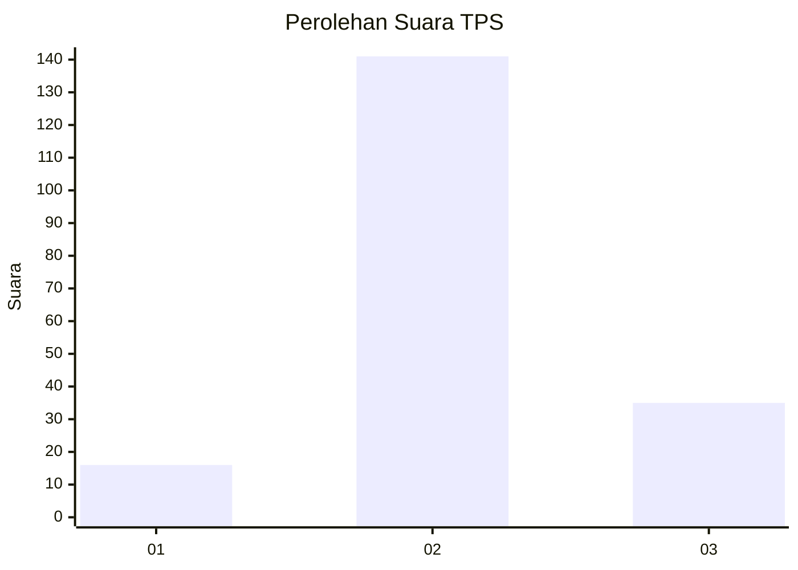

# Hasil

## Grafik

## Tabel

| No. | Nama Paslon    | Suara | Suara (raw) | Persentase |
|:--- |:-------------- | -----:| -----------:| ----------:|
| 1   | ANIES MUHAIMIN | 16    | [16][p-1]   | 8,33       |
| 2   | PRABOWO GIBRAN | 141   | [141][p-2]  | 73,44      |
| 3   | GANJAR MAHFUD  | 35    | [35][p-3]   | 18,23      |

[p-1]: https://github.com/gigit-pemilu/pemilu-2024-35-jawa-timur/blob/main/pilpres/hitung-suara/sub/35-jawa-timur/sub/02-ponorogo/sub/20-jambon/sub/2001-jonggol/sub/008-tps/sub/paslon-1.txt
[p-2]: https://github.com/gigit-pemilu/pemilu-2024-35-jawa-timur/blob/main/pilpres/hitung-suara/sub/35-jawa-timur/sub/02-ponorogo/sub/20-jambon/sub/2001-jonggol/sub/008-tps/sub/paslon-2.txt
[p-3]: https://github.com/gigit-pemilu/pemilu-2024-35-jawa-timur/blob/main/pilpres/hitung-suara/sub/35-jawa-timur/sub/02-ponorogo/sub/20-jambon/sub/2001-jonggol/sub/008-tps/sub/paslon-3.txt

## Foto C Plano

https://sirekap-obj-formc.kpu.go.id/e18a/pemilu/ppwp/35/02/20/20/01/3502202001008-20240226-134752--167352fd-e494-41d3-8623-623a3b539cdc.jpg

https://sirekap-obj-formc.kpu.go.id/e18a/pemilu/ppwp/35/02/20/20/01/3502202001008-20240215-011611--82dae86c-8846-42ff-9ace-06872832242f.jpg

https://sirekap-obj-formc.kpu.go.id/e18a/pemilu/ppwp/35/02/20/20/01/3502202001008-20240215-011807--a578dc62-b3ff-41ea-9e9b-8ce89fd48533.jpg

## Metadata

| Key        | Value               |
| ---------- | ------------------- |
| Time Stamp | 2024-02-26 14:00:00 |

