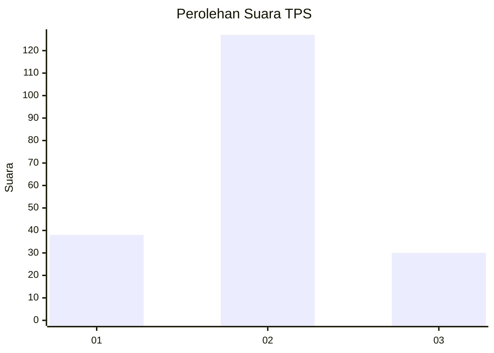
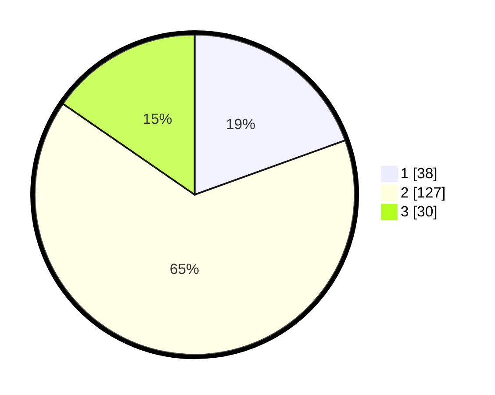

# Hasil

## Grafik

## Tabel

| No. | Nama Paslon    | Suara | Suara (raw) | Persentase |
|:--- |:-------------- | -----:| -----------:| ----------:|
| 1   | ANIES MUHAIMIN | 38    | [38][p-1]   | 19,49      |
| 2   | PRABOWO GIBRAN | 127   | [127][p-2]  | 65,13      |
| 3   | GANJAR MAHFUD  | 30    | [30][p-3]   | 15,38      |

[p-1]: https://github.com/gigit-pemilu/pemilu-2024/blob/main/pilpres/hitung-suara/sub/35-jawa-timur/sub/02-ponorogo/sub/20-jambon/sub/2005-karanglo-kidul/sub/006-tps/sub/paslon-1.txt
[p-2]: https://github.com/gigit-pemilu/pemilu-2024/blob/main/pilpres/hitung-suara/sub/35-jawa-timur/sub/02-ponorogo/sub/20-jambon/sub/2005-karanglo-kidul/sub/006-tps/sub/paslon-2.txt
[p-3]: https://github.com/gigit-pemilu/pemilu-2024/blob/main/pilpres/hitung-suara/sub/35-jawa-timur/sub/02-ponorogo/sub/20-jambon/sub/2005-karanglo-kidul/sub/006-tps/sub/paslon-3.txt

## Foto C Plano

https://sirekap-obj-formc.kpu.go.id/5542/pemilu/ppwp/35/02/20/20/05/3502202005006-20240226-003137--799c1713-690e-43fd-9244-45cde06cf662.jpg

https://sirekap-obj-formc.kpu.go.id/5542/pemilu/ppwp/35/02/20/20/05/3502202005006-20240226-003139--1070fead-7f59-4a6c-b9bb-f38b503a8a59.jpg

https://sirekap-obj-formc.kpu.go.id/5542/pemilu/ppwp/35/02/20/20/05/3502202005006-20240226-003138--a8075c89-c7d6-49a0-9cad-5e18878645f8.jpg

## Metadata

| Key        | Value               |
| ---------- | ------------------- |
| Time Stamp | 2024-02-26 11:00:00 |

## DATA PEMILIH TETAP

Jumlah pemilih dalam DPT: **291**.
 * L: **144**.
 * P: **147**.

## DATA PENGGUNA HAK PILIH

Jumlah pengguna hak pilih dalam DPT: **223**.
 * L: **111**.
 * P: **112**.

Jumlah pengguna hak pilih dalam DPTb: **0**.
 * L: **0**.
 * P: **0**.

Jumlah pengguna hak pilih dalam DPK: **1**.
 * L: **0**.
 * P: **1**.

Jumlah pengguna hak pilih: **224**.
 * L: **111**.
 * P: **113**.

## JUMLAH SUARA SAH DAN TIDAK SAH

JUMLAH SELURUH SUARA SAH: **195**.

JUMLAH SUARA TIDAK SAH: **29**.

JUMLAH SELURUH SUARA SAH DAN SUARA TIDAK SAH: **224**.

