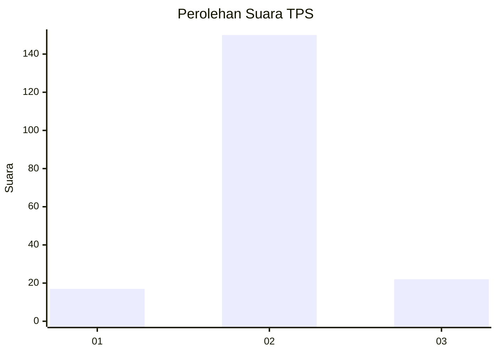
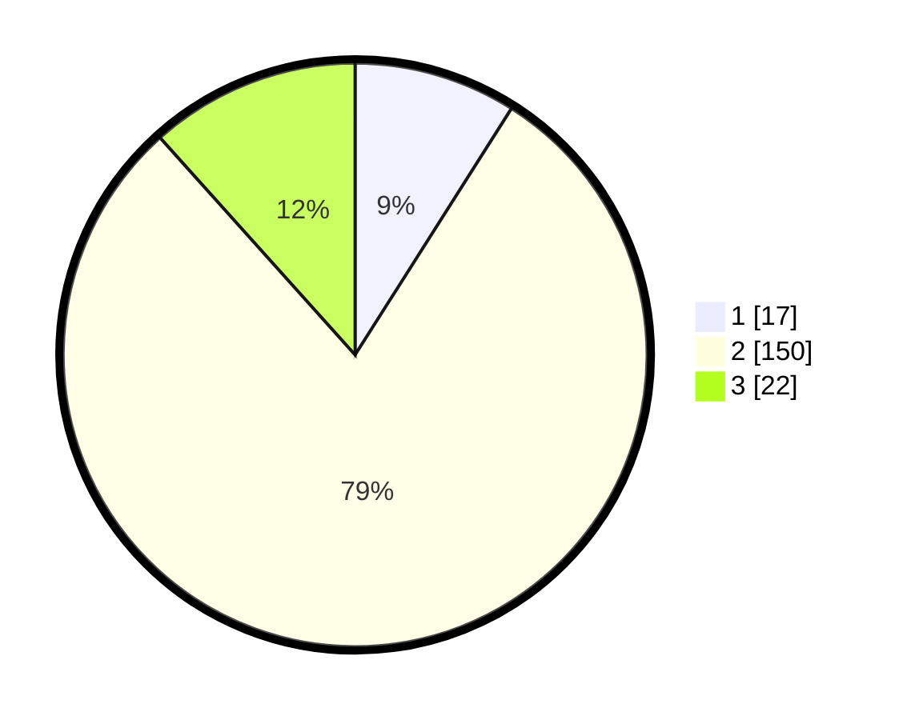

# Hasil

## Grafik

## Tabel

| No. | Nama Paslon    | Suara | Suara (raw) | Persentase |
|:--- |:-------------- | -----:| -----------:| ----------:|
| 1   | ANIES MUHAIMIN | 17    | [17][p-1]   | 8,99       |
| 2   | PRABOWO GIBRAN | 150   | [150][p-2]  | 79,37      |
| 3   | GANJAR MAHFUD  | 22    | [22][p-3]   | 11,64      |

[p-1]: https://github.com/gigit-pemilu/pemilu-2024/blob/main/pilpres/hitung-suara/sub/35-jawa-timur/sub/02-ponorogo/sub/20-jambon/sub/2006-krebet/sub/009-tps/sub/paslon-1.txt
[p-2]: https://github.com/gigit-pemilu/pemilu-2024/blob/main/pilpres/hitung-suara/sub/35-jawa-timur/sub/02-ponorogo/sub/20-jambon/sub/2006-krebet/sub/009-tps/sub/paslon-2.txt
[p-3]: https://github.com/gigit-pemilu/pemilu-2024/blob/main/pilpres/hitung-suara/sub/35-jawa-timur/sub/02-ponorogo/sub/20-jambon/sub/2006-krebet/sub/009-tps/sub/paslon-3.txt

## Foto C Plano

https://sirekap-obj-formc.kpu.go.id/de9b/pemilu/ppwp/35/02/20/20/06/3502202006009-20240226-173221--592fba24-01ce-4896-8927-be8b3a4104f3.jpg

https://sirekap-obj-formc.kpu.go.id/de9b/pemilu/ppwp/35/02/20/20/06/3502202006009-20240215-013051--d65700f2-94fa-45c1-a739-ed4951d1d649.jpg

https://sirekap-obj-formc.kpu.go.id/de9b/pemilu/ppwp/35/02/20/20/06/3502202006009-20240215-013210--570e8812-7595-4aa1-b658-a952b949d12f.jpg

## Metadata

| Key        | Value               |
| ---------- | ------------------- |
| Time Stamp | 2024-02-26 18:00:00 |

