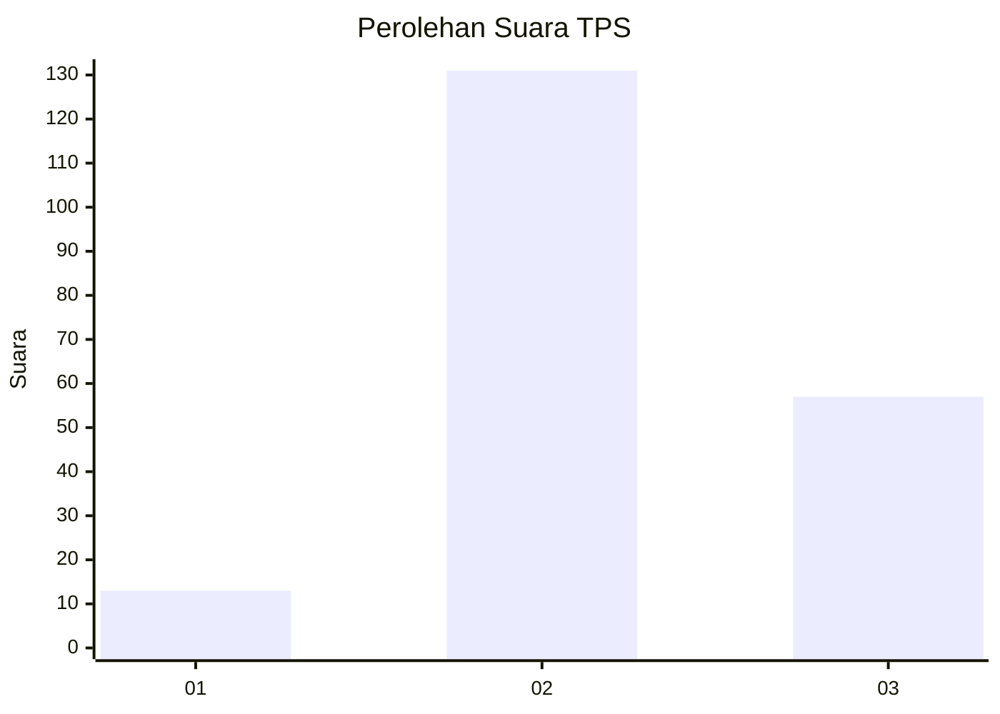
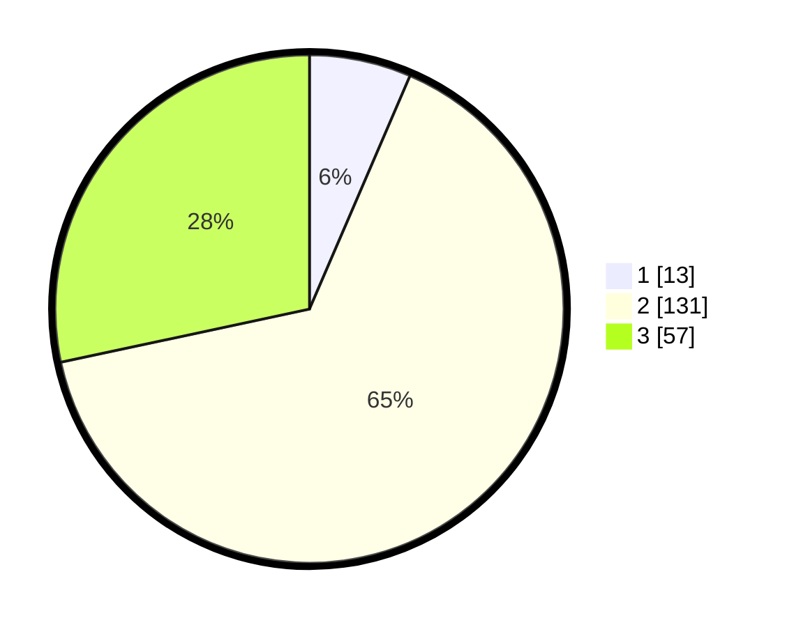

# Hasil

## Grafik

## Tabel

| No. | Nama Paslon    | Suara | Suara (raw) | Persentase |
|:--- |:-------------- | -----:| -----------:| ----------:|
| 1   | ANIES MUHAIMIN | 13    | [13][p-1]   | 6,47       |
| 2   | PRABOWO GIBRAN | 131   | [131][p-2]  | 65,17      |
| 3   | GANJAR MAHFUD  | 57    | [57][p-3]   | 28,36      |

[p-1]: https://github.com/gigit-pemilu/pemilu-2024/blob/main/pilpres/hitung-suara/sub/35-jawa-timur/sub/02-ponorogo/sub/20-jambon/sub/2007-bulu-lor/sub/001-tps/sub/paslon-1.txt
[p-2]: https://github.com/gigit-pemilu/pemilu-2024/blob/main/pilpres/hitung-suara/sub/35-jawa-timur/sub/02-ponorogo/sub/20-jambon/sub/2007-bulu-lor/sub/001-tps/sub/paslon-2.txt
[p-3]: https://github.com/gigit-pemilu/pemilu-2024/blob/main/pilpres/hitung-suara/sub/35-jawa-timur/sub/02-ponorogo/sub/20-jambon/sub/2007-bulu-lor/sub/001-tps/sub/paslon-3.txt

## Foto C Plano

https://sirekap-obj-formc.kpu.go.id/cacf/pemilu/ppwp/35/02/20/20/07/3502202007001-20240225-183837--fb460a1d-7ecc-43be-b2fe-b50a48e60658.jpg

https://sirekap-obj-formc.kpu.go.id/cacf/pemilu/ppwp/35/02/20/20/07/3502202007001-20240225-184223--35f6bd4a-5cab-468a-850d-11fe4e229380.jpg

https://sirekap-obj-formc.kpu.go.id/cacf/pemilu/ppwp/35/02/20/20/07/3502202007001-20240225-184429--b3fbdb18-9582-491f-8ed3-eaebccd21214.jpg

## Metadata

| Key        | Value               |
| ---------- | ------------------- |
| Time Stamp | 2024-02-25 19:00:00 |

## DATA PEMILIH TETAP

Jumlah pemilih dalam DPT: **279**.
 * L: **142**.
 * P: **137**.

## DATA PENGGUNA HAK PILIH

Jumlah pengguna hak pilih dalam DPT: **208**.
 * L: **110**.
 * P: **98**.

Jumlah pengguna hak pilih dalam DPTb: **208**.
 * L: **110**.
 * P: **98**.

Jumlah pengguna hak pilih dalam DPK: **1**.
 * L: **1**.
 * P: **0**.

Jumlah pengguna hak pilih: **210**.
 * L: **112**.
 * P: **98**.

## JUMLAH SUARA SAH DAN TIDAK SAH

JUMLAH SELURUH SUARA SAH: **200**.

JUMLAH SUARA TIDAK SAH: **10**.

JUMLAH SELURUH SUARA SAH DAN SUARA TIDAK SAH: **210**.

