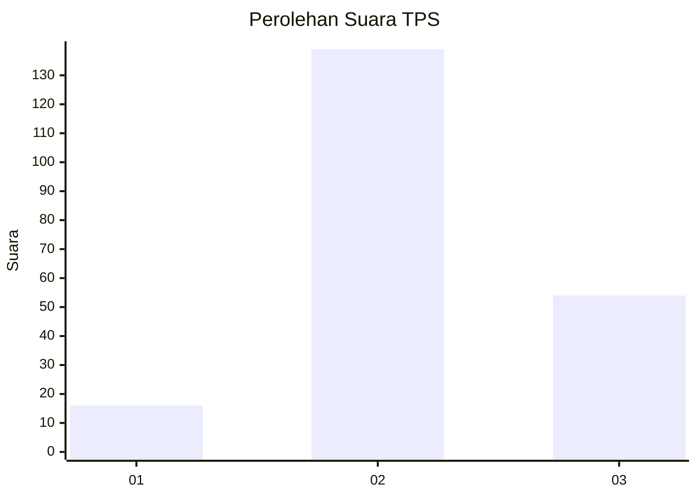
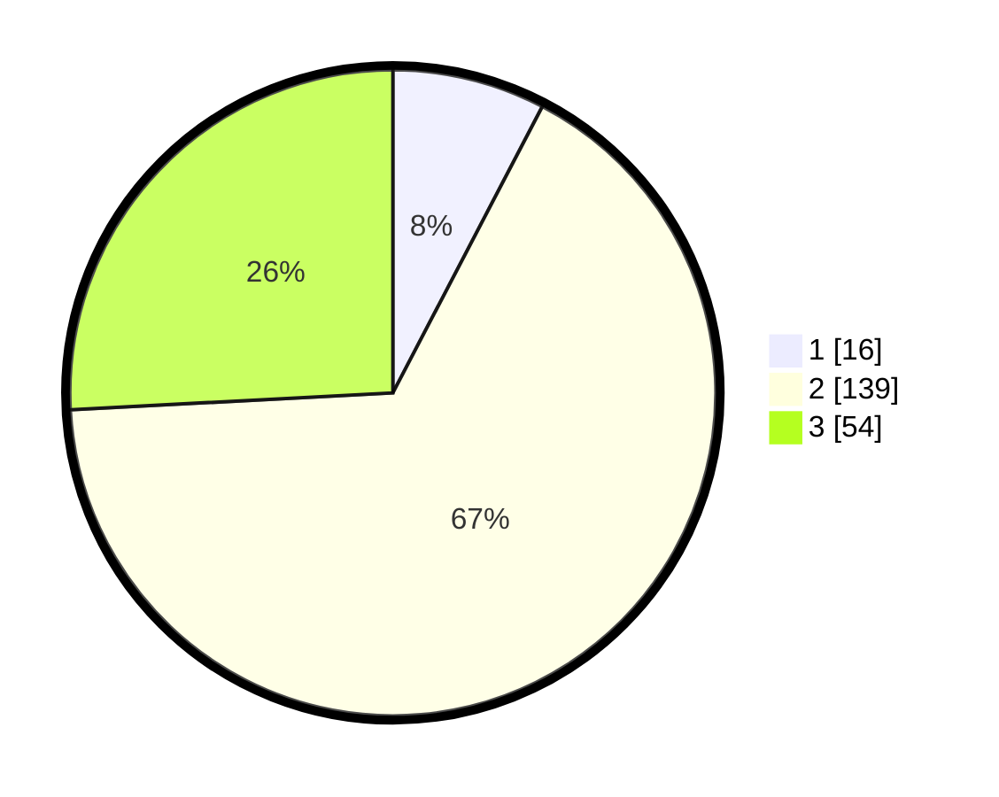

# Hasil

## Grafik

## Tabel

| No. | Nama Paslon    | Suara | Suara (raw) | Persentase |
|:--- |:-------------- | -----:| -----------:| ----------:|
| 1   | ANIES MUHAIMIN | 16    | [16][p-1]   | 7,66       |
| 2   | PRABOWO GIBRAN | 139   | [139][p-2]  | 66,51      |
| 3   | GANJAR MAHFUD  | 54    | [54][p-3]   | 25,84      |

[p-1]: https://github.com/gigit-pemilu/pemilu-2024/blob/main/pilpres/hitung-suara/sub/35-jawa-timur/sub/02-ponorogo/sub/20-jambon/sub/2007-bulu-lor/sub/010-tps/sub/paslon-1.txt
[p-2]: https://github.com/gigit-pemilu/pemilu-2024/blob/main/pilpres/hitung-suara/sub/35-jawa-timur/sub/02-ponorogo/sub/20-jambon/sub/2007-bulu-lor/sub/010-tps/sub/paslon-2.txt
[p-3]: https://github.com/gigit-pemilu/pemilu-2024/blob/main/pilpres/hitung-suara/sub/35-jawa-timur/sub/02-ponorogo/sub/20-jambon/sub/2007-bulu-lor/sub/010-tps/sub/paslon-3.txt

## Foto C Plano

https://sirekap-obj-formc.kpu.go.id/f237/pemilu/ppwp/35/02/20/20/07/3502202007010-20240226-221556--5777500e-1b40-4a1e-89db-4aa959994f6e.jpg

https://sirekap-obj-formc.kpu.go.id/f237/pemilu/ppwp/35/02/20/20/07/3502202007010-20240226-224320--395d8cef-03d9-4676-8bee-a9a3fdaaf5e4.jpg

https://sirekap-obj-formc.kpu.go.id/f237/pemilu/ppwp/35/02/20/20/07/3502202007010-20240226-225030--88ed0f16-e6cc-4c93-9da3-b51dbada0334.jpg

## Metadata

| Key        | Value               |
| ---------- | ------------------- |
| Time Stamp | 2024-02-27 22:00:00 |

