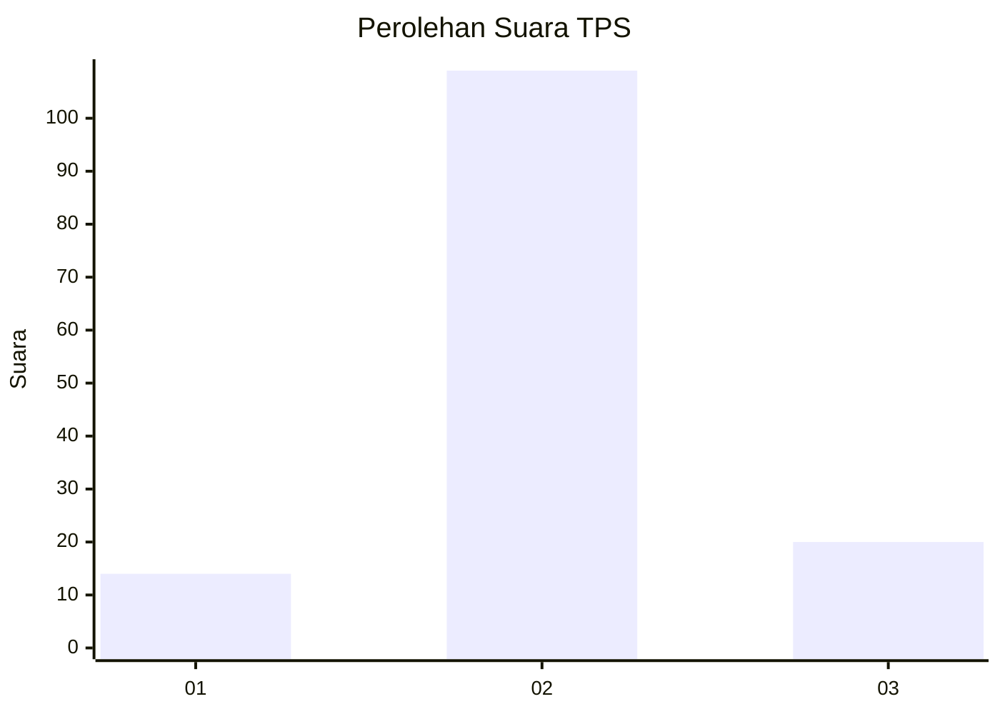
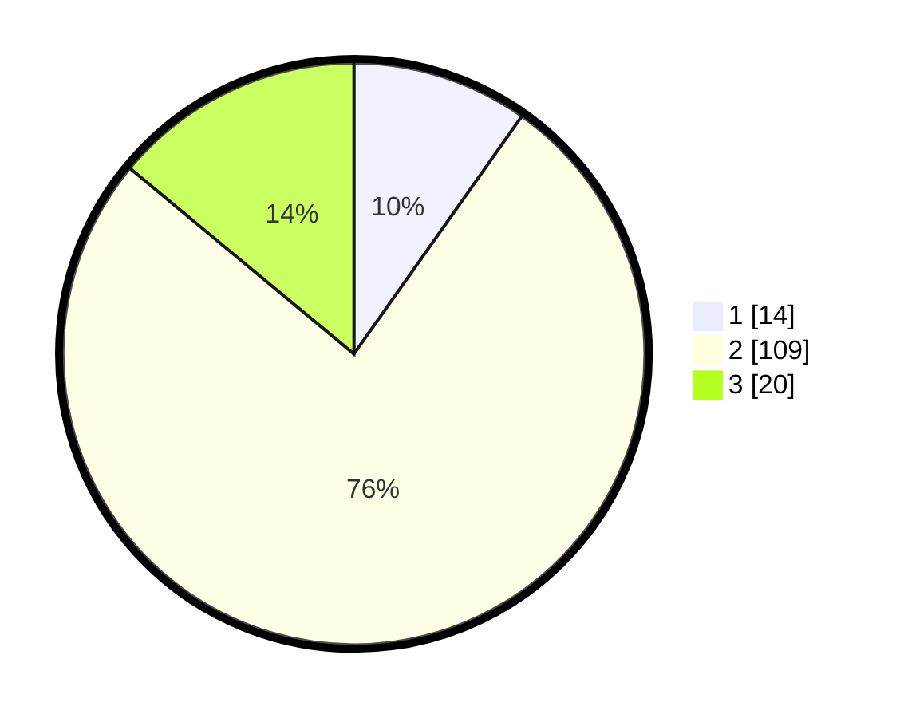

# Hasil

## Grafik

## Tabel

| No. | Nama Paslon    | Suara | Suara (raw) | Persentase |
|:--- |:-------------- | -----:| -----------:| ----------:|
| 1   | ANIES MUHAIMIN | 14    | [14][p-1]   | 9,79       |
| 2   | PRABOWO GIBRAN | 109   | [109][p-2]  | 76,22      |
| 3   | GANJAR MAHFUD  | 20    | [20][p-3]   | 13,99      |

[p-1]: https://github.com/gigit-pemilu/pemilu-2024/blob/main/pilpres/hitung-suara/sub/35-jawa-timur/sub/02-ponorogo/sub/21-pudak/sub/2003-krisik/sub/002-tps/sub/paslon-1.txt
[p-2]: https://github.com/gigit-pemilu/pemilu-2024/blob/main/pilpres/hitung-suara/sub/35-jawa-timur/sub/02-ponorogo/sub/21-pudak/sub/2003-krisik/sub/002-tps/sub/paslon-2.txt
[p-3]: https://github.com/gigit-pemilu/pemilu-2024/blob/main/pilpres/hitung-suara/sub/35-jawa-timur/sub/02-ponorogo/sub/21-pudak/sub/2003-krisik/sub/002-tps/sub/paslon-3.txt

## Foto C Plano

https://sirekap-obj-formc.kpu.go.id/f791/pemilu/ppwp/35/02/21/20/03/3502212003002-20240218-190836--e3e9234e-749c-48a3-aaed-897912dfa860.jpg

https://sirekap-obj-formc.kpu.go.id/f791/pemilu/ppwp/35/02/21/20/03/3502212003002-20240219-191418--b2c5d27a-1c20-45da-b631-603d5ad88425.jpg

https://sirekap-obj-formc.kpu.go.id/f791/pemilu/ppwp/35/02/21/20/03/3502212003002-20240218-204736--5387f1bb-a4e6-49cb-bb04-c5c4d3ec66ea.jpg

## Metadata

| Key        | Value               |
| ---------- | ------------------- |
| Time Stamp | 2024-02-20 16:00:00 |

