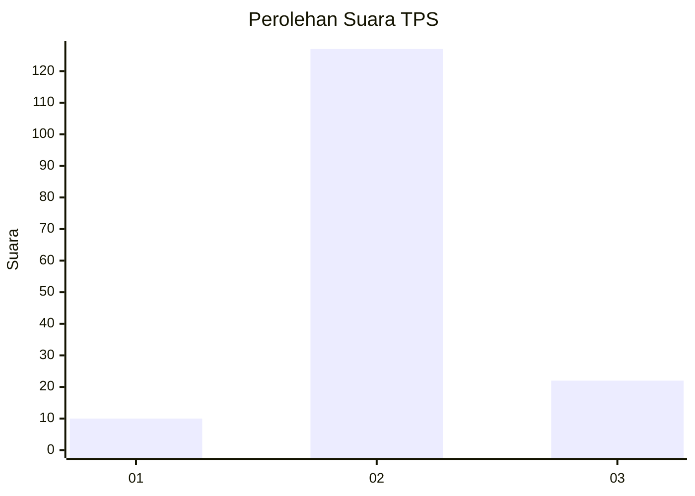
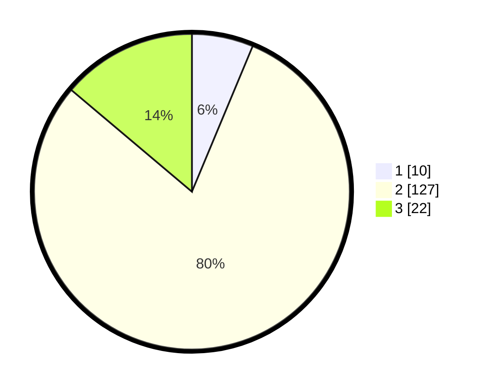

# Hasil

## Grafik

## Tabel

| No. | Nama Paslon    | Suara | Suara (raw) | Persentase |
|:--- |:-------------- | -----:| -----------:| ----------:|
| 1   | ANIES MUHAIMIN | 10    | [10][p-1]   | 6,29       |
| 2   | PRABOWO GIBRAN | 127   | [127][p-2]  | 79,87      |
| 3   | GANJAR MAHFUD  | 22    | [22][p-3]   | 13,84      |

[p-1]: https://github.com/gigit-pemilu/pemilu-2024-35-jawa-timur/blob/main/pilpres/hitung-suara/sub/35-jawa-timur/sub/02-ponorogo/sub/21-pudak/sub/2003-krisik/sub/004-tps/sub/paslon-1.txt
[p-2]: https://github.com/gigit-pemilu/pemilu-2024-35-jawa-timur/blob/main/pilpres/hitung-suara/sub/35-jawa-timur/sub/02-ponorogo/sub/21-pudak/sub/2003-krisik/sub/004-tps/sub/paslon-2.txt
[p-3]: https://github.com/gigit-pemilu/pemilu-2024-35-jawa-timur/blob/main/pilpres/hitung-suara/sub/35-jawa-timur/sub/02-ponorogo/sub/21-pudak/sub/2003-krisik/sub/004-tps/sub/paslon-3.txt

## Foto C Plano

https://sirekap-obj-formc.kpu.go.id/a48d/pemilu/ppwp/35/02/21/20/03/3502212003004-20240218-204025--130189cc-3b0f-41de-ad8e-3a139e282eb3.jpg

https://sirekap-obj-formc.kpu.go.id/a48d/pemilu/ppwp/35/02/21/20/03/3502212003004-20240219-204353--9efc1614-d503-4133-ab27-f3237435bf26.jpg

https://sirekap-obj-formc.kpu.go.id/a48d/pemilu/ppwp/35/02/21/20/03/3502212003004-20240218-020604--5f5be5c5-b943-41f9-873a-ec59694450e3.jpg

## Metadata

| Key        | Value               |
| ---------- | ------------------- |
| Time Stamp | 2024-02-20 16:00:00 |

