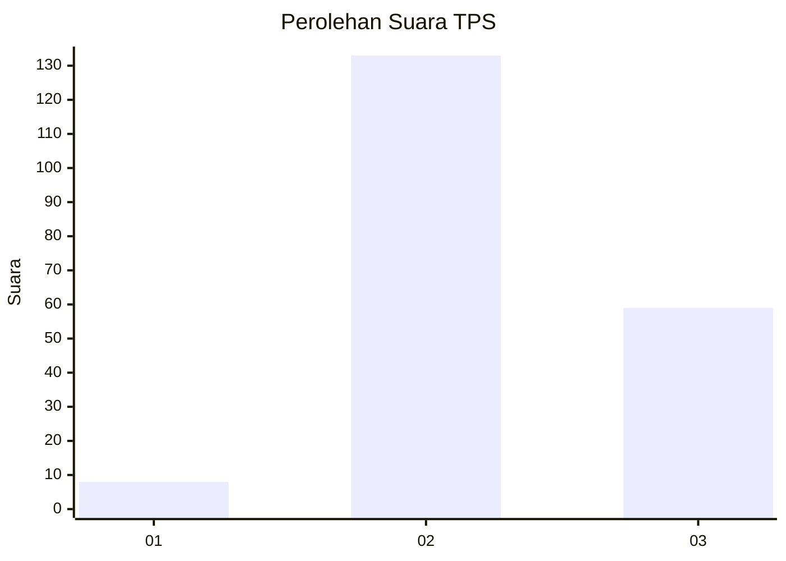

# Hasil

## Grafik

## Tabel

| No. | Nama Paslon    | Suara | Suara (raw) | Persentase |
|:--- |:-------------- | -----:| -----------:| ----------:|
| 1   | ANIES MUHAIMIN | 8     | [8][p-1]    | 4,00       |
| 2   | PRABOWO GIBRAN | 133   | [133][p-2]  | 66,50      |
| 3   | GANJAR MAHFUD  | 59    | [59][p-3]   | 29,50      |

[p-1]: https://github.com/gigit-pemilu/pemilu-2024/blob/main/pilpres/hitung-suara/sub/35-jawa-timur/sub/03-trenggalek/sub/01-panggul/sub/2001-besuki/sub/002-tps/sub/paslon-1.txt
[p-2]: https://github.com/gigit-pemilu/pemilu-2024/blob/main/pilpres/hitung-suara/sub/35-jawa-timur/sub/03-trenggalek/sub/01-panggul/sub/2001-besuki/sub/002-tps/sub/paslon-2.txt
[p-3]: https://github.com/gigit-pemilu/pemilu-2024/blob/main/pilpres/hitung-suara/sub/35-jawa-timur/sub/03-trenggalek/sub/01-panggul/sub/2001-besuki/sub/002-tps/sub/paslon-3.txt

## Foto C Plano

https://sirekap-obj-formc.kpu.go.id/1192/pemilu/ppwp/35/03/01/20/01/3503012001002-20240217-222355--53019d0a-986c-41bb-b90f-52da79d200a0.jpg

https://sirekap-obj-formc.kpu.go.id/1192/pemilu/ppwp/35/03/01/20/01/3503012001002-20240217-204416--df28c51b-96a2-4e55-8ff3-e7ccde64fce5.jpg

https://sirekap-obj-formc.kpu.go.id/1192/pemilu/ppwp/35/03/01/20/01/3503012001002-20240214-200900--8ed08952-907c-4fd8-8ef6-28345e4481e9.jpg

## Metadata

| Key        | Value               |
| ---------- | ------------------- |
| Time Stamp | 2024-02-19 11:00:00 |

## DATA PEMILIH TETAP

Jumlah pemilih dalam DPT: **273**.
 * L: **140**.
 * P: **133**.

## DATA PENGGUNA HAK PILIH

Jumlah pengguna hak pilih dalam DPT: **203**.
 * L: **105**.
 * P: **98**.

Jumlah pengguna hak pilih dalam DPTb: **2**.
 * L: **1**.
 * P: **1**.

Jumlah pengguna hak pilih dalam DPK: **2**.
 * L: **1**.
 * P: **1**.

Jumlah pengguna hak pilih: **207**.
 * L: **107**.
 * P: **100**.

## JUMLAH SUARA SAH DAN TIDAK SAH

JUMLAH SELURUH SUARA SAH: **200**.

JUMLAH SUARA TIDAK SAH: **7**.

JUMLAH SELURUH SUARA SAH DAN SUARA TIDAK SAH: **207**.

