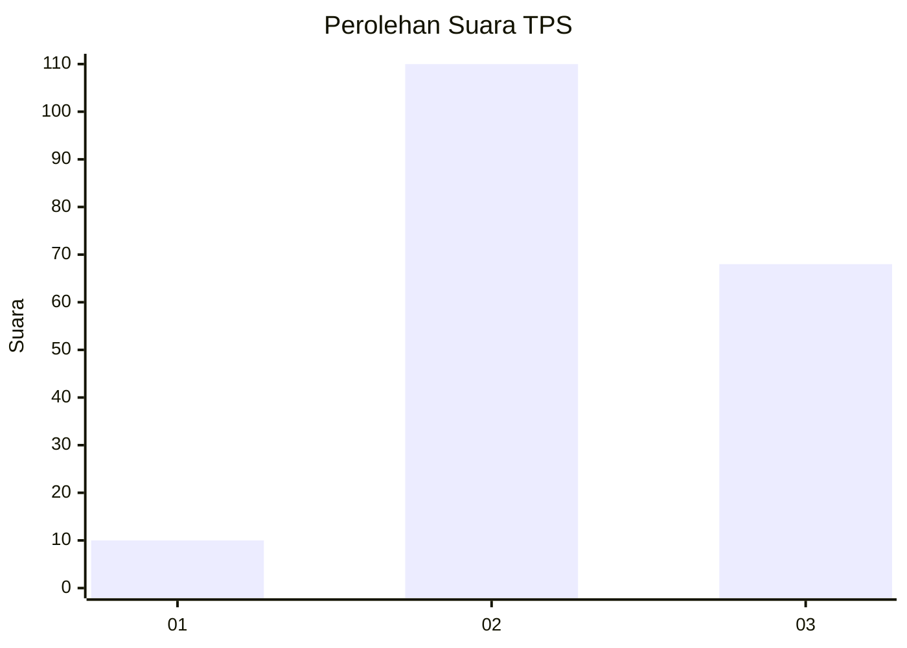
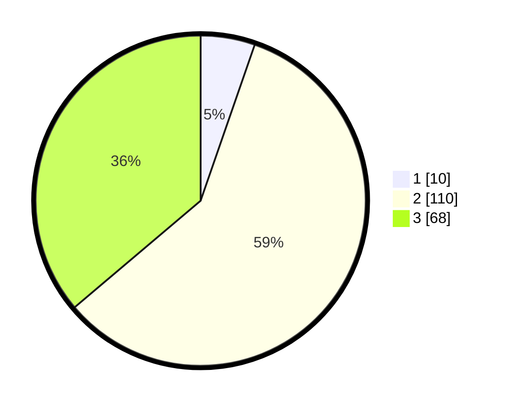

# Hasil

## Grafik

## Tabel

| No. | Nama Paslon    | Suara | Suara (raw) | Persentase |
|:--- |:-------------- | -----:| -----------:| ----------:|
| 1   | ANIES MUHAIMIN | 10    | [10][p-1]   | 5,32       |
| 2   | PRABOWO GIBRAN | 110   | [110][p-2]  | 58,51      |
| 3   | GANJAR MAHFUD  | 68    | [68][p-3]   | 36,17      |

[p-1]: https://github.com/gigit-pemilu/pemilu-2024/blob/main/pilpres/hitung-suara/sub/35-jawa-timur/sub/03-trenggalek/sub/01-panggul/sub/2001-besuki/sub/003-tps/sub/paslon-1.txt
[p-2]: https://github.com/gigit-pemilu/pemilu-2024/blob/main/pilpres/hitung-suara/sub/35-jawa-timur/sub/03-trenggalek/sub/01-panggul/sub/2001-besuki/sub/003-tps/sub/paslon-2.txt
[p-3]: https://github.com/gigit-pemilu/pemilu-2024/blob/main/pilpres/hitung-suara/sub/35-jawa-timur/sub/03-trenggalek/sub/01-panggul/sub/2001-besuki/sub/003-tps/sub/paslon-3.txt

## Foto C Plano

https://sirekap-obj-formc.kpu.go.id/ad77/pemilu/ppwp/35/03/01/20/01/3503012001003-20240215-001102--f1058968-282c-4506-820e-4659577af908.jpg

https://sirekap-obj-formc.kpu.go.id/ad77/pemilu/ppwp/35/03/01/20/01/3503012001003-20240215-004614--c00ce173-4193-4e72-ad80-8602b8183105.jpg

https://sirekap-obj-formc.kpu.go.id/ad77/pemilu/ppwp/35/03/01/20/01/3503012001003-20240215-004710--6b46aa8b-ec2e-4941-ae0d-086c7368ee3e.jpg

## Metadata

| Key        | Value               |
| ---------- | ------------------- |
| Time Stamp | 2024-02-15 18:00:26 |

## DATA PEMILIH TETAP

Jumlah pemilih dalam DPT: **262**.
 * L: **131**.
 * P: **131**.

## DATA PENGGUNA HAK PILIH

Jumlah pengguna hak pilih dalam DPT: **197**.
 * L: **94**.
 * P: **103**.

Jumlah pengguna hak pilih dalam DPTb: **0**.
 * L: **0**.
 * P: **0**.

Jumlah pengguna hak pilih dalam DPK: **0**.
 * L: **0**.
 * P: **0**.

Jumlah pengguna hak pilih: **197**.
 * L: **94**.
 * P: **103**.

## JUMLAH SUARA SAH DAN TIDAK SAH

JUMLAH SELURUH SUARA SAH: **188**.

JUMLAH SUARA TIDAK SAH: **9**.

JUMLAH SELURUH SUARA SAH DAN SUARA TIDAK SAH: **197**.

