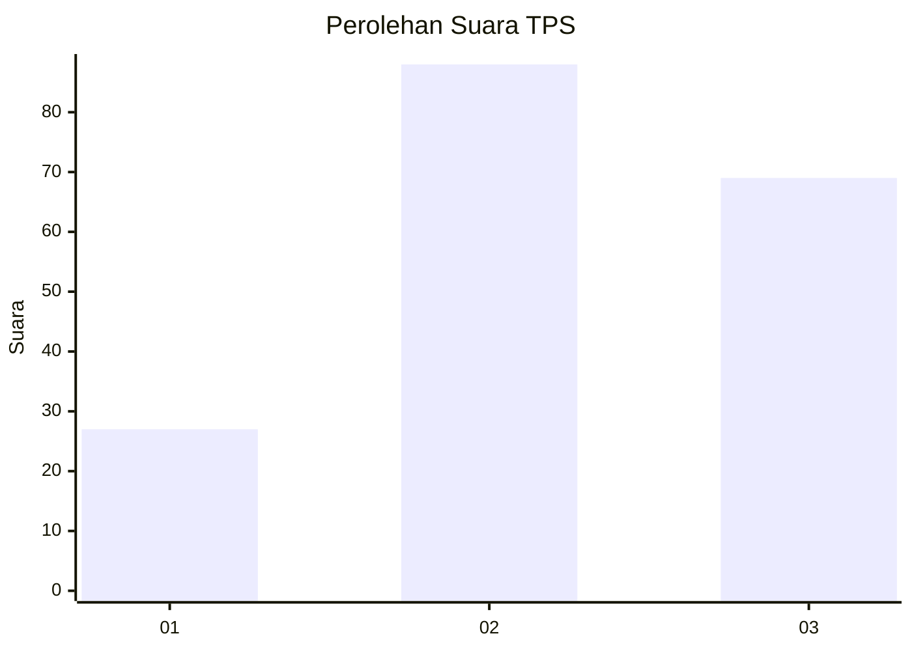
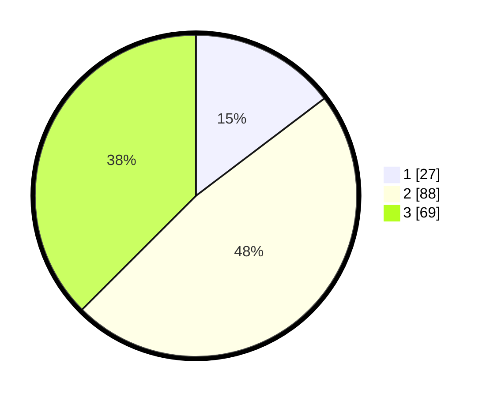

# Hasil

## Grafik

## Tabel

| No. | Nama Paslon    | Suara | Suara (raw) | Persentase |
|:--- |:-------------- | -----:| -----------:| ----------:|
| 1   | ANIES MUHAIMIN | 27    | [27][p-1]   | 14,67      |
| 2   | PRABOWO GIBRAN | 88    | [88][p-2]   | 47,83      |
| 3   | GANJAR MAHFUD  | 69    | [69][p-3]   | 37,50      |

[p-1]: https://github.com/gigit-pemilu/pemilu-2024/blob/main/pilpres/hitung-suara/sub/35-jawa-timur/sub/03-trenggalek/sub/01-panggul/sub/2001-besuki/sub/004-tps/sub/paslon-1.txt
[p-2]: https://github.com/gigit-pemilu/pemilu-2024/blob/main/pilpres/hitung-suara/sub/35-jawa-timur/sub/03-trenggalek/sub/01-panggul/sub/2001-besuki/sub/004-tps/sub/paslon-2.txt
[p-3]: https://github.com/gigit-pemilu/pemilu-2024/blob/main/pilpres/hitung-suara/sub/35-jawa-timur/sub/03-trenggalek/sub/01-panggul/sub/2001-besuki/sub/004-tps/sub/paslon-3.txt

## Foto C Plano

https://sirekap-obj-formc.kpu.go.id/a8c6/pemilu/ppwp/35/03/01/20/01/3503012001004-20240214-205422--178cf25e-0bd0-479e-a6dc-7e2cc662367c.jpg

https://sirekap-obj-formc.kpu.go.id/a8c6/pemilu/ppwp/35/03/01/20/01/3503012001004-20240215-004744--69a7fc78-c22b-42b8-9890-68ade1394074.jpg

https://sirekap-obj-formc.kpu.go.id/a8c6/pemilu/ppwp/35/03/01/20/01/3503012001004-20240215-004916--20a1b936-1406-426e-978a-9ef1decc9ab3.jpg

## Metadata

| Key        | Value               |
| ---------- | ------------------- |
| Time Stamp | 2024-02-17 13:37:34 |

## DATA PEMILIH TETAP

Jumlah pemilih dalam DPT: **247**.
 * L: **120**.
 * P: **127**.

## DATA PENGGUNA HAK PILIH

Jumlah pengguna hak pilih dalam DPT: **188**.
 * L: **87**.
 * P: **101**.

Jumlah pengguna hak pilih dalam DPTb: **4**.
 * L: **3**.
 * P: **1**.

Jumlah pengguna hak pilih dalam DPK: **0**.
 * L: **0**.
 * P: **0**.

Jumlah pengguna hak pilih: **192**.
 * L: **90**.
 * P: **102**.

## JUMLAH SUARA SAH DAN TIDAK SAH

JUMLAH SELURUH SUARA SAH: **184**.

JUMLAH SUARA TIDAK SAH: **8**.

JUMLAH SELURUH SUARA SAH DAN SUARA TIDAK SAH: **192**.

