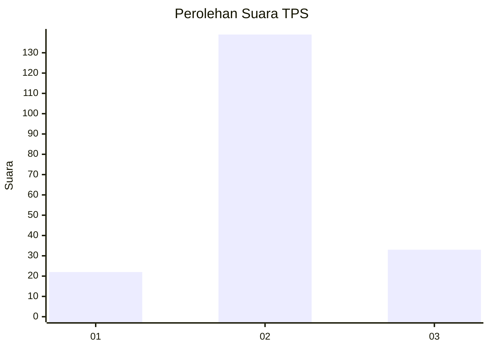
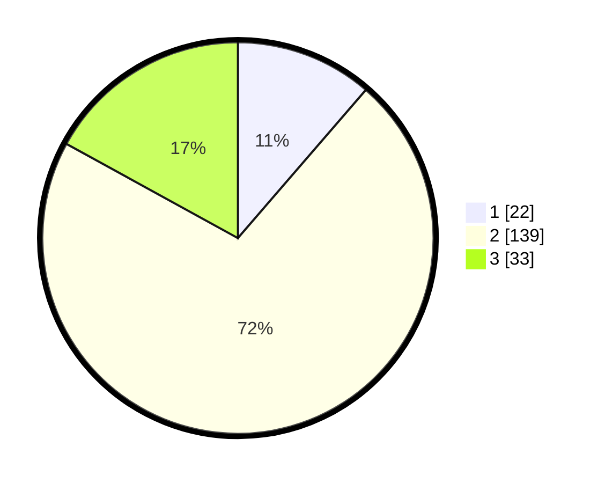

# Hasil

## Grafik

## Tabel

| No. | Nama Paslon    | Suara | Suara (raw) | Persentase |
|:--- |:-------------- | -----:| -----------:| ----------:|
| 1   | ANIES MUHAIMIN | 22    | [22][p-1]   | 11,34      |
| 2   | PRABOWO GIBRAN | 139   | [139][p-2]  | 71,65      |
| 3   | GANJAR MAHFUD  | 33    | [33][p-3]   | 17,01      |

[p-1]: https://github.com/gigit-pemilu/pemilu-2024-35-jawa-timur/blob/main/pilpres/hitung-suara/sub/35-jawa-timur/sub/03-trenggalek/sub/01-panggul/sub/2001-besuki/sub/005-tps/sub/paslon-1.txt
[p-2]: https://github.com/gigit-pemilu/pemilu-2024-35-jawa-timur/blob/main/pilpres/hitung-suara/sub/35-jawa-timur/sub/03-trenggalek/sub/01-panggul/sub/2001-besuki/sub/005-tps/sub/paslon-2.txt
[p-3]: https://github.com/gigit-pemilu/pemilu-2024-35-jawa-timur/blob/main/pilpres/hitung-suara/sub/35-jawa-timur/sub/03-trenggalek/sub/01-panggul/sub/2001-besuki/sub/005-tps/sub/paslon-3.txt

## Foto C Plano

https://sirekap-obj-formc.kpu.go.id/7b57/pemilu/ppwp/35/03/01/20/01/3503012001005-20240215-004706--75a7a7a9-09ba-4d6e-9ff0-741709de6724.jpg

https://sirekap-obj-formc.kpu.go.id/7b57/pemilu/ppwp/35/03/01/20/01/3503012001005-20240215-004817--d99d1ab0-4af2-40d7-a7cd-99b8b838601b.jpg

https://sirekap-obj-formc.kpu.go.id/7b57/pemilu/ppwp/35/03/01/20/01/3503012001005-20240216-213535--146868a5-81c3-4c8a-8814-b3478dc757b7.jpg

## Metadata

| Key        | Value               |
| ---------- | ------------------- |
| Time Stamp | 2024-02-17 13:37:34 |

## DATA PEMILIH TETAP

Jumlah pemilih dalam DPT: **284**.
 * L: **154**.
 * P: **130**.

## DATA PENGGUNA HAK PILIH

Jumlah pengguna hak pilih dalam DPT: **196**.
 * L: **98**.
 * P: **98**.

Jumlah pengguna hak pilih dalam DPTb: **2**.
 * L: **0**.
 * P: **2**.

Jumlah pengguna hak pilih dalam DPK: **1**.
 * L: **0**.
 * P: **1**.

Jumlah pengguna hak pilih: **199**.
 * L: **98**.
 * P: **101**.

## JUMLAH SUARA SAH DAN TIDAK SAH

JUMLAH SELURUH SUARA SAH: **194**.

JUMLAH SUARA TIDAK SAH: **5**.

JUMLAH SELURUH SUARA SAH DAN SUARA TIDAK SAH: **199**.

