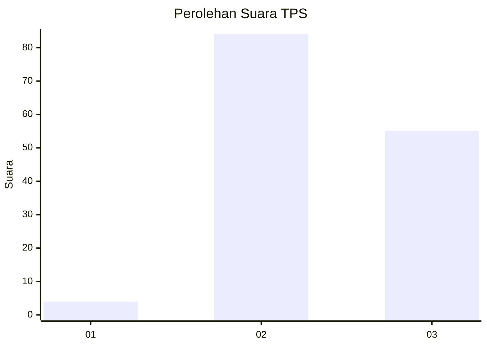
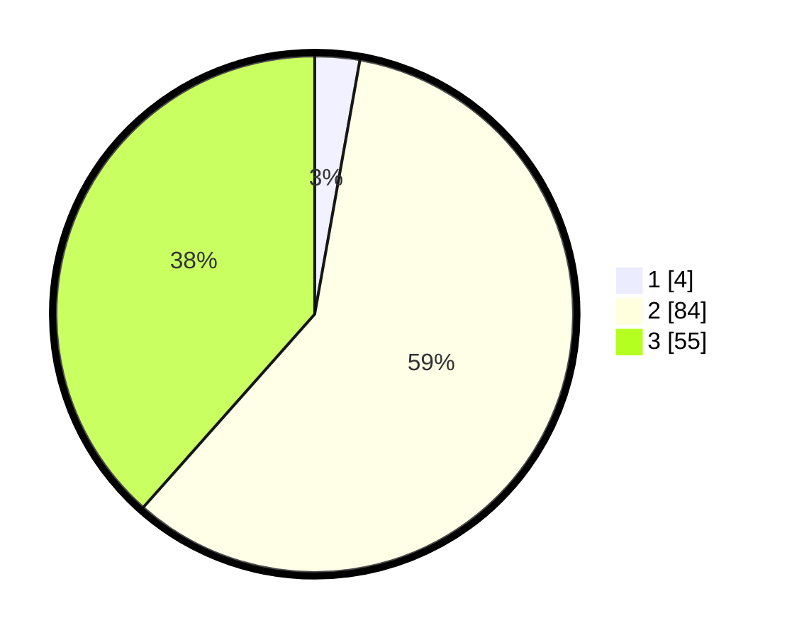

# Hasil

## Grafik

## Tabel

| No. | Nama Paslon    | Suara | Suara (raw) | Persentase |
|:--- |:-------------- | -----:| -----------:| ----------:|
| 1   | ANIES MUHAIMIN | 4     | [4][p-1]    | 2,80       |
| 2   | PRABOWO GIBRAN | 84    | [84][p-2]   | 58,74      |
| 3   | GANJAR MAHFUD  | 55    | [55][p-3]   | 38,46      |

[p-1]: https://github.com/gigit-pemilu/pemilu-2024-35-jawa-timur/blob/main/pilpres/hitung-suara/sub/35-jawa-timur/sub/03-trenggalek/sub/01-panggul/sub/2002-terbis/sub/005-tps/sub/paslon-1.txt
[p-2]: https://github.com/gigit-pemilu/pemilu-2024-35-jawa-timur/blob/main/pilpres/hitung-suara/sub/35-jawa-timur/sub/03-trenggalek/sub/01-panggul/sub/2002-terbis/sub/005-tps/sub/paslon-2.txt
[p-3]: https://github.com/gigit-pemilu/pemilu-2024-35-jawa-timur/blob/main/pilpres/hitung-suara/sub/35-jawa-timur/sub/03-trenggalek/sub/01-panggul/sub/2002-terbis/sub/005-tps/sub/paslon-3.txt

## Foto C Plano

https://sirekap-obj-formc.kpu.go.id/2bc9/pemilu/ppwp/35/03/01/20/02/3503012002005-20240217-182929--655d3ca0-6c00-44ab-96cf-63930f45b45f.jpg

https://sirekap-obj-formc.kpu.go.id/2bc9/pemilu/ppwp/35/03/01/20/02/3503012002005-20240217-192355--c28bd8b0-4e69-46b5-a80b-63cb087ef565.jpg

## Metadata

| Key        | Value               |
| ---------- | ------------------- |
| Time Stamp | 2024-02-17 19:30:00 |

