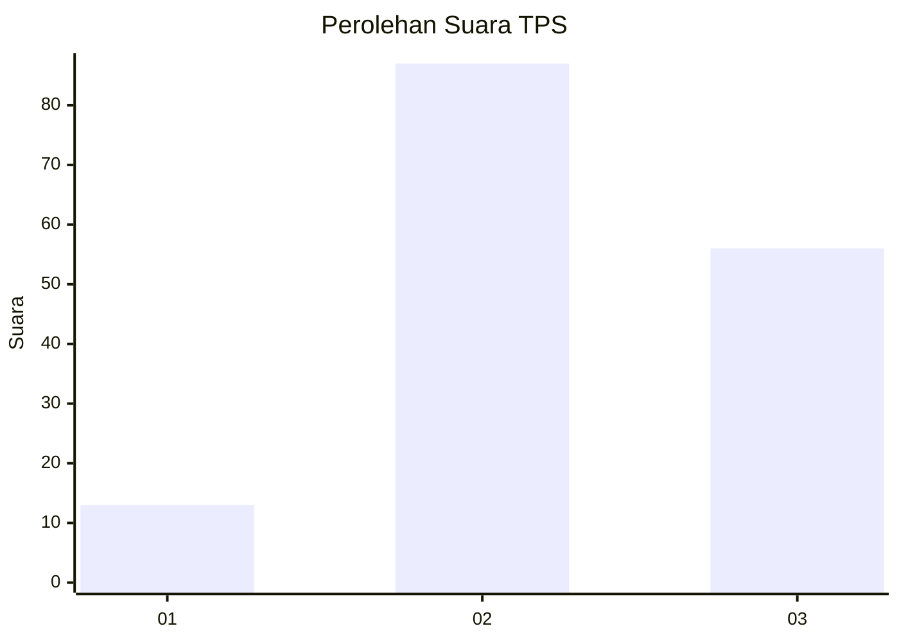
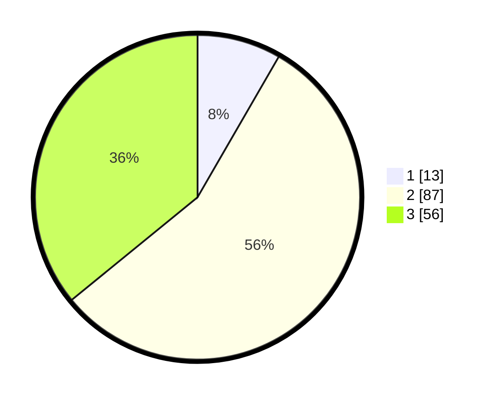

# Hasil

## Grafik

## Tabel

| No. | Nama Paslon    | Suara | Suara (raw) | Persentase |
|:--- |:-------------- | -----:| -----------:| ----------:|
| 1   | ANIES MUHAIMIN | 13    | [13][p-1]   | 8,33       |
| 2   | PRABOWO GIBRAN | 87    | [87][p-2]   | 55,77      |
| 3   | GANJAR MAHFUD  | 56    | [56][p-3]   | 35,90      |

[p-1]: https://github.com/gigit-pemilu/pemilu-2024/blob/main/pilpres/hitung-suara/sub/35-jawa-timur/sub/03-trenggalek/sub/01-panggul/sub/2002-terbis/sub/009-tps/sub/paslon-1.txt
[p-2]: https://github.com/gigit-pemilu/pemilu-2024/blob/main/pilpres/hitung-suara/sub/35-jawa-timur/sub/03-trenggalek/sub/01-panggul/sub/2002-terbis/sub/009-tps/sub/paslon-2.txt
[p-3]: https://github.com/gigit-pemilu/pemilu-2024/blob/main/pilpres/hitung-suara/sub/35-jawa-timur/sub/03-trenggalek/sub/01-panggul/sub/2002-terbis/sub/009-tps/sub/paslon-3.txt

## Foto C Plano

https://sirekap-obj-formc.kpu.go.id/3bb1/pemilu/ppwp/35/03/01/20/02/3503012002009-20240216-164724--a3eafc96-8d61-4a5f-b741-31a522cffc83.jpg

https://sirekap-obj-formc.kpu.go.id/3bb1/pemilu/ppwp/35/03/01/20/02/3503012002009-20240216-164850--88f35323-a715-4df9-8cf4-190f959cb4b0.jpg

https://sirekap-obj-formc.kpu.go.id/3bb1/pemilu/ppwp/35/03/01/20/02/3503012002009-20240215-002448--d76b5c4a-8343-4204-af99-d92712310c5d.jpg

## Metadata

| Key        | Value               |
| ---------- | ------------------- |
| Time Stamp | 2024-02-16 21:01:00 |

