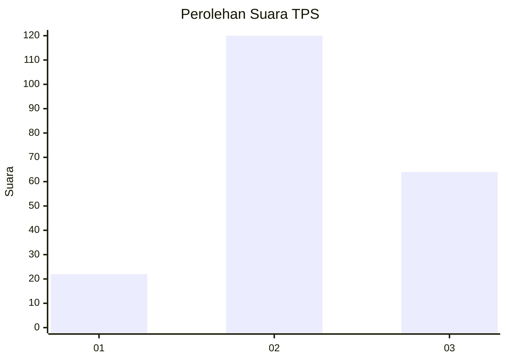
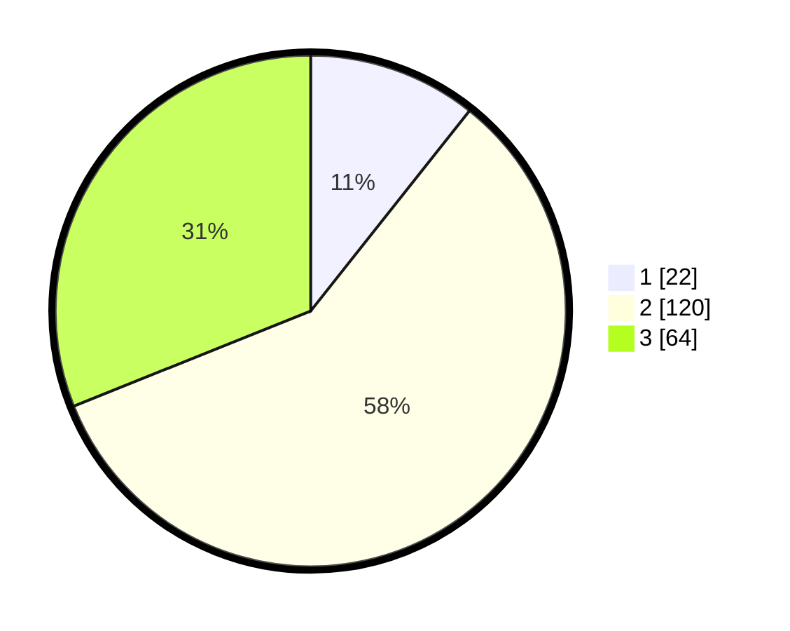

# Hasil

## Grafik

## Tabel

| No. | Nama Paslon    | Suara | Suara (raw) | Persentase |
|:--- |:-------------- | -----:| -----------:| ----------:|
| 1   | ANIES MUHAIMIN | 22    | [22][p-1]   | 10,68      |
| 2   | PRABOWO GIBRAN | 120   | [120][p-2]  | 58,25      |
| 3   | GANJAR MAHFUD  | 64    | [64][p-3]   | 31,07      |

[p-1]: https://github.com/gigit-pemilu/pemilu-2024-35-jawa-timur/blob/main/pilpres/hitung-suara/sub/35-jawa-timur/sub/03-trenggalek/sub/01-panggul/sub/2003-karangtengah/sub/014-tps/sub/paslon-1.txt
[p-2]: https://github.com/gigit-pemilu/pemilu-2024-35-jawa-timur/blob/main/pilpres/hitung-suara/sub/35-jawa-timur/sub/03-trenggalek/sub/01-panggul/sub/2003-karangtengah/sub/014-tps/sub/paslon-2.txt
[p-3]: https://github.com/gigit-pemilu/pemilu-2024-35-jawa-timur/blob/main/pilpres/hitung-suara/sub/35-jawa-timur/sub/03-trenggalek/sub/01-panggul/sub/2003-karangtengah/sub/014-tps/sub/paslon-3.txt

## Foto C Plano

https://sirekap-obj-formc.kpu.go.id/7459/pemilu/ppwp/35/03/01/20/03/3503012003014-20240217-190858--5b26549f-54cc-45d9-a6de-c8f0573f4f78.jpg

https://sirekap-obj-formc.kpu.go.id/7459/pemilu/ppwp/35/03/01/20/03/3503012003014-20240217-190102--a4d2389d-86d1-46dd-9047-1e833989c87a.jpg

https://sirekap-obj-formc.kpu.go.id/7459/pemilu/ppwp/35/03/01/20/03/3503012003014-20240217-190342--7edf4370-8014-4b35-bda8-965e6871c439.jpg

## Metadata

| Key        | Value               |
| ---------- | ------------------- |
| Time Stamp | 2024-02-25 11:00:00 |

