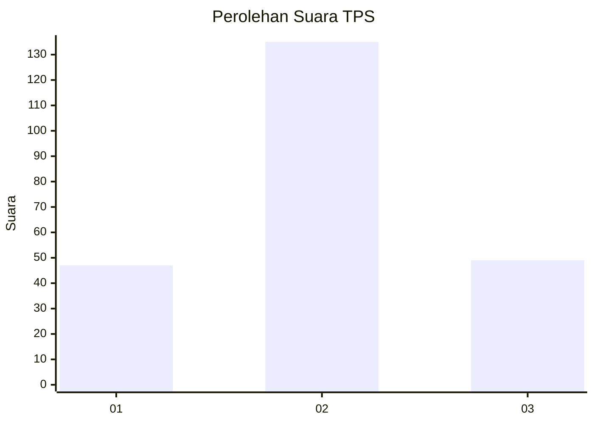
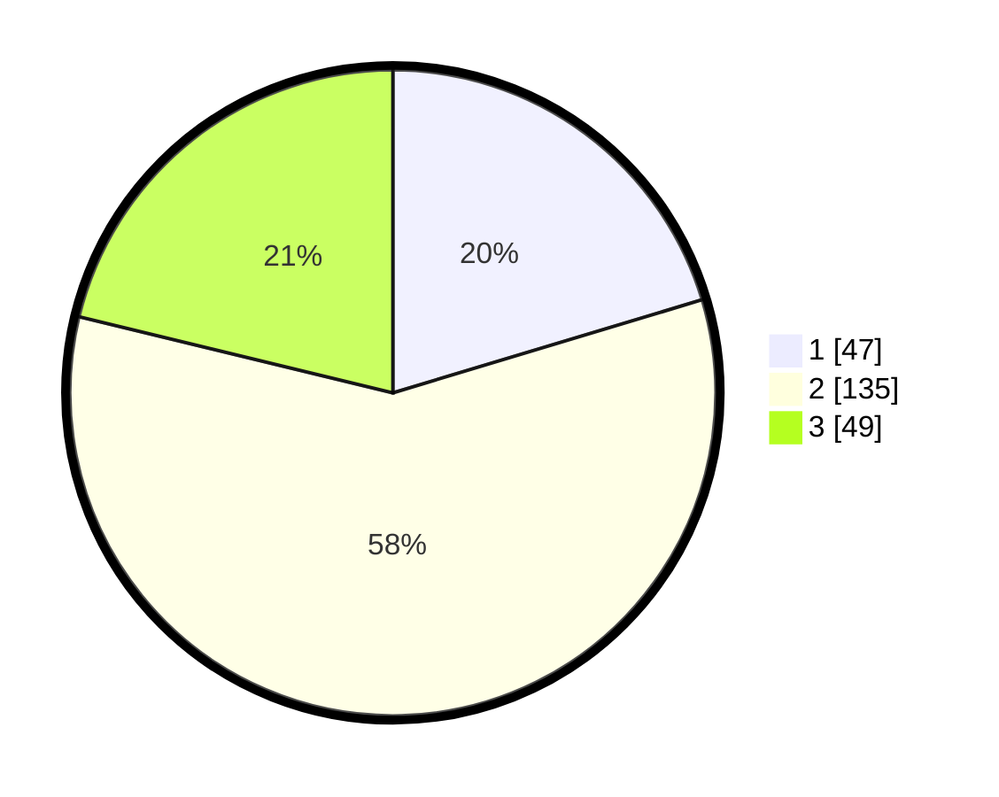

# Hasil

## Grafik

## Tabel

| No. | Nama Paslon    | Suara | Suara (raw) | Persentase |
|:--- |:-------------- | -----:| -----------:| ----------:|
| 1   | ANIES MUHAIMIN | 47    | [47][p-1]   | 20,35      |
| 2   | PRABOWO GIBRAN | 135   | [135][p-2]  | 58,44      |
| 3   | GANJAR MAHFUD  | 49    | [49][p-3]   | 21,21      |

[p-1]: https://github.com/gigit-pemilu/pemilu-2024-35-jawa-timur/blob/main/pilpres/hitung-suara/sub/35-jawa-timur/sub/03-trenggalek/sub/01-panggul/sub/2004-wonocoyo/sub/003-tps/sub/paslon-1.txt
[p-2]: https://github.com/gigit-pemilu/pemilu-2024-35-jawa-timur/blob/main/pilpres/hitung-suara/sub/35-jawa-timur/sub/03-trenggalek/sub/01-panggul/sub/2004-wonocoyo/sub/003-tps/sub/paslon-2.txt
[p-3]: https://github.com/gigit-pemilu/pemilu-2024-35-jawa-timur/blob/main/pilpres/hitung-suara/sub/35-jawa-timur/sub/03-trenggalek/sub/01-panggul/sub/2004-wonocoyo/sub/003-tps/sub/paslon-3.txt

## Foto C Plano

https://sirekap-obj-formc.kpu.go.id/fe7a/pemilu/ppwp/35/03/01/20/04/3503012004003-20240219-210158--d295a88e-ef16-4392-819b-1512ad0d7e12.jpg

https://sirekap-obj-formc.kpu.go.id/fe7a/pemilu/ppwp/35/03/01/20/04/3503012004003-20240219-215820--833cf3b4-0bed-4025-9894-336ad85dfbf3.jpg

## Metadata

| Key        | Value               |
| ---------- | ------------------- |
| Time Stamp | 2024-02-24 22:31:28 |

