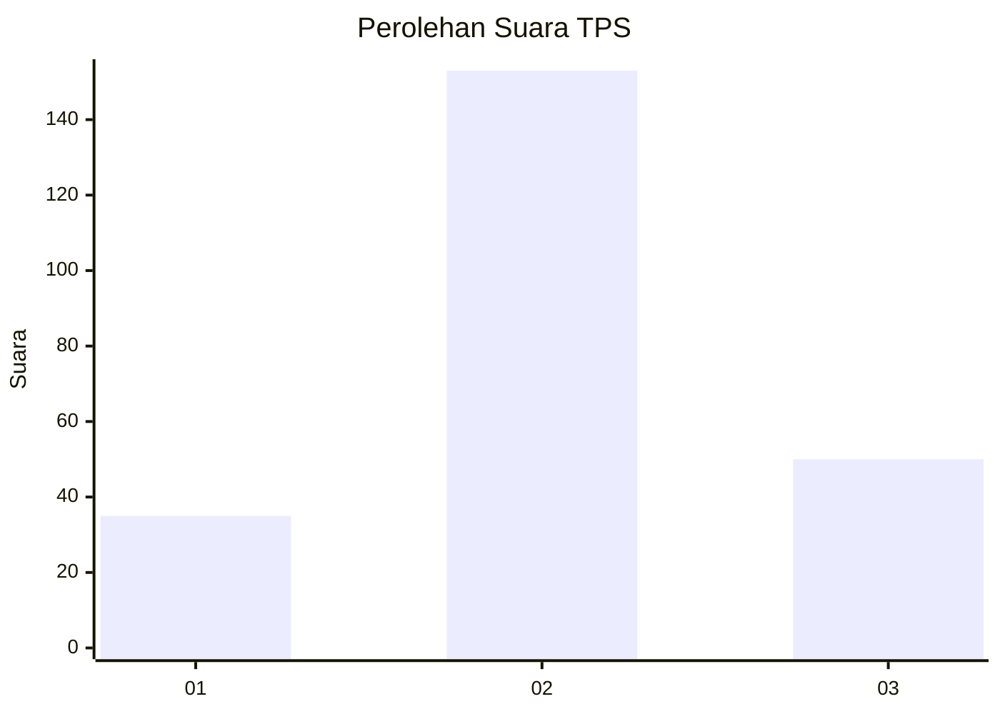
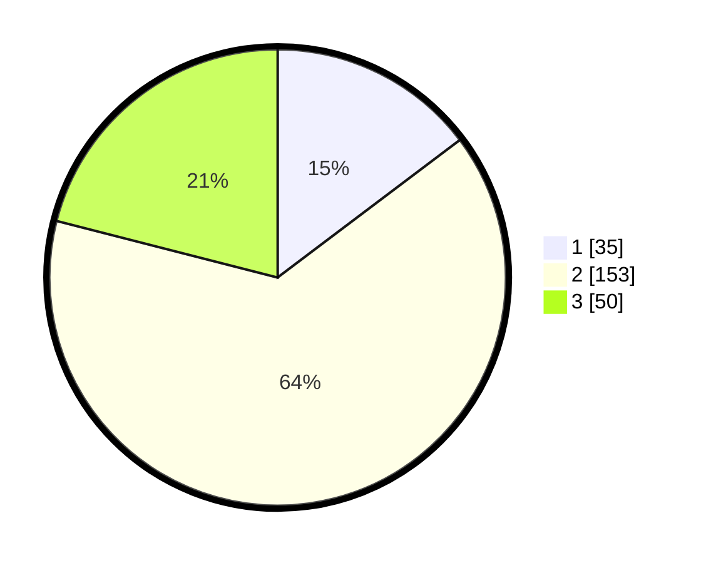

# Hasil

## Grafik

## Tabel

| No. | Nama Paslon    | Suara | Suara (raw) | Persentase |
|:--- |:-------------- | -----:| -----------:| ----------:|
| 1   | ANIES MUHAIMIN | 35    | [35][p-1]   | 14,71      |
| 2   | PRABOWO GIBRAN | 153   | [153][p-2]  | 64,29      |
| 3   | GANJAR MAHFUD  | 50    | [50][p-3]   | 21,01      |

[p-1]: https://github.com/gigit-pemilu/pemilu-2024-35-jawa-timur/blob/main/pilpres/hitung-suara/sub/35-jawa-timur/sub/03-trenggalek/sub/01-panggul/sub/2004-wonocoyo/sub/005-tps/sub/paslon-1.txt
[p-2]: https://github.com/gigit-pemilu/pemilu-2024-35-jawa-timur/blob/main/pilpres/hitung-suara/sub/35-jawa-timur/sub/03-trenggalek/sub/01-panggul/sub/2004-wonocoyo/sub/005-tps/sub/paslon-2.txt
[p-3]: https://github.com/gigit-pemilu/pemilu-2024-35-jawa-timur/blob/main/pilpres/hitung-suara/sub/35-jawa-timur/sub/03-trenggalek/sub/01-panggul/sub/2004-wonocoyo/sub/005-tps/sub/paslon-3.txt

## Foto C Plano

https://sirekap-obj-formc.kpu.go.id/1af9/pemilu/ppwp/35/03/01/20/04/3503012004005-20240219-215006--56560b68-f2ce-493e-9f32-ffc4977a1c06.jpg

https://sirekap-obj-formc.kpu.go.id/1af9/pemilu/ppwp/35/03/01/20/04/3503012004005-20240219-215135--084eee62-b72c-4534-aff5-d94e558a5860.jpg

https://sirekap-obj-formc.kpu.go.id/1af9/pemilu/ppwp/35/03/01/20/04/3503012004005-20240219-213346--be7935ea-5f64-460a-90f4-ce71c9a5cdae.jpg

## Metadata

| Key        | Value               |
| ---------- | ------------------- |
| Time Stamp | 2024-02-25 16:00:00 |

