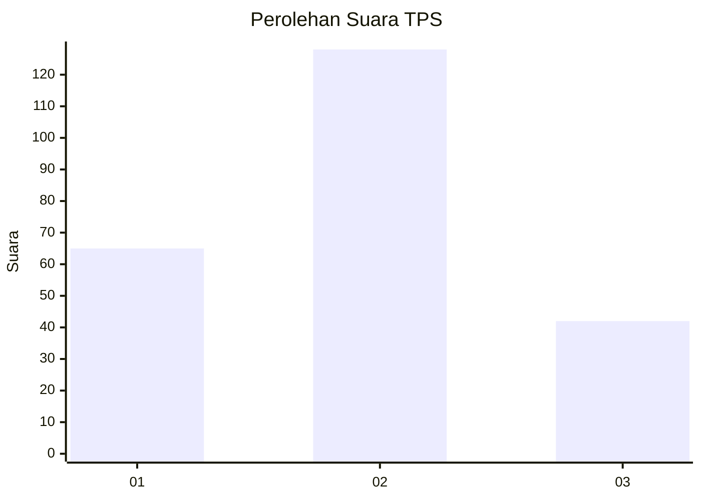
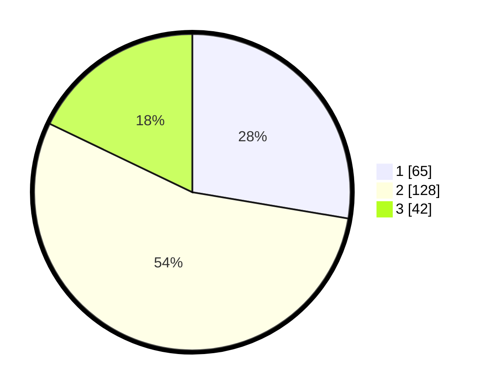

# Hasil

## Grafik

## Tabel

| No. | Nama Paslon    | Suara | Suara (raw) | Persentase |
|:--- |:-------------- | -----:| -----------:| ----------:|
| 1   | ANIES MUHAIMIN | 65    | [65][p-1]   | 27,66      |
| 2   | PRABOWO GIBRAN | 128   | [128][p-2]  | 54,47      |
| 3   | GANJAR MAHFUD  | 42    | [42][p-3]   | 17,87      |

[p-1]: https://github.com/gigit-pemilu/pemilu-2024/blob/main/pilpres/hitung-suara/sub/35-jawa-timur/sub/03-trenggalek/sub/01-panggul/sub/2008-panggul/sub/006-tps/sub/paslon-1.txt
[p-2]: https://github.com/gigit-pemilu/pemilu-2024/blob/main/pilpres/hitung-suara/sub/35-jawa-timur/sub/03-trenggalek/sub/01-panggul/sub/2008-panggul/sub/006-tps/sub/paslon-2.txt
[p-3]: https://github.com/gigit-pemilu/pemilu-2024/blob/main/pilpres/hitung-suara/sub/35-jawa-timur/sub/03-trenggalek/sub/01-panggul/sub/2008-panggul/sub/006-tps/sub/paslon-3.txt

## Foto C Plano

https://sirekap-obj-formc.kpu.go.id/7cb6/pemilu/ppwp/35/03/01/20/08/3503012008006-20240218-135029--df9f0d33-efda-4617-a000-0aba2580d682.jpg

https://sirekap-obj-formc.kpu.go.id/7cb6/pemilu/ppwp/35/03/01/20/08/3503012008006-20240218-135230--de6ac8a3-a8fa-4e10-84c6-31bc52a28612.jpg

https://sirekap-obj-formc.kpu.go.id/7cb6/pemilu/ppwp/35/03/01/20/08/3503012008006-20240218-135324--7401d79a-96b0-493a-b6d9-2a8ec3c53f8e.jpg

## Metadata

| Key        | Value               |
| ---------- | ------------------- |
| Time Stamp | 2024-02-25 15:00:00 |

