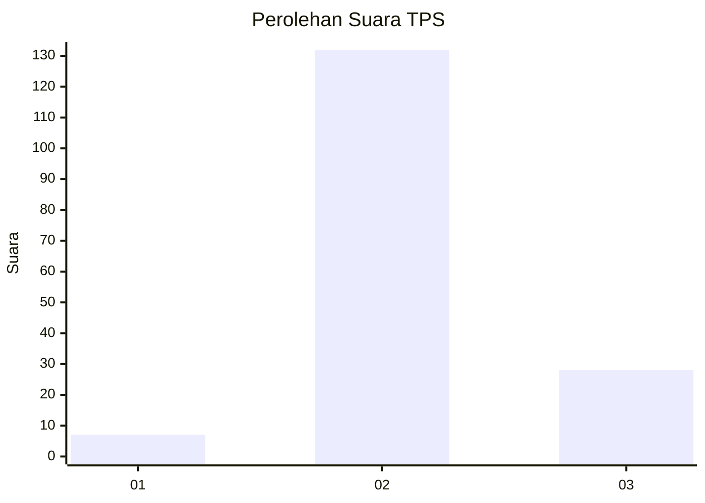
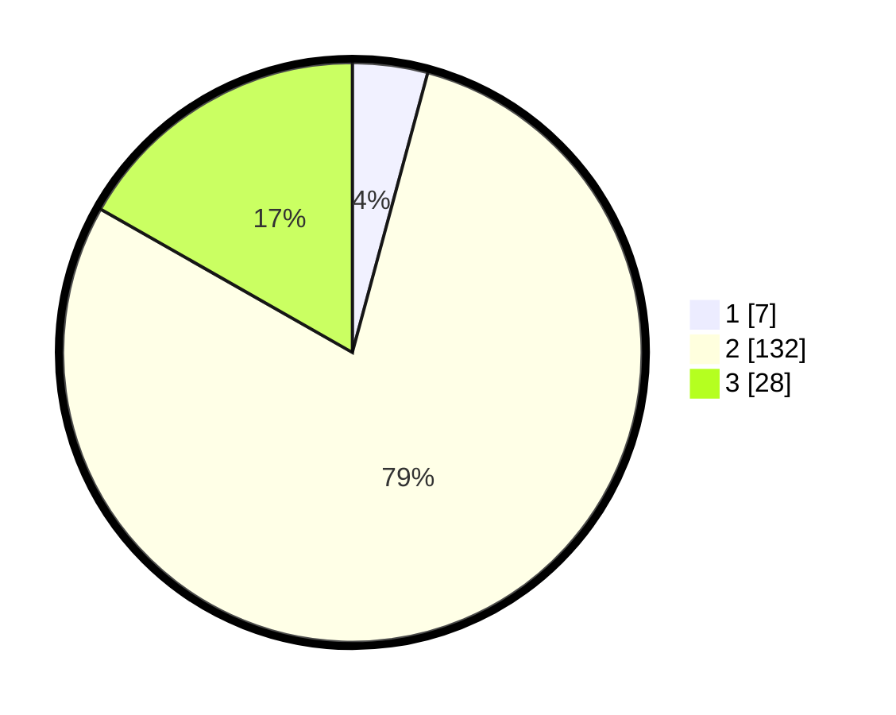

# Hasil

## Grafik

## Tabel

| No. | Nama Paslon    | Suara | Suara (raw) | Persentase |
|:--- |:-------------- | -----:| -----------:| ----------:|
| 1   | ANIES MUHAIMIN | 7     | [7][p-1]    | 4,19       |
| 2   | PRABOWO GIBRAN | 132   | [132][p-2]  | 79,04      |
| 3   | GANJAR MAHFUD  | 28    | [28][p-3]   | 16,77      |

[p-1]: https://github.com/gigit-pemilu/pemilu-2024/blob/main/pilpres/hitung-suara/sub/35-jawa-timur/sub/03-trenggalek/sub/01-panggul/sub/2012-banjar/sub/004-tps/sub/paslon-1.txt
[p-2]: https://github.com/gigit-pemilu/pemilu-2024/blob/main/pilpres/hitung-suara/sub/35-jawa-timur/sub/03-trenggalek/sub/01-panggul/sub/2012-banjar/sub/004-tps/sub/paslon-2.txt
[p-3]: https://github.com/gigit-pemilu/pemilu-2024/blob/main/pilpres/hitung-suara/sub/35-jawa-timur/sub/03-trenggalek/sub/01-panggul/sub/2012-banjar/sub/004-tps/sub/paslon-3.txt

## Foto C Plano

https://sirekap-obj-formc.kpu.go.id/0703/pemilu/ppwp/35/03/01/20/12/3503012012004-20240217-112659--dff76f5a-6882-480e-953b-244812f899aa.jpg

https://sirekap-obj-formc.kpu.go.id/0703/pemilu/ppwp/35/03/01/20/12/3503012012004-20240217-105536--472dd9dd-a4ed-4a46-8ca1-50ef419fbbf9.jpg

https://sirekap-obj-formc.kpu.go.id/0703/pemilu/ppwp/35/03/01/20/12/3503012012004-20240217-112838--c2c4f013-0e75-4e1a-9327-d3af684edd9f.jpg

## Metadata

| Key        | Value               |
| ---------- | ------------------- |
| Time Stamp | 2024-02-17 12:00:00 |

