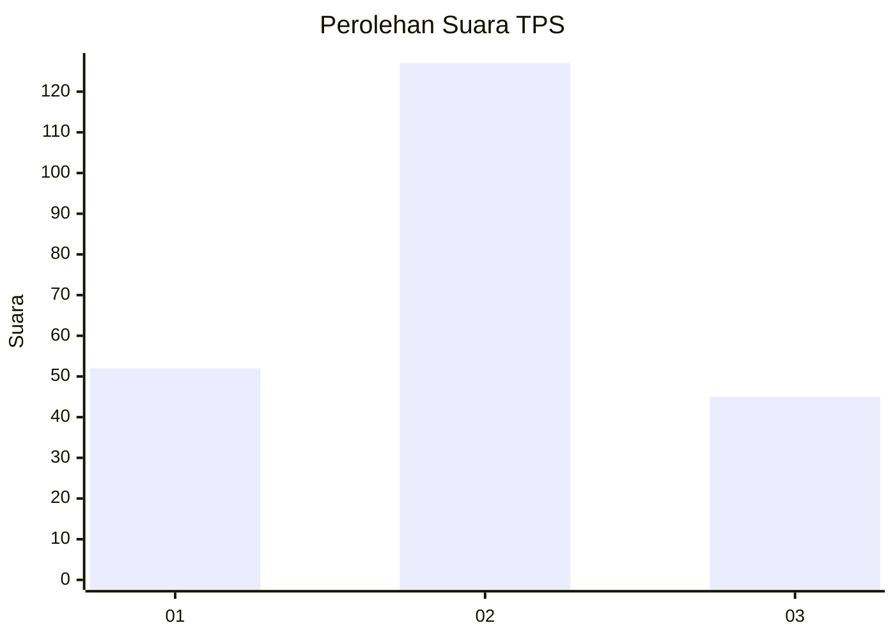
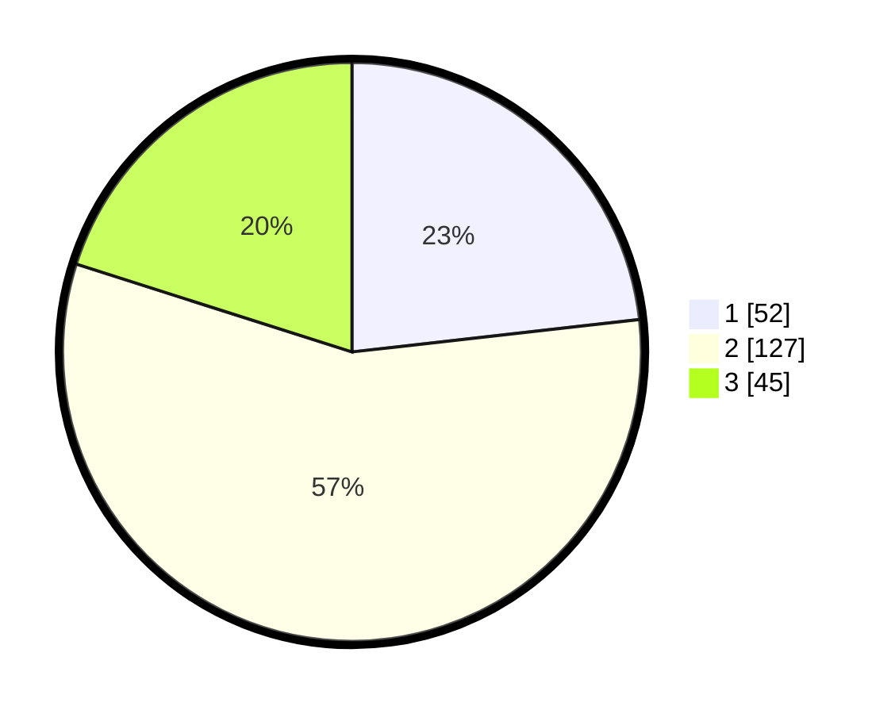

# Hasil

## Grafik

## Tabel

| No. | Nama Paslon    | Suara | Suara (raw) | Persentase |
|:--- |:-------------- | -----:| -----------:| ----------:|
| 1   | ANIES MUHAIMIN | 52    | [52][p-1]   | 23,21      |
| 2   | PRABOWO GIBRAN | 127   | [127][p-2]  | 56,70      |
| 3   | GANJAR MAHFUD  | 45    | [45][p-3]   | 20,09      |

[p-1]: https://github.com/gigit-pemilu/pemilu-2024/blob/main/pilpres/hitung-suara/sub/35-jawa-timur/sub/03-trenggalek/sub/01-panggul/sub/2013-ngrencak/sub/002-tps/sub/paslon-1.txt
[p-2]: https://github.com/gigit-pemilu/pemilu-2024/blob/main/pilpres/hitung-suara/sub/35-jawa-timur/sub/03-trenggalek/sub/01-panggul/sub/2013-ngrencak/sub/002-tps/sub/paslon-2.txt
[p-3]: https://github.com/gigit-pemilu/pemilu-2024/blob/main/pilpres/hitung-suara/sub/35-jawa-timur/sub/03-trenggalek/sub/01-panggul/sub/2013-ngrencak/sub/002-tps/sub/paslon-3.txt

## Foto C Plano

https://sirekap-obj-formc.kpu.go.id/f995/pemilu/ppwp/35/03/01/20/13/3503012013002-20240218-070140--65b546a2-2c29-429f-9140-fde778eeb523.jpg

https://sirekap-obj-formc.kpu.go.id/f995/pemilu/ppwp/35/03/01/20/13/3503012013002-20240216-133712--59b6a515-5df2-45da-9a49-1a58da1d20cf.jpg

https://sirekap-obj-formc.kpu.go.id/f995/pemilu/ppwp/35/03/01/20/13/3503012013002-20240216-135657--18358c0b-46be-4a62-9789-f2700966e904.jpg

## Metadata

| Key        | Value               |
| ---------- | ------------------- |
| Time Stamp | 2024-02-19 06:16:00 |

