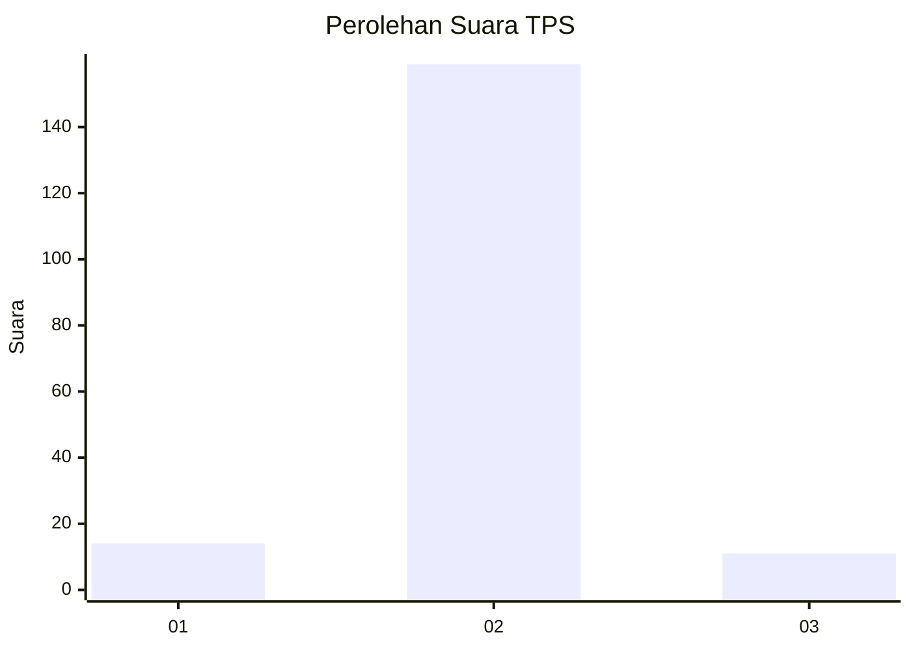
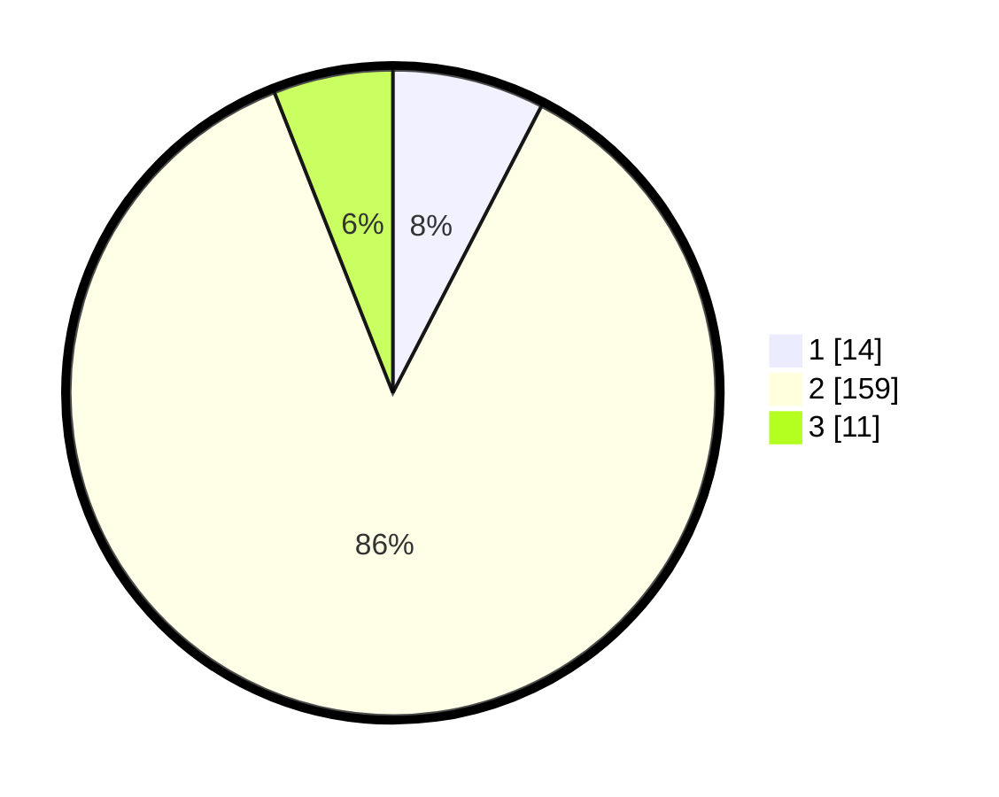

# Hasil

## Grafik

## Tabel

| No. | Nama Paslon    | Suara | Suara (raw) | Persentase |
|:--- |:-------------- | -----:| -----------:| ----------:|
| 1   | ANIES MUHAIMIN | 14    | [14][p-1]   | 7,61       |
| 2   | PRABOWO GIBRAN | 159   | [159][p-2]  | 86,41      |
| 3   | GANJAR MAHFUD  | 11    | [11][p-3]   | 5,98       |

[p-1]: https://github.com/gigit-pemilu/pemilu-2024-35-jawa-timur/blob/main/pilpres/hitung-suara/sub/35-jawa-timur/sub/03-trenggalek/sub/01-panggul/sub/2016-manggis/sub/012-tps/sub/paslon-1.txt
[p-2]: https://github.com/gigit-pemilu/pemilu-2024-35-jawa-timur/blob/main/pilpres/hitung-suara/sub/35-jawa-timur/sub/03-trenggalek/sub/01-panggul/sub/2016-manggis/sub/012-tps/sub/paslon-2.txt
[p-3]: https://github.com/gigit-pemilu/pemilu-2024-35-jawa-timur/blob/main/pilpres/hitung-suara/sub/35-jawa-timur/sub/03-trenggalek/sub/01-panggul/sub/2016-manggis/sub/012-tps/sub/paslon-3.txt

## Foto C Plano

https://sirekap-obj-formc.kpu.go.id/7b8a/pemilu/ppwp/35/03/01/20/16/3503012016012-20240218-084017--ed6cc454-b4e6-4b1c-91da-31420ae2e6ac.jpg

https://sirekap-obj-formc.kpu.go.id/7b8a/pemilu/ppwp/35/03/01/20/16/3503012016012-20240215-005318--8c211351-11f0-40d8-9e93-894f64f7b158.jpg

https://sirekap-obj-formc.kpu.go.id/7b8a/pemilu/ppwp/35/03/01/20/16/3503012016012-20240215-005405--3da1dba1-d33c-4fc2-bf7c-692e32dc1318.jpg

## Metadata

| Key        | Value               |
| ---------- | ------------------- |
| Time Stamp | 2024-02-19 06:16:00 |

