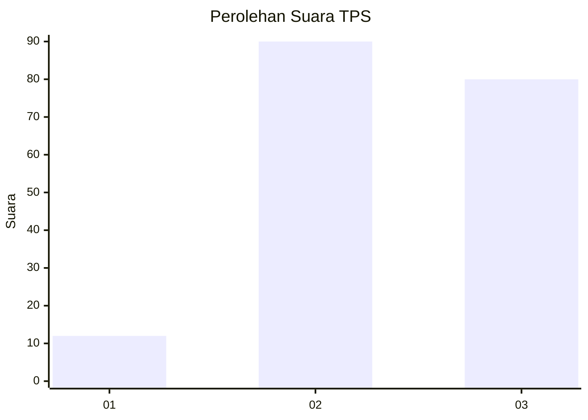
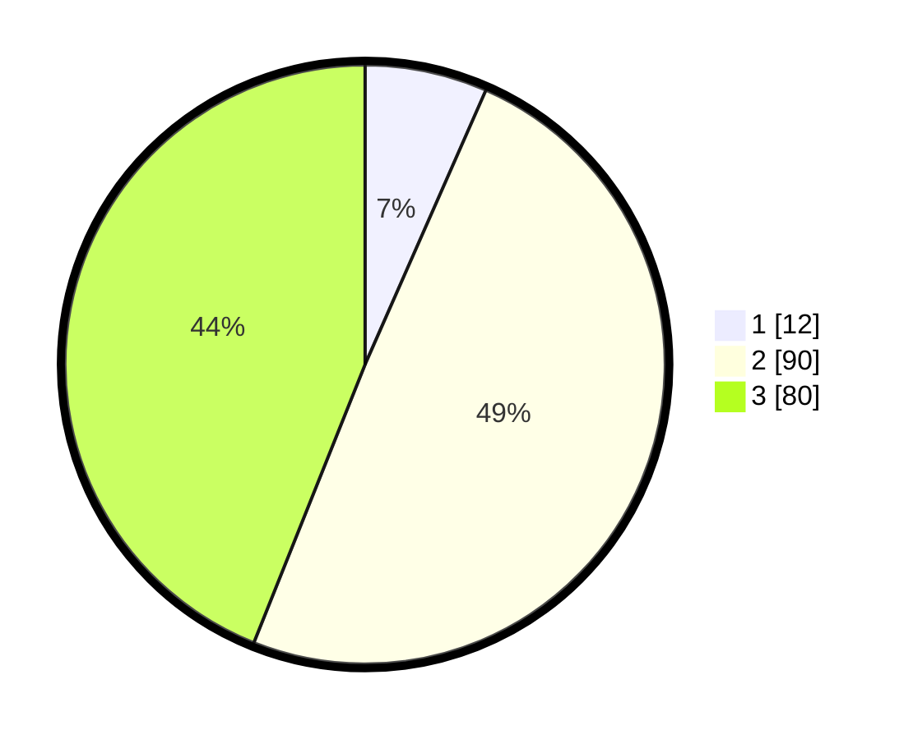

# Hasil

## Grafik

## Tabel

| No. | Nama Paslon    | Suara | Suara (raw) | Persentase |
|:--- |:-------------- | -----:| -----------:| ----------:|
| 1   | ANIES MUHAIMIN | 12    | [12][p-1]   | 6,59       |
| 2   | PRABOWO GIBRAN | 90    | [90][p-2]   | 49,45      |
| 3   | GANJAR MAHFUD  | 80    | [80][p-3]   | 43,96      |

[p-1]: https://github.com/gigit-pemilu/pemilu-2024-35-jawa-timur/blob/main/pilpres/hitung-suara/sub/35-jawa-timur/sub/03-trenggalek/sub/01-panggul/sub/2016-manggis/sub/015-tps/sub/paslon-1.txt
[p-2]: https://github.com/gigit-pemilu/pemilu-2024-35-jawa-timur/blob/main/pilpres/hitung-suara/sub/35-jawa-timur/sub/03-trenggalek/sub/01-panggul/sub/2016-manggis/sub/015-tps/sub/paslon-2.txt
[p-3]: https://github.com/gigit-pemilu/pemilu-2024-35-jawa-timur/blob/main/pilpres/hitung-suara/sub/35-jawa-timur/sub/03-trenggalek/sub/01-panggul/sub/2016-manggis/sub/015-tps/sub/paslon-3.txt

## Foto C Plano

https://sirekap-obj-formc.kpu.go.id/7388/pemilu/ppwp/35/03/01/20/16/3503012016015-20240214-215422--b4ff11a4-e0bf-4327-8421-5eb584c8fc79.jpg

https://sirekap-obj-formc.kpu.go.id/7388/pemilu/ppwp/35/03/01/20/16/3503012016015-20240215-032211--dd073e0e-74e7-450e-b419-53e2abff073d.jpg

https://sirekap-obj-formc.kpu.go.id/7388/pemilu/ppwp/35/03/01/20/16/3503012016015-20240215-032252--86ab934f-87c8-4e39-9a58-828e08e6e14d.jpg

## Metadata

| Key        | Value               |
| ---------- | ------------------- |
| Time Stamp | 2024-02-16 06:00:27 |

