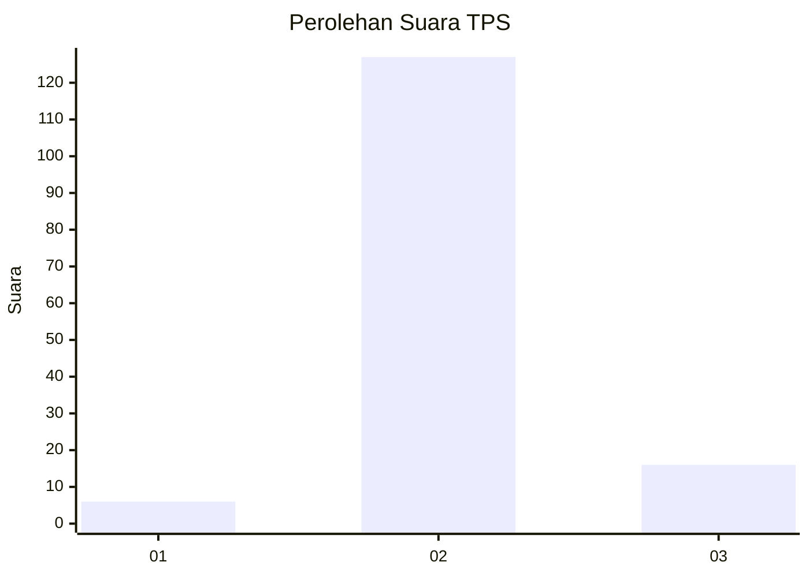
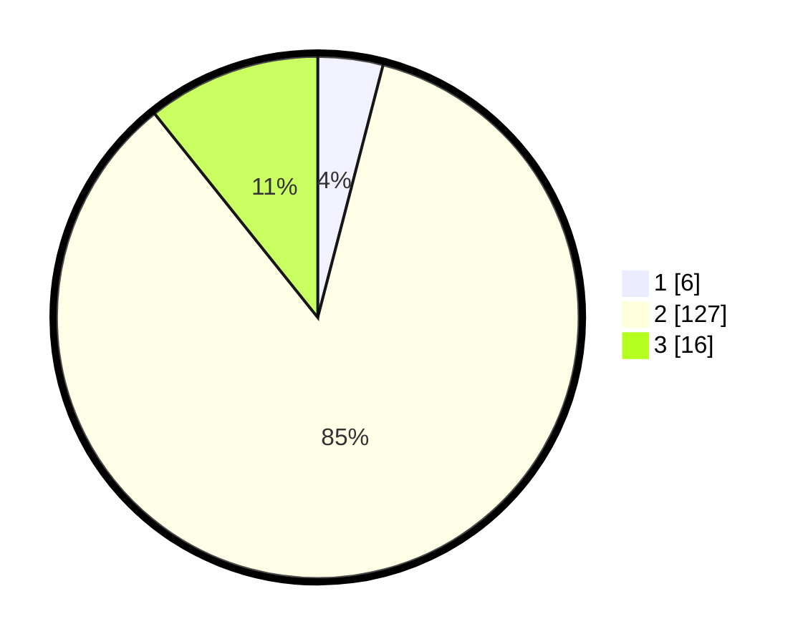

# Hasil

## Grafik

## Tabel

| No. | Nama Paslon    | Suara | Suara (raw) | Persentase |
|:--- |:-------------- | -----:| -----------:| ----------:|
| 1   | ANIES MUHAIMIN | 6     | [6][p-1]    | 4,03       |
| 2   | PRABOWO GIBRAN | 127   | [127][p-2]  | 85,23      |
| 3   | GANJAR MAHFUD  | 16    | [16][p-3]   | 10,74      |

[p-1]: https://github.com/gigit-pemilu/pemilu-2024/blob/main/pilpres/hitung-suara/sub/35-jawa-timur/sub/03-trenggalek/sub/02-munjungan/sub/2001-ngulungkulon/sub/002-tps/sub/paslon-1.txt
[p-2]: https://github.com/gigit-pemilu/pemilu-2024/blob/main/pilpres/hitung-suara/sub/35-jawa-timur/sub/03-trenggalek/sub/02-munjungan/sub/2001-ngulungkulon/sub/002-tps/sub/paslon-2.txt
[p-3]: https://github.com/gigit-pemilu/pemilu-2024/blob/main/pilpres/hitung-suara/sub/35-jawa-timur/sub/03-trenggalek/sub/02-munjungan/sub/2001-ngulungkulon/sub/002-tps/sub/paslon-3.txt

## Foto C Plano

https://sirekap-obj-formc.kpu.go.id/b144/pemilu/ppwp/35/03/02/20/01/3503022001002-20240217-202641--abe4c918-e2f0-43db-842d-de2190a721db.jpg

https://sirekap-obj-formc.kpu.go.id/b144/pemilu/ppwp/35/03/02/20/01/3503022001002-20240217-202643--0d5eb0d6-c58d-4b41-864b-358798f93f1e.jpg

https://sirekap-obj-formc.kpu.go.id/b144/pemilu/ppwp/35/03/02/20/01/3503022001002-20240217-202642--6ae27435-005e-49cd-bb75-d7a607e914e0.jpg

## Metadata

| Key        | Value               |
| ---------- | ------------------- |
| Time Stamp | 2024-02-19 06:16:00 |

## DATA PEMILIH TETAP

Jumlah pemilih dalam DPT: **182**.
 * L: **83**.
 * P: **99**.

## DATA PENGGUNA HAK PILIH

Jumlah pengguna hak pilih dalam DPT: **157**.
 * L: **75**.
 * P: **82**.

Jumlah pengguna hak pilih dalam DPTb: **0**.
 * L: **0**.
 * P: **0**.

Jumlah pengguna hak pilih dalam DPK: **0**.
 * L: **0**.
 * P: **0**.

Jumlah pengguna hak pilih: **157**.
 * L: **75**.
 * P: **82**.

## JUMLAH SUARA SAH DAN TIDAK SAH

JUMLAH SELURUH SUARA SAH: **149**.

JUMLAH SUARA TIDAK SAH: **8**.

JUMLAH SELURUH SUARA SAH DAN SUARA TIDAK SAH: **157**.

