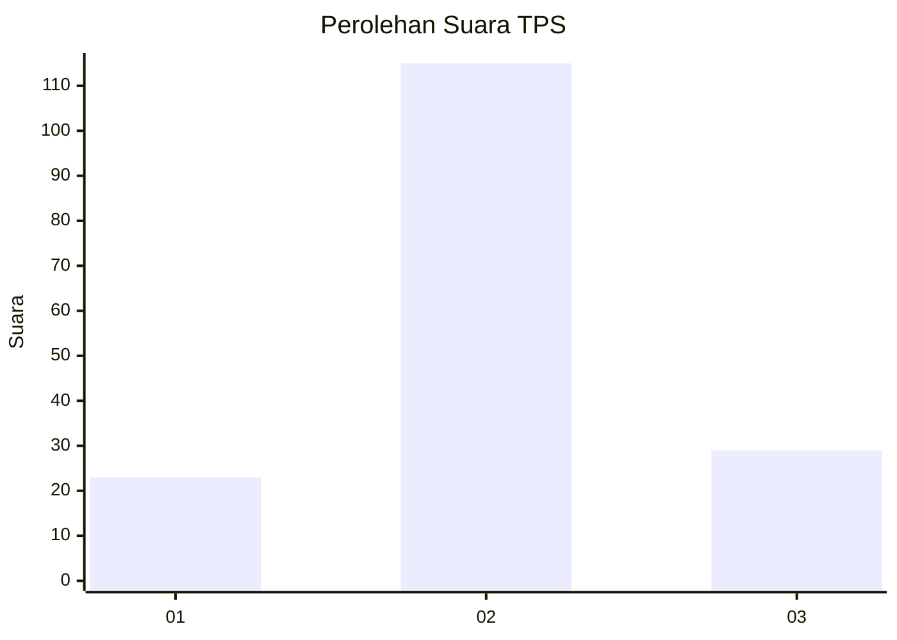
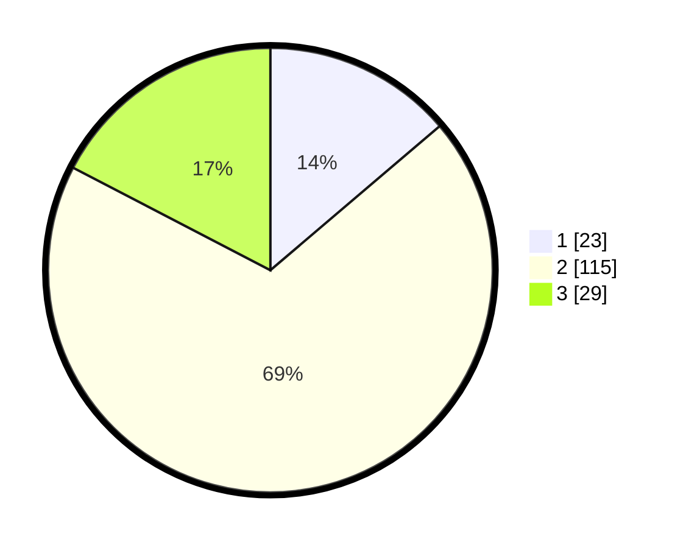

# Hasil

## Grafik

## Tabel

| No. | Nama Paslon    | Suara | Suara (raw) | Persentase |
|:--- |:-------------- | -----:| -----------:| ----------:|
| 1   | ANIES MUHAIMIN | 23    | [23][p-1]   | 13,77      |
| 2   | PRABOWO GIBRAN | 115   | [115][p-2]  | 68,86      |
| 3   | GANJAR MAHFUD  | 29    | [29][p-3]   | 17,37      |

[p-1]: https://github.com/gigit-pemilu/pemilu-2024/blob/main/pilpres/hitung-suara/sub/35-jawa-timur/sub/03-trenggalek/sub/02-munjungan/sub/2001-ngulungkulon/sub/004-tps/sub/paslon-1.txt
[p-2]: https://github.com/gigit-pemilu/pemilu-2024/blob/main/pilpres/hitung-suara/sub/35-jawa-timur/sub/03-trenggalek/sub/02-munjungan/sub/2001-ngulungkulon/sub/004-tps/sub/paslon-2.txt
[p-3]: https://github.com/gigit-pemilu/pemilu-2024/blob/main/pilpres/hitung-suara/sub/35-jawa-timur/sub/03-trenggalek/sub/02-munjungan/sub/2001-ngulungkulon/sub/004-tps/sub/paslon-3.txt

## Foto C Plano

https://sirekap-obj-formc.kpu.go.id/e716/pemilu/ppwp/35/03/02/20/01/3503022001004-20240218-103611--167388c3-0c30-44a2-a4ce-05ed1e60e76a.jpg

https://sirekap-obj-formc.kpu.go.id/e716/pemilu/ppwp/35/03/02/20/01/3503022001004-20240218-103612--1011dd6f-42ed-40f8-b48a-f96fd6874a52.jpg

https://sirekap-obj-formc.kpu.go.id/e716/pemilu/ppwp/35/03/02/20/01/3503022001004-20240218-103611--bd53839b-3b9b-42d1-8ebe-d66164ee6224.jpg

## Metadata

| Key        | Value               |
| ---------- | ------------------- |
| Time Stamp | 2024-02-20 11:00:00 |

## DATA PEMILIH TETAP

Jumlah pemilih dalam DPT: **216**.
 * L: **102**.
 * P: **114**.

## DATA PENGGUNA HAK PILIH

Jumlah pengguna hak pilih dalam DPT: **173**.
 * L: **77**.
 * P: **96**.

Jumlah pengguna hak pilih dalam DPTb: **2**.
 * L: **1**.
 * P: **1**.

Jumlah pengguna hak pilih dalam DPK: **0**.
 * L: **0**.
 * P: **0**.

Jumlah pengguna hak pilih: **175**.
 * L: **78**.
 * P: **97**.

## JUMLAH SUARA SAH DAN TIDAK SAH

JUMLAH SELURUH SUARA SAH: **167**.

JUMLAH SUARA TIDAK SAH: **8**.

JUMLAH SELURUH SUARA SAH DAN SUARA TIDAK SAH: **175**.

