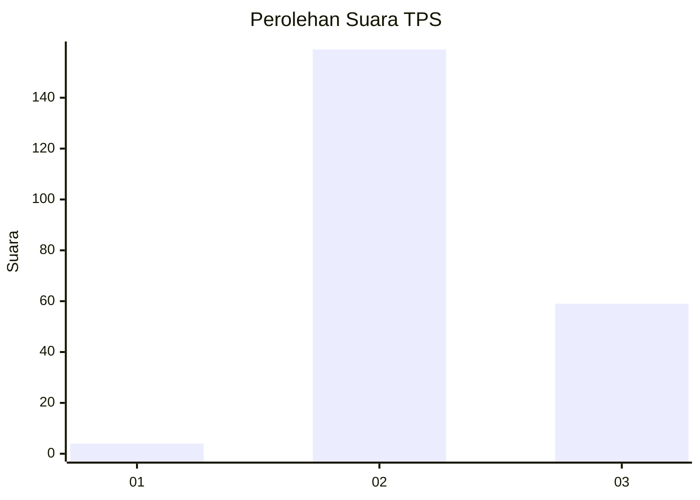
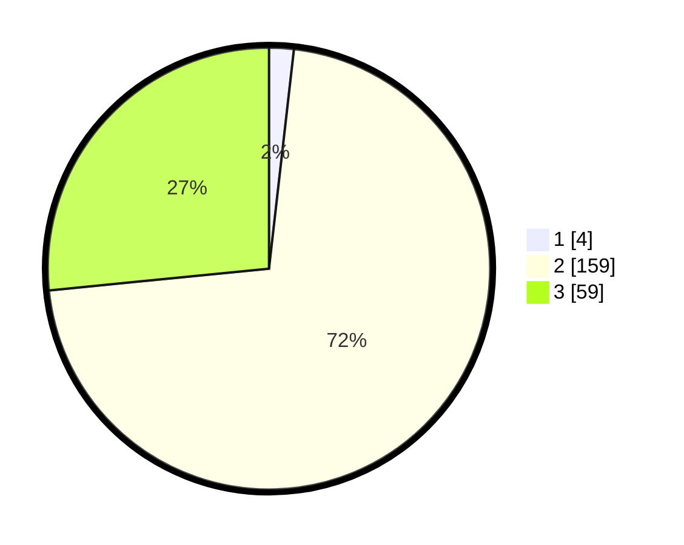

# Hasil

## Grafik

## Tabel

| No. | Nama Paslon    | Suara | Suara (raw) | Persentase |
|:--- |:-------------- | -----:| -----------:| ----------:|
| 1   | ANIES MUHAIMIN | 4     | [4][p-1]    | 1,80       |
| 2   | PRABOWO GIBRAN | 159   | [159][p-2]  | 71,62      |
| 3   | GANJAR MAHFUD  | 59    | [59][p-3]   | 26,58      |

[p-1]: https://github.com/gigit-pemilu/pemilu-2024-35-jawa-timur/blob/main/pilpres/hitung-suara/sub/35-jawa-timur/sub/03-trenggalek/sub/02-munjungan/sub/2005-masaran/sub/007-tps/sub/paslon-1.txt
[p-2]: https://github.com/gigit-pemilu/pemilu-2024-35-jawa-timur/blob/main/pilpres/hitung-suara/sub/35-jawa-timur/sub/03-trenggalek/sub/02-munjungan/sub/2005-masaran/sub/007-tps/sub/paslon-2.txt
[p-3]: https://github.com/gigit-pemilu/pemilu-2024-35-jawa-timur/blob/main/pilpres/hitung-suara/sub/35-jawa-timur/sub/03-trenggalek/sub/02-munjungan/sub/2005-masaran/sub/007-tps/sub/paslon-3.txt

## Foto C Plano

https://sirekap-obj-formc.kpu.go.id/14d5/pemilu/ppwp/35/03/02/20/05/3503022005007-20240217-223704--4772761f-fc6c-4355-a78b-af0125339489.jpg

https://sirekap-obj-formc.kpu.go.id/14d5/pemilu/ppwp/35/03/02/20/05/3503022005007-20240215-000140--48119656-5b4e-4e96-a111-a07c510cc4fe.jpg

https://sirekap-obj-formc.kpu.go.id/14d5/pemilu/ppwp/35/03/02/20/05/3503022005007-20240215-000232--80312994-d73d-4f79-ba8d-f4f1d748808d.jpg

## Metadata

| Key        | Value               |
| ---------- | ------------------- |
| Time Stamp | 2024-02-19 06:16:00 |

