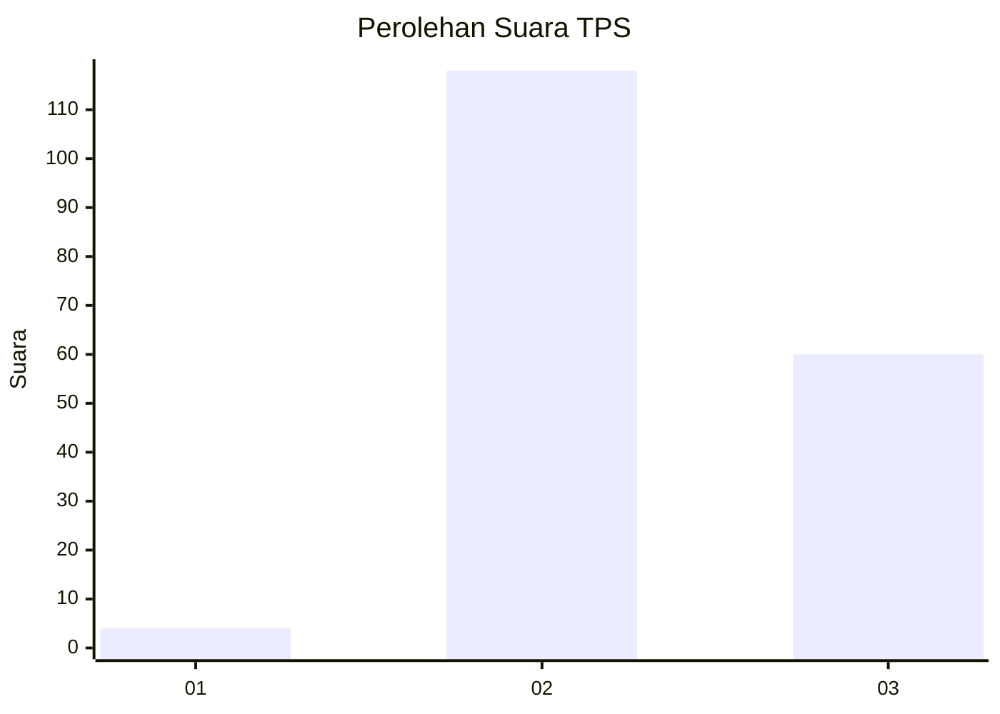
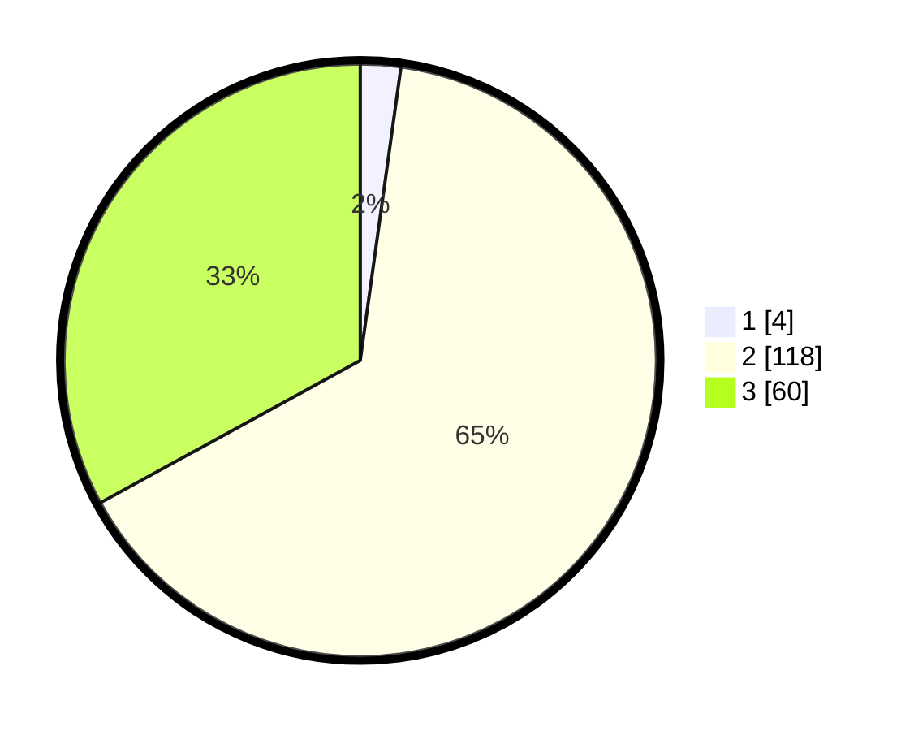

# Hasil

## Grafik

## Tabel

| No. | Nama Paslon    | Suara | Suara (raw) | Persentase |
|:--- |:-------------- | -----:| -----------:| ----------:|
| 1   | ANIES MUHAIMIN | 4     | [4][p-1]    | 2,20       |
| 2   | PRABOWO GIBRAN | 118   | [118][p-2]  | 64,84      |
| 3   | GANJAR MAHFUD  | 60    | [60][p-3]   | 32,97      |

[p-1]: https://github.com/gigit-pemilu/pemilu-2024-35-jawa-timur/blob/main/pilpres/hitung-suara/sub/35-jawa-timur/sub/03-trenggalek/sub/02-munjungan/sub/2005-masaran/sub/015-tps/sub/paslon-1.txt
[p-2]: https://github.com/gigit-pemilu/pemilu-2024-35-jawa-timur/blob/main/pilpres/hitung-suara/sub/35-jawa-timur/sub/03-trenggalek/sub/02-munjungan/sub/2005-masaran/sub/015-tps/sub/paslon-2.txt
[p-3]: https://github.com/gigit-pemilu/pemilu-2024-35-jawa-timur/blob/main/pilpres/hitung-suara/sub/35-jawa-timur/sub/03-trenggalek/sub/02-munjungan/sub/2005-masaran/sub/015-tps/sub/paslon-3.txt

## Foto C Plano

https://sirekap-obj-formc.kpu.go.id/7c3d/pemilu/ppwp/35/03/02/20/05/3503022005015-20240217-121628--83041c67-e7ff-4829-bdc2-2fe77e94572c.jpg

https://sirekap-obj-formc.kpu.go.id/7c3d/pemilu/ppwp/35/03/02/20/05/3503022005015-20240217-081720--8eee1e13-e472-4001-a56a-a137572eeead.jpg

https://sirekap-obj-formc.kpu.go.id/7c3d/pemilu/ppwp/35/03/02/20/05/3503022005015-20240217-081829--b8aa64ca-87a8-404f-9aab-5144ca788a4c.jpg

## Metadata

| Key        | Value               |
| ---------- | ------------------- |
| Time Stamp | 2024-02-17 13:37:34 |

