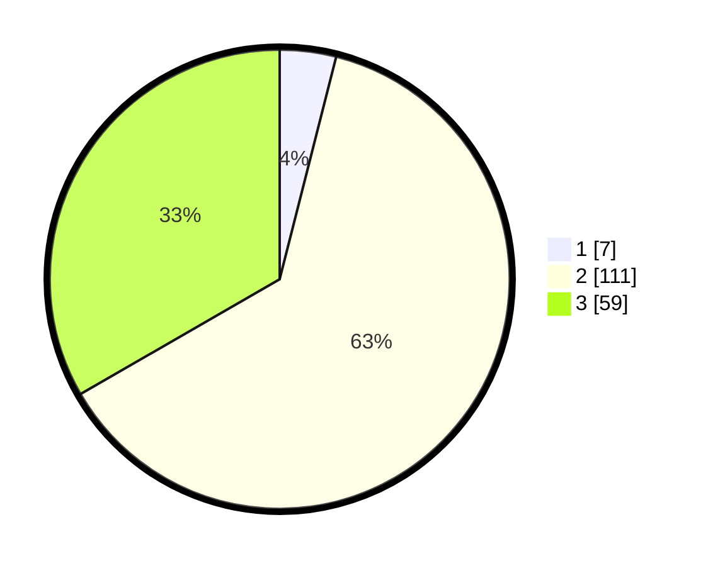

# Hasil

## Grafik

## Tabel

| No. | Nama Paslon    | Suara | Suara (raw) | Persentase |
|:--- |:-------------- | -----:| -----------:| ----------:|
| 1   | ANIES MUHAIMIN | 7     | [7][p-1]    | 3,95       |
| 2   | PRABOWO GIBRAN | 111   | [111][p-2]  | 62,71      |
| 3   | GANJAR MAHFUD  | 59    | [59][p-3]   | 33,33      |

[p-1]: https://github.com/gigit-pemilu/pemilu-2024-35-jawa-timur/blob/main/pilpres/hitung-suara/sub/35-jawa-timur/sub/03-trenggalek/sub/02-munjungan/sub/2006-tawing/sub/014-tps/sub/paslon-1.txt
[p-2]: https://github.com/gigit-pemilu/pemilu-2024-35-jawa-timur/blob/main/pilpres/hitung-suara/sub/35-jawa-timur/sub/03-trenggalek/sub/02-munjungan/sub/2006-tawing/sub/014-tps/sub/paslon-2.txt
[p-3]: https://github.com/gigit-pemilu/pemilu-2024-35-jawa-timur/blob/main/pilpres/hitung-suara/sub/35-jawa-timur/sub/03-trenggalek/sub/02-munjungan/sub/2006-tawing/sub/014-tps/sub/paslon-3.txt

## Foto C Plano

https://sirekap-obj-formc.kpu.go.id/c633/pemilu/ppwp/35/03/02/20/06/3503022006014-20240218-184103--930a0fb4-55ee-4272-bc74-80aea5f05f8b.jpg

https://sirekap-obj-formc.kpu.go.id/c633/pemilu/ppwp/35/03/02/20/06/3503022006014-20240218-184333--6e6e894c-f800-4a3a-beed-089e22d195e5.jpg

https://sirekap-obj-formc.kpu.go.id/c633/pemilu/ppwp/35/03/02/20/06/3503022006014-20240218-184441--6086506b-fc7f-420d-b86e-1e7030c33cac.jpg

## Metadata

| Key        | Value               |
| ---------- | ------------------- |
| Time Stamp | 2024-02-25 15:00:00 |

