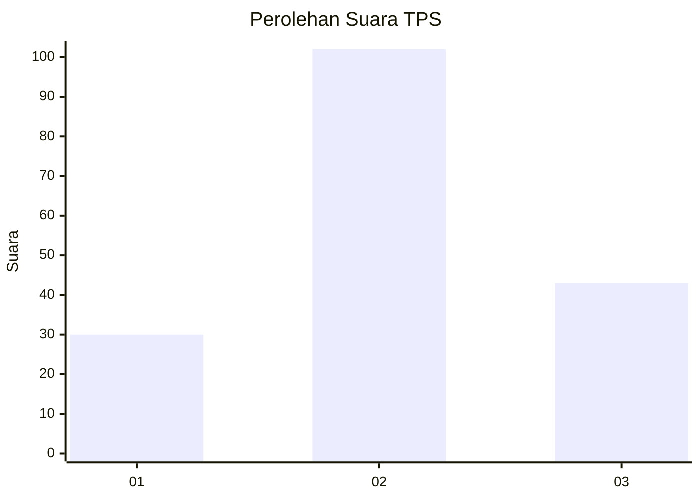
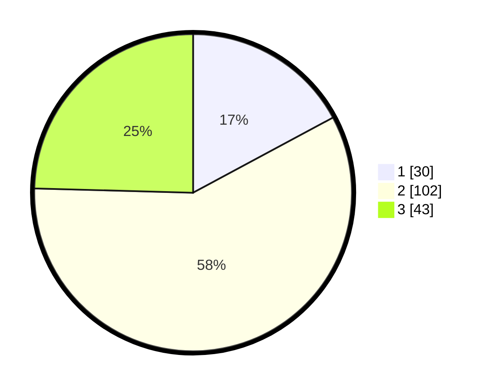

# Hasil

## Grafik

## Tabel

| No. | Nama Paslon    | Suara | Suara (raw) | Persentase |
|:--- |:-------------- | -----:| -----------:| ----------:|
| 1   | ANIES MUHAIMIN | 30    | [30][p-1]   | 17,14      |
| 2   | PRABOWO GIBRAN | 102   | [102][p-2]  | 58,29      |
| 3   | GANJAR MAHFUD  | 43    | [43][p-3]   | 24,57      |

[p-1]: https://github.com/gigit-pemilu/pemilu-2024-35-jawa-timur/blob/main/pilpres/hitung-suara/sub/35-jawa-timur/sub/03-trenggalek/sub/02-munjungan/sub/2008-munjungan/sub/001-tps/sub/paslon-1.txt
[p-2]: https://github.com/gigit-pemilu/pemilu-2024-35-jawa-timur/blob/main/pilpres/hitung-suara/sub/35-jawa-timur/sub/03-trenggalek/sub/02-munjungan/sub/2008-munjungan/sub/001-tps/sub/paslon-2.txt
[p-3]: https://github.com/gigit-pemilu/pemilu-2024-35-jawa-timur/blob/main/pilpres/hitung-suara/sub/35-jawa-timur/sub/03-trenggalek/sub/02-munjungan/sub/2008-munjungan/sub/001-tps/sub/paslon-3.txt

## Foto C Plano

https://sirekap-obj-formc.kpu.go.id/87bd/pemilu/ppwp/35/03/02/20/08/3503022008001-20240217-172749--e44e57bb-ebd1-4881-aa8d-7f315e839ed7.jpg

https://sirekap-obj-formc.kpu.go.id/87bd/pemilu/ppwp/35/03/02/20/08/3503022008001-20240214-141319--5e97b069-64fa-4db2-88f1-75bdac1c61b1.jpg

https://sirekap-obj-formc.kpu.go.id/87bd/pemilu/ppwp/35/03/02/20/08/3503022008001-20240217-102845--44c4552d-16d3-4b9c-b665-c722d18dff9d.jpg

## Metadata

| Key        | Value               |
| ---------- | ------------------- |
| Time Stamp | 2024-02-17 17:30:00 |

