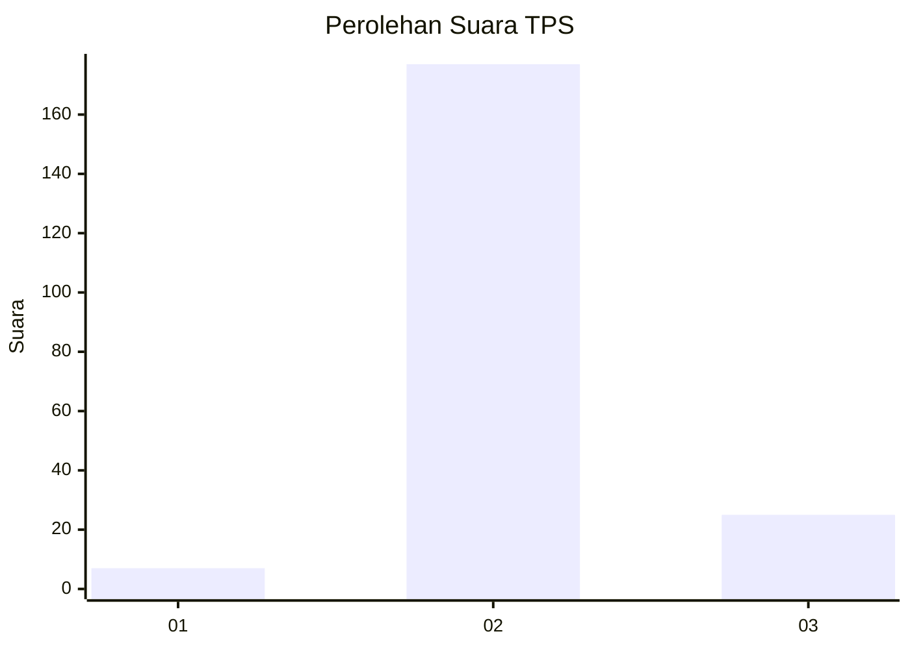
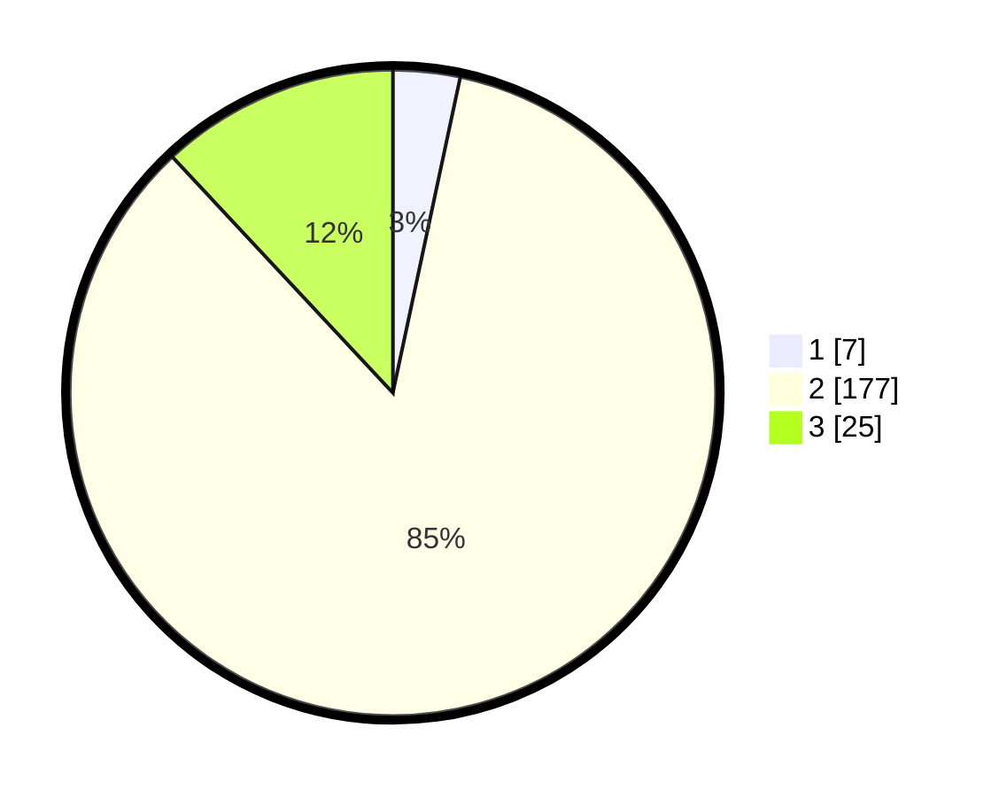

# Hasil

## Grafik

## Tabel

| No. | Nama Paslon    | Suara | Suara (raw) | Persentase |
|:--- |:-------------- | -----:| -----------:| ----------:|
| 1   | ANIES MUHAIMIN | 7     | [7][p-1]    | 3,35       |
| 2   | PRABOWO GIBRAN | 177   | [177][p-2]  | 84,69      |
| 3   | GANJAR MAHFUD  | 25    | [25][p-3]   | 11,96      |

[p-1]: https://github.com/gigit-pemilu/pemilu-2024-35-jawa-timur/blob/main/pilpres/hitung-suara/sub/35-jawa-timur/sub/03-trenggalek/sub/02-munjungan/sub/2011-bangun/sub/014-tps/sub/paslon-1.txt
[p-2]: https://github.com/gigit-pemilu/pemilu-2024-35-jawa-timur/blob/main/pilpres/hitung-suara/sub/35-jawa-timur/sub/03-trenggalek/sub/02-munjungan/sub/2011-bangun/sub/014-tps/sub/paslon-2.txt
[p-3]: https://github.com/gigit-pemilu/pemilu-2024-35-jawa-timur/blob/main/pilpres/hitung-suara/sub/35-jawa-timur/sub/03-trenggalek/sub/02-munjungan/sub/2011-bangun/sub/014-tps/sub/paslon-3.txt

## Foto C Plano

https://sirekap-obj-formc.kpu.go.id/72f5/pemilu/ppwp/35/03/02/20/11/3503022011014-20240215-083137--3ddd8a9f-a6be-4133-8f33-bfb5c8daabce.jpg

https://sirekap-obj-formc.kpu.go.id/72f5/pemilu/ppwp/35/03/02/20/11/3503022011014-20240217-211732--7b8f91d1-8172-428e-baaa-89ed84acd8d8.jpg

https://sirekap-obj-formc.kpu.go.id/72f5/pemilu/ppwp/35/03/02/20/11/3503022011014-20240218-161421--9224a066-a35f-427c-afbb-9c86bb530674.jpg

## Metadata

| Key        | Value               |
| ---------- | ------------------- |
| Time Stamp | 2024-02-19 06:16:00 |

