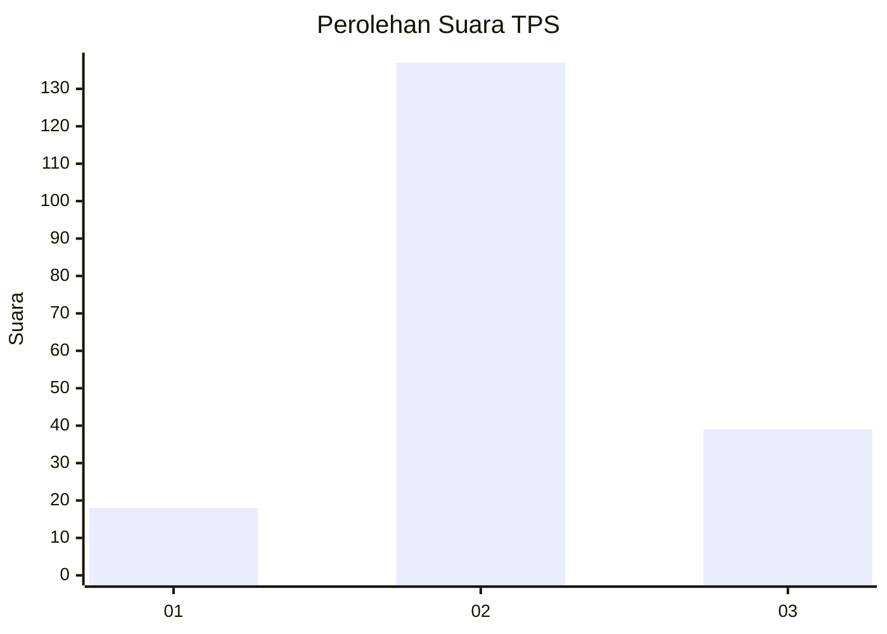
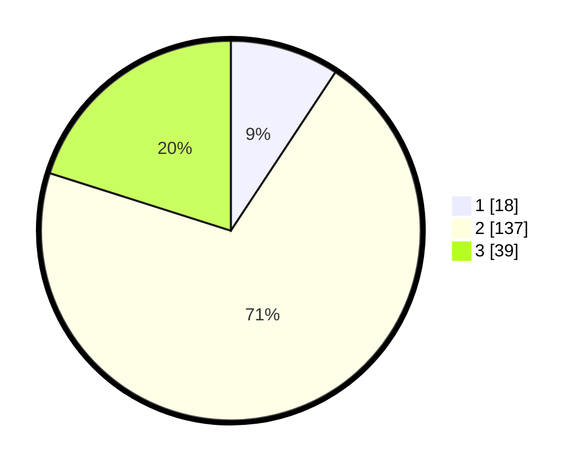

# Hasil

## Grafik

## Tabel

| No. | Nama Paslon    | Suara | Suara (raw) | Persentase |
|:--- |:-------------- | -----:| -----------:| ----------:|
| 1   | ANIES MUHAIMIN | 18    | [18][p-1]   | 9,28       |
| 2   | PRABOWO GIBRAN | 137   | [137][p-2]  | 70,62      |
| 3   | GANJAR MAHFUD  | 39    | [39][p-3]   | 20,10      |

[p-1]: https://github.com/gigit-pemilu/pemilu-2024-35-jawa-timur/blob/main/pilpres/hitung-suara/sub/35-jawa-timur/sub/03-trenggalek/sub/03-pule/sub/2001-sidomulyo/sub/008-tps/sub/paslon-1.txt
[p-2]: https://github.com/gigit-pemilu/pemilu-2024-35-jawa-timur/blob/main/pilpres/hitung-suara/sub/35-jawa-timur/sub/03-trenggalek/sub/03-pule/sub/2001-sidomulyo/sub/008-tps/sub/paslon-2.txt
[p-3]: https://github.com/gigit-pemilu/pemilu-2024-35-jawa-timur/blob/main/pilpres/hitung-suara/sub/35-jawa-timur/sub/03-trenggalek/sub/03-pule/sub/2001-sidomulyo/sub/008-tps/sub/paslon-3.txt

## Foto C Plano

https://sirekap-obj-formc.kpu.go.id/8a67/pemilu/ppwp/35/03/03/20/01/3503032001008-20240216-173331--f2b53dc6-b54f-422f-a99c-2f7b3269779d.jpg

https://sirekap-obj-formc.kpu.go.id/8a67/pemilu/ppwp/35/03/03/20/01/3503032001008-20240216-173639--00546f3d-9f9b-43f4-9adf-4652f93a805b.jpg

## Metadata

| Key        | Value               |
| ---------- | ------------------- |
| Time Stamp | 2024-02-17 02:00:02 |

